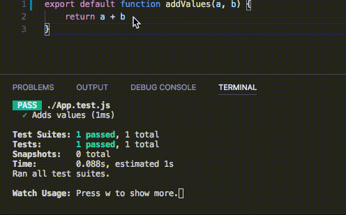
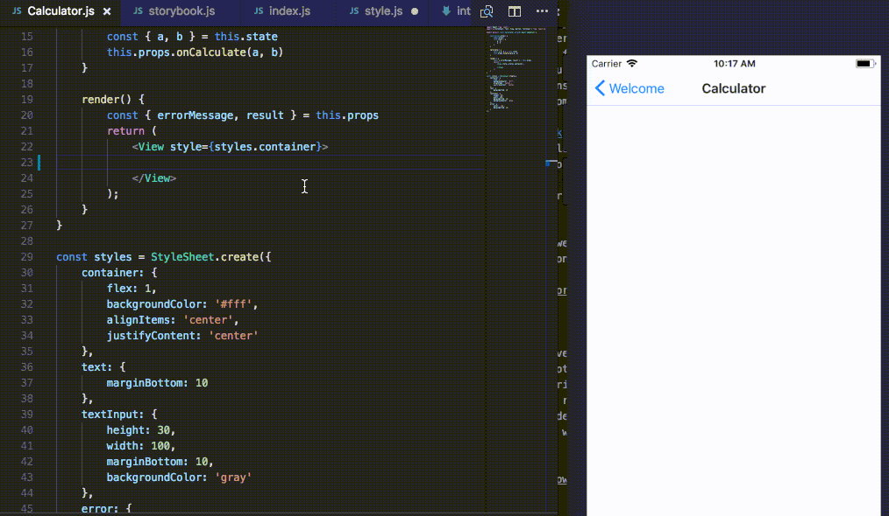

"A developer needs tools that support her/his workflow to be fully productive". Well, I guess that this statement fits to any profession that you can think of. It is really important for me to feel that the environment that I'm working in really supports my flow and works well with my approach to software development. That's why, today I'd like to share a number of things that boost my productivity while creating mobile app in React Native.

The following list has been prepared by a developer that comes from the native iOS background. If you have web background, then these things won't be as revolutionary as they are for a developer with pure mobile experience. ;)

## 1. [TypeScript](https://www.typescriptlang.org/)
If your background is development in Swift, Kotlin or other "mobile" language and you move to the JavaScript world, then I wouldn't be surprised if you missed the support that Swift/Kotlin have in the IDE or simply, you would like to use a strongly-typed language again. "JavaScript that scales." - this is a statement that you will find while entering TypeScript's home page. TypeScript is a superset of JavaScript that will allow you to achieve a better code completion, strong typing, to add interfaces to your code etc. However, you have to keep in mind that TypeScript will not force you to adapt new coding conventions instantly. It's up to you in terms of how you decide to configure it. In the end, the output can be much more pleasant than writing pure JavaScript.  
Do not be afraid of trying TypeScript. It is transpiled to JavaScript code that looks really similar to the TypeScript that you've written, so if you're not happy with the outcome, you can always go back to your pure JavaScript (spoiler alert: you won't).

## 2. [Storybook](https://github.com/storybooks/storybook)
I cannot emphasize strongly enough how much I love storybooks. This single tool itself can greatly improve your workflow on UI parts of your application. Storybook allows you to create stories in which you prepare pre filled UI elements with data that could possibly show up there during normal app lifetime. Later within a few seconds you can easily go through all stories that you've described and see how they look on your device / emulator without the need of going through all of these states in normal app flow which takes much longer time.

This is a tiny example of a single story, however if you develop a normal app, you will surely have much more of them which may cover all of possible UI states for your components.

## 3. Quick tests

If you were previously doing native mobile development, then you are probably used to switching your targets in order to run tests and you will surely know that they do not work as fast as you would probably want them to. This can be changed while you switch to development in JavaScript or TypeScript. If your app grows, it's easy to guess that tests will not run in a matter of milliseconds, but it's still normal to have a result of them within 1-3 seconds from the time that you saved your file. This allows you keep your tests running while you develop your app and catch any issue at the time that you change the code that was responsible for it. It also encourages you to write more tests because you know, that test runner does it's best to help you with this.

## 4. Work division

Having an ability to easily work with an isolated UI in the application and work on your logic code with tests as a first client can greatly improve your productivity. You will end up with much faster feedback loop and components created in isolation, which will make it easier to share them later. At the time that you have your UI components prepared and logic ready to be used, then the only thing left is to finally integrate them in the main application. This task will be also simplified due to the fact that you can utilize a hot reloading feature and benefit from the fact that you don't have to wait for your app to recompile in order to check the results of your work. What's even better - you can easily check this on both Android and iOS devices in a quick way.

What are the things that improve your workflow? I'd be glad to hear about them!

*This article is cross-posted with [my personal blog](https://eliaszsawicki.com/).*
