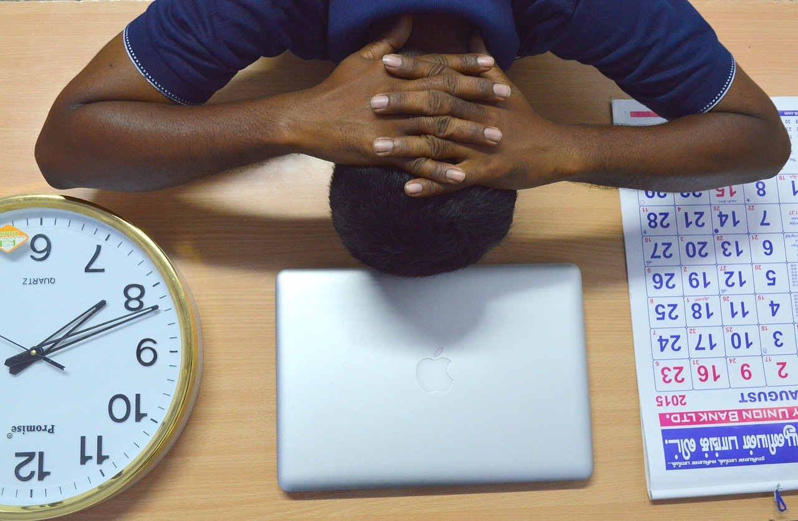
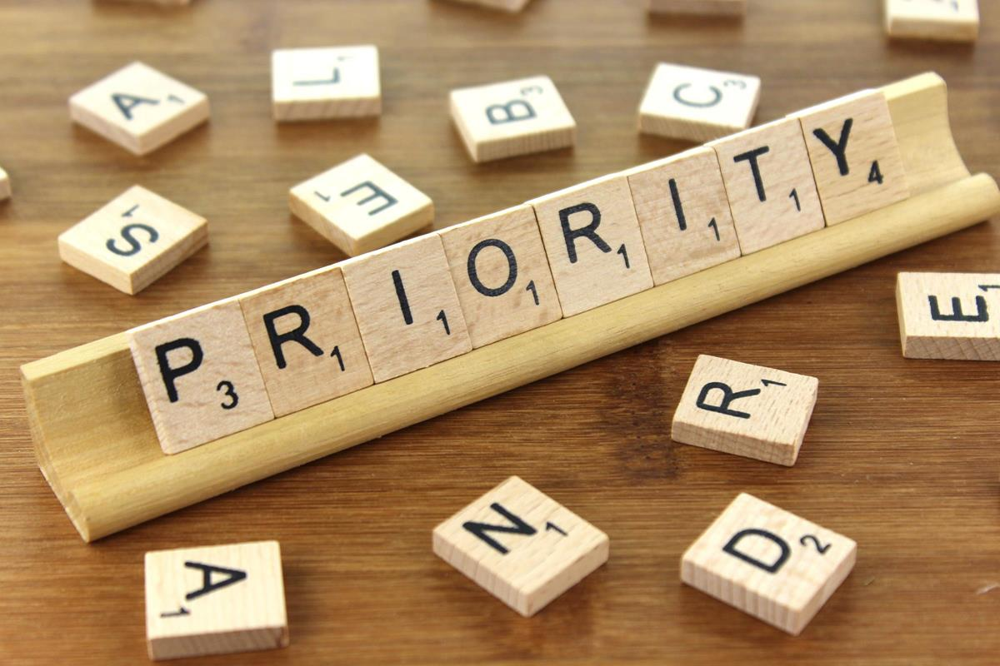
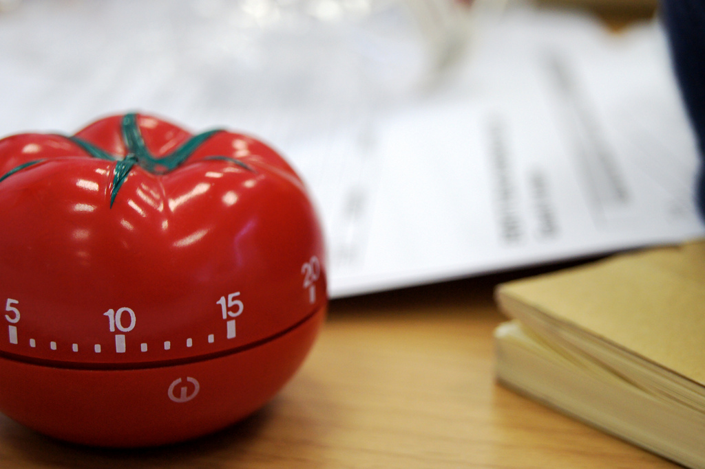

Day has 24 hours. You can spend it doing whatever you want. 

When I was younger I thought that school was everything and could not imagine doing something more than that. I was sure I just did not have enough time. Then I began my studies and assumed it was everything, but after a while the first job appeared and it turned out that it was possible for me to bring these two together. And now? Now I ride my bike every day, teach English in the evenings, do a renovation of my flat, work full-time at Bright Inventions (just finished postgraudate studies and still have time to call my mum every afternoon and meet friends). A few years ago this kind of scenario was hard to imagine.

**Some people can achieve much more during the same time than the others. The secret may lie in their time management.** It is not an innate skill we are born with. I suppose I am learning it constantly by doing regular updates in my to-do list. By managing our time effectively we do not only complete tasks much faster, but also work smarter while not being overloaded and burnt out. 

Time management is nothing more than planning, organising and dividing work in such a way that each activity can be done on time and in a efficient manner. It should allow us to work smarter so that we can do more in less time, even under strain or facing tight deadlines. Among many benefits **good time management allows for higher productivity, less stress, better chances for advancement and self-development, and after all achieving your career and personal goals.**

So if we experience a poor work quality and feel there is something wrong with our work flow efficiency, it is high time we reassessed our daily, weekly or monthly schedules and start paying attention wisely to what we do and with whom we spend our time. After investing some hours upfront you should be able to make the most of each day. In the beginning we learn a lot - how to be assertive, how to plan, how to prioritise and many more.  

**Frequently the key to good time management is understanding which of our tasks are urgent and which are not - while prioritising our list-to-do take into account what level of importance and urgency each assignment has. It may turn out that some of the tasks do not have to be done at all or that you spend a half of your day doing something wth a low importance.** The importance or urgency status is not fixed yet and it does not mean that once checked it will never alter. We should carry out a quick analysis of our task regularly and update our priorities list on everyday or every week basis. It is good to have at the beginning of each day a kind of planning session and set up realistic goals to achieve. Not only does it teach you how to manage time, but also shows how the task's levels of urgency and importance change with passing time. 

**Do you know that there is something called Parkinson’s Law that states that work expands so as to fill the time available for its completion?** It may also explain why we can do the same task in a week and in a day. In a nutshell Parkinson’s Law says that the more time we devote to a project, the longer it will take to complete it. You have a deadline set for a next month? You will be doing a given task all next month. But the same task can be done quicker with the same effect. So make deadlines strict and you will do more in a shorter time and the rest spend on doing different staff. 

“Giving” your task too much time is not, however, the only case when we face problems connected with inappropriate time management. There is also a quite common phenomenon called **a priority inversion - a state when an operating system (here we are operating systems) using multiple tasks with different priorities fails as a result of a situation in which a hight priority task is waiting for a task with low priority which is waiting for a medium priority task. Under these circumstances the system can crash and a high-priority task is not done in due time. Priority inversion is visible in our workflow simply as avoidance.** Frequently, it is not like the task is too difficult, but we just avoid doing it. How many times have you said “I will do it later. Now I don’t have enough time. It is too difficult for me. No, no, no….”? But is the task truly too challenging? We may often avoid doing tasks since we are fatigue, sleepy or just without any particularly clever reason. Fighting priority inversion habit is vital for good time management. If there is a task with a high priority and importance, it should be done first. And that is it. 

**Meetings.** Take part in these that you can benefit from. If you feel that spending another minute participating in a particular discussion will not give you any asset, do not feel obliged to be there. **Meetings are essential part of every organisation, but only these run effectively should be an essential part of your day.** So if you have a chance to avoid spending two hours fruitlessly in a conference room, just leave, and devote this time to boosting your productivity instead. Leaving a non-compulsory meeting as long as we find it futile, is not missing business savour-vivre but taking care of your goals. 

Another situation that may prove unavailing are disagreements. Feeling an argument leads to nowhere, let it go. It is time-consuming, energy-consuming and just pointless. The sooner you realise that, the better for you. 

Supposedly, in life of every developer there is also time for stand-up meetings. **Genuine stand-up meetings should take 5 minutes and involve answering three main questions:**

**What did I do yesterday?**
**What am I going to do today?**
**And what is in my way?** 

Honestly, you do not need to spend a half an hour on that. As long as stand-up meetings do not evolve into casual conversations and push your work forward, they are fine. But the moment you notice no one is paying attention just sitting aimlessly means that maybe this stand-up is not necessarily vital for the progress and completion of your work. 

We all shall remember that frenzy of work should not take away our health. **Recharging is necessary.** And it may involve either sleeping, eating properly, exercising, 10-minute walk or drinking a coffee. Just because our day is hectic does mean that finding time for a break is not important. Never ignore your physical and mental needs. Dividing your work session into several timeframes help in sustaining high productivity levels and  staying focus. **Taking a break may allow not only to clear our head, but also to gain a new perspective.** Work is not a sprint but a marathon thus sustainable maintenance in our case is as much significant as in every operating system. 

And now let us focus on tomatoes. **Pomodro Technique is a popular time management approach in which you divide work into blocks of time. Typically you work for 25 minutes (this is your pomodoro “tomato” session) followed by a 5-minute break.** During each pomodoro session we should be fully focused on our task. There is no space for distractions of any kind like social media, talking with your colleagues or answering phone. Our motivation should push us to finish the task and avoid interruptions. At the beginning of each pomodoro session we choose a task we would like to pay our attention to. After four sessions it is advisable to refresh mind and take a longer 20-minute break. Does it always work? It may not, but if you have not tried, it is still worth giving a go.

**Day has 24 hours. You can spend it doing whatever you want.**

