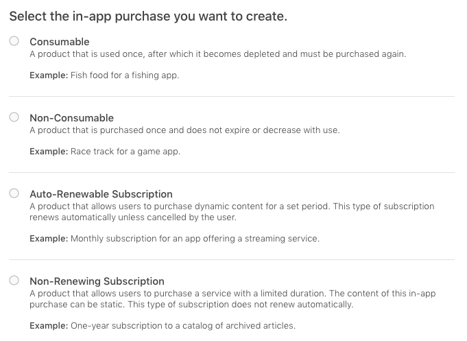
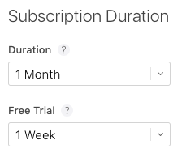
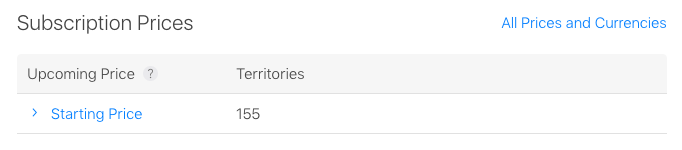
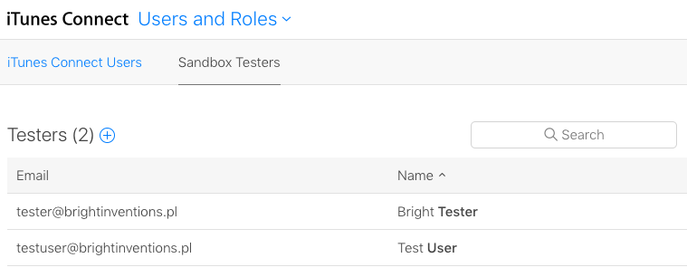
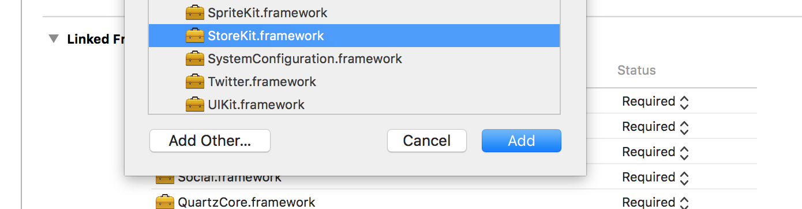
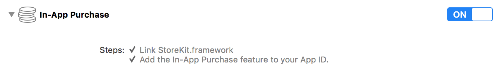
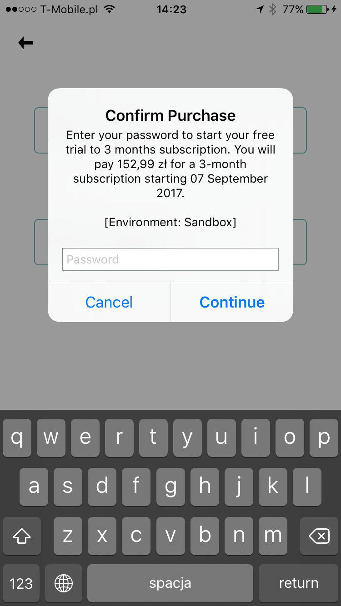
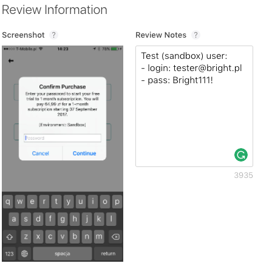
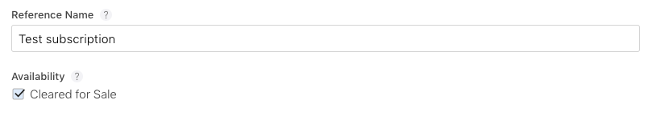
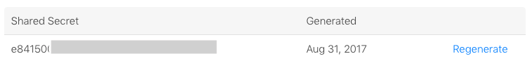

There are more pleasant things to do in iOS development than setting up and testing in-app purchases. The process is laborious and requires thorough testing, especially that in-app purchases are crucial from a business perspective.


## iTunes Connect configuration - part 1

**This tutorial is based on auto-renewable subscriptions, but you can configure any other in-app purchase in a very similar way.**

To set up the in-app purchases follow the steps below:

1. Log in to [iTunes Connect](https://itunesconnect.apple.com).

2. Open **My Apps** and select the app you'll configure.

3. Open **Features** header and select **In-App Purchases** on the left pane.

4. Click **+** icon and select the in-app purchase type. There are 4 types of in-app purchases that you can use:

    

    Each type has a specific use case so make sure you read the descriptions first.

    If you can't see auto-renewable subscription you either haven't accepted updated `Apple Developer Program License Agreement` or you haven't completed filling Agreements, Tax, and Banking info on iTunes Connect.

5. **Assuming you've selected Auto-Renewable Subscription**, provide the **Reference Name** and **Product ID**.

    a) The reference name is used on iTunes Connect and in Sales and Trends reports only. It won't be displayed in the App Store, so it can be anything you like.

    b) Product ID must be unique, so it's recommended to use your app reversed domain with a subscription name, for example: `com.reversed.domain.onemonth`.

6. Select **Create New Subscription Group** or choose an already existing group, if any.

    All auto-renewable subscriptions must be a part of a group. Users can only subscribe to one subscription in a group a time, but they can change to another subscription in the same group. This allows users to upgrade or downgrade a subscription without paying twice for the same service.

    **Subscription Group Reference Name**, same as the reference name, is used on iTunes Connect and in Sales and Trends reports only.

7. Auto-renewable subscription details page should appear. Select **Subscription Duration** (from 1 week to 1 year) and **optional Free Trial** period (from 3 days to 1 year).

    

8. Click **Set Starting Price** to select the default currency and price (you must choose from pricing tiers), prices for other countries are calculated automatically.

9. Now you can select a different price for individual territories. After you save changes you'll notice that your price is kept as pricing tier:

    

10. Add at least one **Localization** including **Subscription Display Name** and **Description**, preferably for all languages you support. Those values will be visible to the users, so make sure they sound trustworthy.

11. Now you need to add at least one **Localization** to your subscription group. Save changes and select the group you've created in step 6 on the left pane. Fill **Subscription Group Display Name** and optionally set **Custom Name** if your app name is different than your service or publication name. Keep in mind that those values will be visible to the users.

As you've probably noticed, we've skipped the **Review Information** section on the product details page. To fill up this section we first need to make an App Store call from our application in order to complete the configuration phase.

Remember to complete filling your Agreements, Tax, and Banking info on iTunes Connect. You can find it on iTunes Connect main page or in the dropdown on top left corner of the page.

## Setting up a test account

In order to test in the in-app purchases you need to create a sandbox test account.

1. Log in to [iTunes Connect](https://itunesconnect.apple.com).

2. Open **Users and Roles**.

3. Open **Sandbox Testers** header.

    

4. Click **+** icon and fill the test account details. Keep the credentials.

    You can use a fake email address for testing (an easy one), but **Apple might send you an email to verify the test account** and by using a fake account you won't be able to do that so you'll need to create another one because purchases from an unverified account will always fail.


## Project configuration

Now you need to make some changes to your **Xcode project**.

1. Open the project settings (click on the root of your project's files tree).

2. In **General** header, scroll down to **Linked Frameworks and Libraries**.

3. Click **+** icon, find **StoreKit.framework** and click **Add**.

    

4. Open **Capabilities** header and turn **In-App Purchase** on.

    

And it's finally time for some coding!

## Code

First, you need to import the `StoreKit` in your class:

```swift
import StoreKit
```

Before making any other action you should check whether user can make payments. If he can't, parental control might be turned on.

```swift
SKPaymentQueue.canMakePayments()
```

In order to make purchases you need to download purchasable products first:

```swift
private let kOneMonthSubscriptionId = "com.reversed.domain.onemonth"

func loadProducts() {
    let identifiers = Set([kOneMonthSubscriptionId])
    let request = SKProductsRequest(productIdentifiers: identifiers)
    request.delegate = self
    request.start()
}
```

Loaded products will be available in `productsRequest` method of `SKProductsRequestDelegate` delegate. To handle the store delegate methods your class needs to implement `SKProductsRequestDelegate`. You can wrap this up in an extension:

```swift
extension SubscriptionService: SKProductsRequestDelegate {

  func productsRequest(_ request: SKProductsRequest, didReceive response: SKProductsResponse) {
    if response.products.count > 0 {
      print("Purchasable products available!")
      // 1. Save the SKProduct's so you could let user make a purchase
      // 2. Update the UI - it lets you change the product prices without updating the app
    } else {
      print("No purchasable products available.")
      // This might happen when your product identifiers are incorrect or your in-app purchases products weren't processed on iTunes Connect yet
    }
  }

}
```

If you aren't able to fetch the purchasable products you've configured, please note that **it can take even up to few hours** for your products to be registered on iTunes Connect.

Now you can let users make a purchase. Remember to lock the UI with a loader until the process is finished to avoid double calls and to make sure that users know that something is going on.

```swift
func purchase(product : SKProduct) {
    let payment = SKPayment(product: product)
    SKPaymentQueue.defaultQueue().addTransactionObserver(self)
    SKPaymentQueue.defaultQueue().addPayment(payment)
}
```

The result of the transaction is handled in `paymentQueue` method of `SKProductsRequestDelegate` delegate. Let's grow our extension:

```swift
extension SubscriptionService: SKProductsRequestDelegate {
  // (...)

  func paymentQueue(queue: SKPaymentQueue, updatedTransactions transactions: [SKPaymentTransaction]) {
        for transaction in transactions {
            switch transaction.transactionState {
            case .Purchasing:
                print("The payment is being processed.")
            case .Purchased:
                print("Payment processed successfully.")
                // Add your logic
            case .Restored:
                print("Payment restored successfully.")
                // Add your logic - it'll happen when your products could be restored (e.g. non-consumable products)
            case .Failed:
                if transaction.error?.code == SKErrorPaymentCancelled {
                    print("User cancelled the payment.")
                    break;
                }
                print("Payment failed with error: \(transaction.error ?? "")")
                // Handle the error
            case .Deferred:
                print("Payment is waiting for outside action.")
            }
        }
    }

}
```

Remember to restore purchasable products that can be restored before letting users to make a purchase call because they won't be able to buy it again anyway.

## Testing

To complete the configuration process you need to make sure that your payments are working and take a screenshot for the App Store review process. This is both easy and tricky so let's follow the steps below:

1. Sign out of you current Apple ID:

    a) Open your iPhone's **Settings**.

    b) Go to **iTunes & App Stores**.

    c) Select your email address and select **Sign Out**.

    Do not sign in using a sandbox account - you won't be able to do that.

2. Run your app and trigger an in-app purchase.

3. You'll be prompted to provide an Apple ID. Use the **sandbox account** credentials and continue.

4. The payment info dialog will be presented. Take a screenshot of your screen (hold power/sleep and home buttons simultaneously).



**You must test the in-app purchases on a real device. Purchases will always fail on iOS simulator.**


## iTunes Connect configuration - part 2

Since you have already implemented the in-app purchases and taken a screenshot of a system dialog while connecting to the App Store API, you can finally finish the iTunes Connect configuration.

Go back to your in-app purchase details page on **iTunes Connect** (My Apps->Your app->Features->In-App Purchases->Your purchase) and scroll down to **Review Information**.

Upload the screenshot and enter the credentials of the sandbox account you've used in **Review Notes**.



Save changes and make sure that the **Availability** of your in-app purchase is set to **Cleared for Sale** (on the top of the page).



Keep in mind that your **first in-app purchase must be submitted with a new app version**. Once your binary has been uploaded and your first in-app purchase has been submitted for a review, additional in-app purchases can be submitted from the In-App Purchases section.


## Server-side subscription validation

You can verify whether user's subscription is still valid outside the app. It's especially useful when your application is also available on other platforms with separate store like Android, and you decide to make your user pay only once per account, not per platform.

To validate the user's subscription server-side you'll need a **Shared Secret**. You can find it in your app's In-App Purchases list (My Apps->Your app->Features->In-App Purchases), click **App-Specific Shared Secret** to open a dialog with the secret. If necessary, click **Generate Shared Secret**.



Shared Secret, together with receipt details that you'll receive after completing the in-app purchase, will allow backend application to verify whether user's subscription is still valid or not.


## Be meticulous

As you have probably noticed, **setting up in-app purchases is arduous**. Yet it's worth investing time in a meticulous step-by-step configuration to avoid unnecessary unpleasantness during the process.

By the way, do you know, that even if you follow these instructions, **your iOS app might be rejected?** [Check out this blog post to find out why](/blog/dont-let-your-ios-app-be-rejected/).
