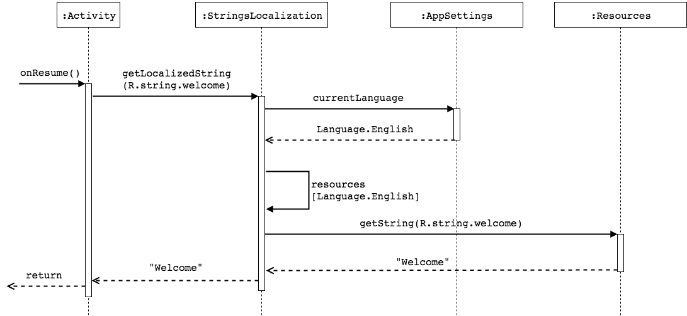

Android resolves language- and culture-specific resources based on the system locale setting. This is a desired behavior that makes perfect sense. Despite it's officially not encouraged you may still need to write an app that allows the user to change its language without leaving it. In this article I will show you one of the possible ways to implement such feature.


## The big picture

Before I start with the code, let me explain how this whole mechanism will work.

I'm going to translate all the strings visible on the current application screen during the lifecycle callbacks (e.g. `Activity.onResume()` and `Fragment.onResume()`). This approach is easy to implement and understand and it currently covers all my needs. I won't try to force the app to translate itself magically. This means some overhead in the code for re-initializing all the texts and views which need to be translated.

The following diagram illustrates the flow of getting a localized string by Activity:



The flow involves `StringLocalization` object which has a map containing all the available `Resources` and that uses `AppSettings` to get current language that was set by the user.

## Storing user preferences

To keep the chosen language between app restarts, we will store the preference in `SharedPreferences`. But first, let's declare an enum class to represent our languages and an object with locale codes to avoid hardcoding values in various places.

```kotlin
object LocaleCodes {
    const val ENGLISH = "en"
    const val POLISH = "pl"
    const val GERMAN = "de"
}

enum class Language(val locale: Locale) {
    English(Locale(LocaleCodes.ENGLISH)),
    German(Locale(LocaleCodes.GERMAN)),
    Polish(Locale(LocaleCodes.POLISH));

    companion object {
        val DEFAULT = English

        fun fromLocale(locale: Locale): Language =
                values().firstOrNull { it.locale.language == locale.language } ?: DEFAULT
    }
}
```

Additionally, the enum class has a static `DEFAULT` value and `fromLocale` function which we will use later on.

Now, let's implement a class for storing user preferences:

```kotlin
interface AppSettings {
    var currentLanguage: Language
}

class SharedPrefAppSettings(
    private val sharedPref: SharedPreferences,
    private val androidConfiguration: Configuration
) : AppSettings {

    private var currentLanguageCache: Language? = null

    override var currentLanguage: Language
        get() {
            val cachedValue = currentLanguageCache

            return if (cachedValue == null) {
                val storedValue = sharedPref.getString(APP_LANGUAGE_KEY, "")
                val storedLanguage = try {
                    Language.valueOf(storedValue)
                } catch (ex: Exception) {
                    null
                }

                val language = storedLanguage ?: getDefaultLanguage()

                currentLanguage = language

                language
            } else cachedValue
        }
        set(value) {
            currentLanguageCache = value
            sharedPref.edit().putString(APP_LANGUAGE_KEY, value.toString()).apply()
        }

    private fun getDefaultLanguage(): Language {
        val locale = if (Build.VERSION.SDK_INT >= Build.VERSION_CODES.N) {
            androidConfiguration.locales[0]
        } else {
            androidConfiguration.locale
        }

        return Language.fromLocale(locale)
    }

    companion object {
        private const val APP_LANGUAGE_KEY = "app_language"
    }
}
```

I don't like to say the code is self-explanatory so let me tell you what's going on.
Storing the chosen language is quite simple: we cache its value in `currentLanguageCache` and store it in `SharedPreferences` at `APP_LANGUAGE_KEY`.
Getting the language is a bit more complicated, especially when the app is launched for the first time:

* we use the cached value if it's present
* if we don't have it yet, we read from `SharedPreferences`
* then we try to get our enum from that value
* if we can't get it properly (because there was no value in `SharedPrefereces` or we read something that can't be represented by our enum), we get a default language using `getDefaultLanguage()`

  * we read the `Locale` the app was started with from `Configuration` (it comes from `context.resources.configuration`)
  * then we try to get our enum value from that `Locale`
  * in worst case scenario we end up with the `Language.DEFAULT` value
* we cache the resulting language by calling the setter: `currentLanguage = language`

We will use Dagger to inject `SharedPrefAppSettings` implementation of the `AppSettings` interface thanks to this simple module:

```kotlin
@Module
class AppSettingsModule {
    @Provides
    @Singleton
    fun provideAppSettings(context: Context, configuration: Configuration): AppSettings =
            SharedPrefAppSettings(PreferenceManager.getDefaultSharedPreferences(context), configuration)
}
```

## Initializing locale-specific resources

In order to access resources defined for a specific locale, we need to do the following:

* make a new copy of your current resources `Configuration`
* set the desired locale with `setLocale()`
* create a configuration context with `context.createConfigurationContext()`
* get resources from the new context

so the code can look like this:

```kotlin
val conf = Configuration(context.resources.configuration)
conf.setLocale(Locale(LocaleCodes.ENGLISH))
val localizedContext = context.createConfigurationContext(conf)
val localizedResources = localizedContext.resources
```

Now we can generate a map of resources for each language. As usual, there are plenty of ways you can do it. In this example we use Dagger [map multibindings](https://google.github.io/dagger/multibindings#map-multibindings).

First, let's define a `LanguageKey` annotation so that we can have a map with `Language` enum keys:

```kotlin
@MustBeDocumented
@Target(AnnotationTarget.FUNCTION)
@Retention(AnnotationRetention.RUNTIME)
@MapKey
annotation class LanguageKey(val value: Language)
```

Next, we use it to generate multiple `Resources`:

```kotlin
@Module
class LocalizationModule {

    @Provides
    @IntoMap
    @LanguageKey(Language.English)
    fun providesEnglishResources(context: Context): Resources =
        getLocalizedResources(context, Language.English.locale)

    @Provides
    @IntoMap
    @LanguageKey(Language.Polish)
    fun providesPolishResources(context: Context): Resources =
        getLocalizedResources(context, Language.Polish.locale)

    @Provides
    @IntoMap
    @LanguageKey(Language.German)
    fun providesGermanResources(context: Context): Resources =
        getLocalizedResources(context, Language.German.locale)

    private fun getLocalizedResources(context: Context, locale: Locale): Resources {
        val conf = Configuration(context.resources.configuration)
        conf.setLocale(locale)
        val localizedContext = context.createConfigurationContext(conf)
        return localizedContext.resources
    }
}
```

And voila, we can now inject `Map<Language, Resources>` with Dagger.

## Providing string resources

Finally, it's time to add a helper class that will provide string resources from the generated map.

```kotlin
@Singleton
class StringsLocalization @Inject constructor(
        private val settings: AppSettings,
        private val resMap: Map<Language, @JvmSuppressWildcards Resources>
) {

    private val log = logger

    fun getString(@StringRes stringId: Int): String = resMap
            .getOrElse(settings.currentLanguage, this::getFallbackResources)
            .getString(stringId)

    private fun getFallbackResources(): Resources {
        val defaultLanguage =
                if (Language.DEFAULT in resMap) Language.DEFAULT
                else resMap.keys.firstOrNull()

        if (defaultLanguage != null) {
            log.error("Current language resources not found. Fallback to: {}", defaultLanguage)
            settings.currentLanguage = defaultLanguage

            return resMap[defaultLanguage]!!
        } else {
            throw ResourcesNotFoundException("String resources not found")
        }
    }
}

class ResourcesNotFoundException(message: String) : RuntimeException(message)
```

Both `AppSettings` (i.e. `SharedPrefAppSettings`) and the resources map will be injected by Dagger.
You can see the `getString()` method that takes string resource ID, just like the regular `Activity.getString()` method. It will get the language from `AppSettings` and use it to retrieve the proper `Resources` from the map. If the map doesn't contain anything at that language key for some reason, we will use `getFallbackResources()` method as a last resort before failing to provide a string.

## Making it work

All we have to do now is to inject `StringsLocalization` object into the Activities and Fragments and use it to translate whatever we need.
But first, let's write a helper interface to make this task less boilerplate:

```kotlin
interface HasStringsLocalization {
    val stringsLocalization: StringsLocalization
}

fun HasStringsLocalization.getLocalizedString(@StringRes stringId: Int): String =
        stringsLocalization.getString(stringId)
```

So now we can access strings with `getLocalizedString` easily like this:

```kotlin
class WelcomeActivity : AppCompatActivity(), HasStringsLocalization {

    @Inject
    override lateinit var stringsLocalization: StringsLocalization

    override fun onResume() {
        super.onResume()
        setTranslatedTexts()
    }

    private fun setTranslatedTexts() {
        welcomeText.text = getLocalizedString(R.string.WELCOME)
        // and more...
    }
}
```

*Side note: I skipped some code here to make the example shorter and more readable. The full implementation could involve some kind of injection with Dagger, layout inflation, etc.*
