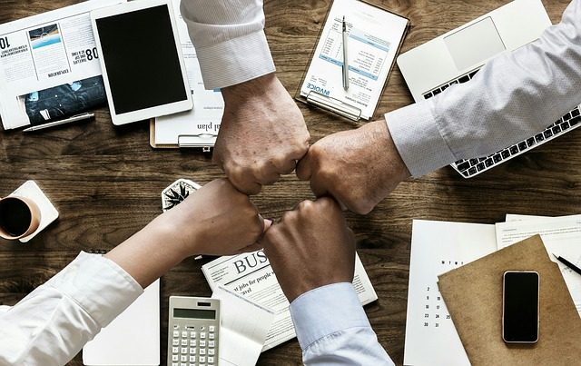

Last week I attended a climbing competition dedicated for girls only to celebrate the international women’s day. It was held quite far away from my home town and on my way back I was wondering why I was so excited to attend a climbing competition for women and at the very same time I am so sceptical about any girls-only programming events.

**Anyone will agree that men and women are built differently when it comes to both physique and physiology**. In general, climbing men benefit from being stronger, taller and more dynamic while climbing women are more flexible, have smaller fingers and weight less. In non-official climbing competitions, especially in qualifiers, it is common to have the same routes both for men and women. This is why I really wanted to take part in the girls-only comp: no too long moves, no too physical moves, in general no too men-style routes. No excuses! :)

Now, how does it conform to programming girls-only events? The obvious reason of having them would be that women’s brains are different than men’s in terms of programming skills. And I don’t think it’s true. **Both women and men use the same programming languages, the same tools and environments, the same machines**. The approach of a teacher on a course or the type of a presentation on a conference should not be gender-specific.

One may say it’s easier and more comfortable to start programming in a group of females. But eventually the day will come and you will have to face the real programming world, where there are boys. Quite a lot of them actually :) And you will probably meet a rude one, who will depreciate your skills just because you are a girl. But this is not because he is a man. This is because he simply is rude.

So it doesn’t matter if you are a girl or a boy, if you are black or white, if you are a Pole or a Russian. **If you want to become a programmer, just find other enthusiasts and start doing it**. In sport if you train with better people, you progress faster. This is also true in any other domains. Find the best programmers to learn from them. Statistics say it will probably be a man. If you are a girl, just start coding and change the statistics :)
