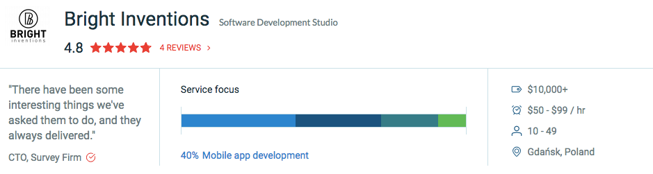

[Clutch](https://clutch.co/profile/bright-inventions) is a ratings and reviews research-based firm in Washington, D.C., which conducts phone interviews with our past clients to evaluate our level of performance. Our clients have rated us with 4.8 out of 5 stars! This high level of quality is important to our clients and even more important to us here at Bright Inventions.

We focus on intuitive [software development](https://themanifest.com/app-development/how-small-businesses-build-mobile-apps) and strive to give our clients a wide variety of effective and quality software solutions. Apart from mobile development we also focus on Blockchain expertise, aiming to innovate and come up with creative solutions for our clients utilising the newest technologies. This commitment has shined through to our clients, and here are a few of them detailing our work in their Clutch reviews:

*“They’re responsive, responsible, and enjoy their work. Most other companies provide standard and boring solutions, but Bright Inventions is innovative and engages with their work in new ways.”*

*“I liked that Bright Inventions was quite attentive to details. That's not always the case with developers. They actually care a lot about the design. You had to be almost perfect, and that was fine with us.”*

“*We trust them and their work so much that they have the liberty to make a lot of different decisions that aren’t typically allotted to contractors. They’re essentially responsible for certain pieces of our business; that’s how much we rely on them.”*

Along with our impressive rating on Clutch for our overall quality, we also received a perfect score for our cost. We aim to be completely transparent and deliver our client the most cost effective option possible, and it would seem that we deliver! One of our clients described their experience by stating, *“They tried to be responsible, so whenever we came up with new ideas, they made it clear that it could extend the project and make it more expensive. Otherwise, they could have agreed to everything we wanted them to do, and it could have taken ages to complete. I like dealing with them.”* We hope to treat each and every one of clients with this same level of commitment and transparency!
