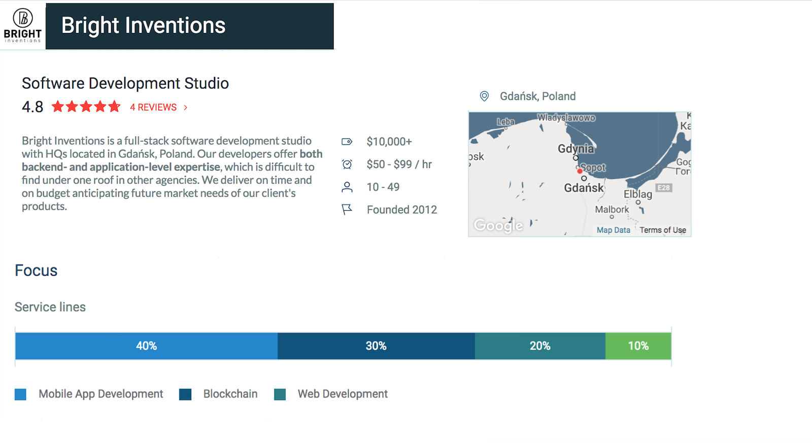

As a digital business development agency, Bright Inventions specializes in the development of mobile applications. By providing our clients with smart web and backend solutions, along with mobile app construction services, we hope to equip our clients with the resources they need to come out on top in their respective industries. 

It is by virtue of our diligent work ethic that we were featured on Clutch’s recent press release for the [Top Polish App Developers](https://clutch.co/app-developers/poland)! Clutch’s coverage of app developers in Poland includes over 200 firms, so we are proud to be highlighted as one of the best.

 

Because of our impressive work and success, we have also been recognized as top [app developers](https://themanifest.com/pl/app-development/companies#brightinventions) and [web developers](https://themanifest.com/pl/web-development/companies#brightinventions) in Poland by Clutch’s sister website, The Manifest - a research platform meant to aid buyers in the awareness, discovery, and decision-making process of selecting an agency to hire for a project. Our profile on The Manifest gives a brief description of our services as well as our notable projects and clients.

Clutch is a ratings and reviews company based in Washington, DC that covers technology development, marketing, design and related digital services so that users or business buyers can find the most suitable partners to assist on their projects.

To strengthen a firm’s attractiveness on Clutch, it must demonstrate a capacity to produce high quality results along with assembling a growing archive of positive reviews. Our rigorous standard for excellence has led our esteemed clients to give us a 4.8-star rating out of 5, leaving such reviews as:

_"We’ve had a great collaboration in terms of both production and communication."_ - Artjom Pusch, Former CEO, Therap.io.

_“Besides being extremely proficient in their field, they care about our business and want us to succeed.”_ - Founder, Retail Management System.

We truly look forward to initiating more client relationships and assisting them in reaching their professional goals. For more great reviews about us, take a look at our [Bright Inventions](https://clutch.co/profile/bright-inventions) profile on Clutch!
