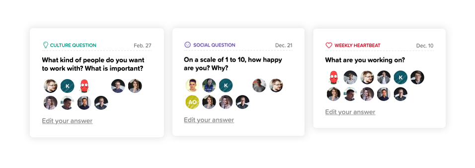

The core of business is to build and maintain a great environment so everyone can do their best.  Without a comfortable environment where employees feel they can do their job, you will find that the turnover may claim its victims. But, have you ever wondered if there is a key to create a perfect workplace? I dare to say it may reach far deeper than corporate benefits and cool offices, and focus more on relationships. The relationships are frequently why some workers love their job and hate to leave, and why job applicants have a desire to work at your place.

When I was joining Bright Inventions there were 9 people in the team and everything was easy to set up. Scheduling a meeting, being up-to-date with projects, discussing everyday issues… It was enough to talk with each other and to be honest everyone knew everything and everyone knew what should be done. While the team has started growing, the situation got complicated a bit as there were much more things to discuss, but days were still 24 hours long. That time we decided to use a perfect tool that should help us maintain team’s happiness and satisfaction, and at the same time improve communication - [Know Your Team](https://knowyourteam.com/) (then Know Your Company) - an employee engagement and feedback software with a mission to help people become happier at work. The founder, Claire Lew, speaks internationally on how to create more open and honest workplace and how to become a better manager, but also a better team member and colleague in general. I really recommend you checking her [Medium](https://medium.com/@clairejlew) or [company's](https://knowyourteam.com/blog/) blog as a source of sheer inspiration how collaboration and effective communication should look.

## **Let us break the ice**

We all know that working together on a project is not everything. In order to build a long lasting and genuine relationship we need to get to know each other a bit better. In Know Your Team (KYT) each new person who joins our team gets a few introductory questions, so called IceBreakers. It is a great way to start a new relation between a new employee and the rest of employees in the organisation. It is great way to show that apart from X years of experience you have also hobbies, family or favourite kind of pizza.

## **Let us talk**

Know Your Team is a tool where we can ask questions, give recognition and feedback, express our complaints or say what can be done to make our company a better place. We talk there about our company culture, work organisation, time management and we also share there updates on our work progress. Everything is done on weekly basis without redundant breaks. Speaking bluntly, it is the tool which helps you stay up-to-date with your team’s life and build (in consequence also improve) our relationships.

### 1. Heartbeat Checkins

Sharing work/progress updates with the team is something we can do every Monday by answering  a simple question "What are you working on?". It does not only save time and energy, but also gives each and every team member an opportunity to be on the same page of current issues and projects.  And it also gives an opportunity to talk about some interesting key points later during a coffee break or lunch.

### 2. Culture questions

Each Wednesday we get one question to uncover how the team feels about the work and culture. At times we add our own questions and we can also take advantage of a huge base of questions suggested by managers from other companies.  In this way we are able to work on our company culture all the time and learn something new every week. If there is a problem, we can handle it immediately. Culture questions encourage the team to raise all the issues smoothly and embrace transparency. 

### 3. Social questions

On Fridays we have social non-work-related questions such as “what is your favourite ice-cream flavour" or “what is your best childhood memory” or just how happy your are at the moment. Having a strong relationships at work drives employee engagement, but it does not happen automatically. Building strong coworker relationships takes time and effort. It is not only about work itself. Real team is not only a bunch of individuals working together, it is a group of people who like each other, have similar values and feel that they are an integral part of your organisation. 

Answering KYT questions is not only a regular and ongoing review of how team members are performing to their objectives, but also how they feel about everyday issues inside and outside work.  Using the software is entirely uncomplicated as you get questions via email and then you are  redirected to the KYT board. It is just a matter of few seconds.

## **Let us build effective communication**

Know Your Team when used properly can really reduce the amount of wasted time in the company.  It provides a high-level overview of current issues and work progress. I believe that regularity of the questions and their insightfulness help to build trust and loyalty. The questions are frequently the sparks for further discussion. I also use KYT to plan and prepare for our 1:1 meetings, which are a great way of strengthening an individual relationship with each team member and talk about issues raised in regular questions. It is an occasion for face-to-face communication that we do not always have time for on daily basis. And above all, it is time to express concerns, and also appreciation and recognition. Time you may be spending on ad hoc conversations or writing emails can be condensed here utterly.

Of course, all this does not mean that now everything is perfect . There are still some communication problems, but we are consistently trying to work on them. Yet always the first step to solve a problem is to find out about it, and KYT gives space to do that. It has become the base for our communication needs. It helps us in knowledge dissemination and bringing everybody closer together, by which it is at the same time a tool of achieving organisational and personal goals.
