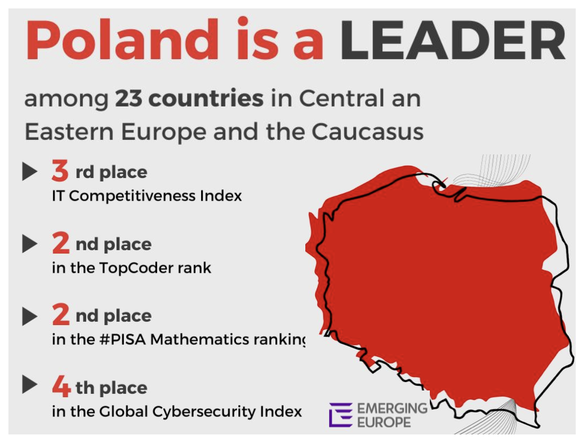
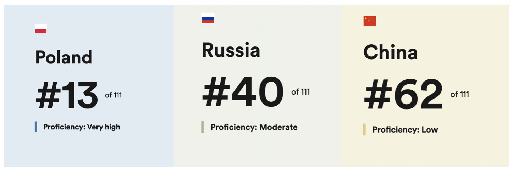

**Let us be honest: outsourcing your software development to a different company or – even more so – country, is always a huge step. So, it is natural that you want to look into every possible option. Now, given that you have come across this post,  we are assuming you are at least a little intrigued with what it is like to work with Polish developers. Are they really as good as they say? How easy is it to communicate with them in English? What about their work ethics? Wonder no more!**

We have created a list of five things you may have always wanted to know about Polish developers, but were too afraid to ask. Let us take a look. 

## 1. Poland is a leader among countries in CEE

Poland has been recognized as one of the leading countries in Central and Eastern Europe (CEE) for software development. The Future of IT report 2023 gives a regional overview of the IT sector in the region, available talent, costs as well as room for potential growth. Polish developers have gained prominence in the tech industry due to several factors. 

###### Source: https://emerging-europe.com/future-of-it

You also might have heard of a site called [HackerRank.](https://www.hackerrank.com/) It’s where hundreds of thousands of developers from all around the world test their skills by completing various coding challenges. The results of HackerRank’s [Programming Olympics](https://blog.hackerrank.com/which-country-would-win-in-the-programming-olympics/) say it all: Polish developers took third place (an average score from across all types of tech challenges in areas such as algorithms, Java, data structures, and many others).

Poles were only two points short from the top two countries on the list, China and Russia. So, who knows what the next round of the Olympics might bring?

## 2. Polish people speak English very well

I am sure you have read some dreadful stories about how outsourcing to a foreign country can be a real nightmare, as you might end up working with a team that barely speaks any English. This won’t be your worry if you choose to work with [a software agency from Poland](/). English is by far the most widely spoken foreign language in the country (a huge factor being that you can only graduate from high school if you pass a foreign language exam).

Take a look at Poland’s [English Proficiency Index](https://www.ef.com/wwen/epi/regions/europe/poland/) with the position in Europe 11 of 35, 13 out of 111 countries in the world today, and with the high proficiency as compared to Russia and China (so, the other two countries on the HackerRank podium):

###### **Source:** https://www.ef.com/wwen/epi/regions/europe/poland

Bear in mind that these statistics show Poland as a whole – not just the IT crowd. Looks encouraging, doesn’t it?

## 3. Polish developers are known for strong work ethics

There’s no better way to put this than in the words of the [European Committee](https://ec.europa.eu/eures/main.jsp?catId=2789&countryId=PL&acro=lmi&lang=en&regionId=PL0&nuts2Code=%20&nuts3Code=&regionName=National%20Level): “Poland's greatest asset is its people. What stands out is their ambition, motivation to learn, high work ethics, loyalty and rare entrepreneurial spirit”. This is clearly reflected in the way Polish developers work, prioritize, as well as in their understanding of the word “done”.

You’ll also notice that Polish developers don’t give up on challenging tasks all that easily. As a matter of fact, HackerRank listed Poland as the 2nd most resilient group of developers in the world – a rank it shares with Hungary. Additionally, Poland is the 6th largest economy in the European Union, with strong international business presence.

There are thousands of global companies with significant business operation units located in Poland. These include, for instance, JP Morgan Chase, Google, Uber, Goldman Sachs, EY and McKinsey & Company, among many, many others. This also means that many programmers at Polish software houses have previously worked and gained experience at these and other multinational organisations.

## 4. Poland is GDPR compliant – meaning, your data is safe and sound

Safety is another crucial point you can cross off from your potential worries’ list. Being part of the EU, Polish software companies are GDPR-compliant and the data you disclose to them is protected on all fronts (to demonstrate, here’s an example of our own [privacy policy](/privacy-policy/) at Bright Inventions).

When you work with Polish software houses, your data is kept secure both by advanced tech, as well as a legal team who works themselves to the bone to keep your data and software protected, 24/7. And now last, but not least…

## 5. The time difference is acceptable, with only 6 hours separating Poland and the U.S. East Coast

Poland is ideally located if you want a team who’s available regardless whether you’re based in the Western or Eastern hemisphere. There’s a 6-hour difference between Poland and New York, meaning that both sides can comfortably communicate during office hours.

So, for instance, if you want to schedule your sprint planning call during your morning coffee at 9 a.m., EST, your developers will just have finished lunch, with 3 p.m. on the clock.

**Hopefully, we have answered at least some of the questions you may have about working with Polish developers. If there is anything else you would like to know, reach us out. We would love to tell you more!**
