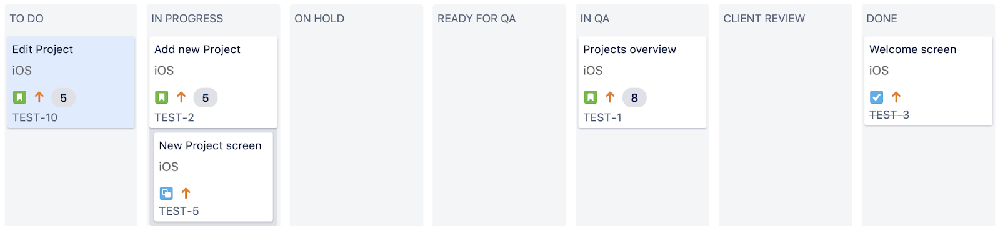

It is a truth universally acknowledged, that a well organised company which runs multiple projects, must be in want of an issue tracking solution. At Bright Inventions we value effective solutions so a choice of the issue tracking tool was an important one. We had a vision of the process we’d like to follow, we just needed a tool that would allow us to reflect it in an easy to use form which , that would not hinder the developers’ work but would support it. That’s how we decided to use [Jira](https://www.atlassian.com/software/jira). 

The tool itself is obviously not enough - the way you use it is far more important. [Jira sometimes has a reputation of being overly complicated](https://deviniti.com/atlassian/why-people-say-they-hate-using-jira). And indeed, at first it might seem like taming a 7 headed dragon. With magical recovery properties. But once you realise what is it that your dragon needs, it can become your favourite pet. Still wild at heart and keeping you on your toes, but super useful at the same time. As 7 headed dragons are. The time spent on adjusting the settings to your needs, from user management to issue layout, usually pays off and in effect you can obtain a product tailored exactly to your needs. 

So here we are with a few things that we’ve learned along the way and that work for us. Maybe it will help you with your Jira dragon as well.

## 1. Approach

Most of our projects are based either on Scrum or Kanban approach, depending on the project characteristics. Scrum is usually chosen for the better defined projects, with a clear schedule. It allows to better control the progress and estimate the effort. When we work in a less regular way or in a maintenance/bug fixing phase, we usually opt for Kanban, which gives us more flexibility.  The choice of a real project development approach forms a basis for the Jira project set-up. 

## 2. Workflows

A workflow is where you define the statuses that different types of issues can be in as well as the transitions between them. While Jira is equipped with multiple ready to use workflow schemes, for different project development approaches, the experience we gained along the way, helped us to build a few of our own schemes. Each project board can have one workflow assigned to it. These are the dance steps for your issues to perform on the dance-Board.  The first thing to consider are the states a particular issue can be in during the project. The basic workflow for our project Boards includes the following set of states :

* To Do (or Selected for Development in Kanban projects). -> an issue should be handled in the nearest future, be it a Sprint or just a priority-based schedule. Issues do not have to be assigned to anyone specific at this stage. In Progress -> a developer has started to work on the issue
* On Hold -> for an external reason, the work on a specific issue had to be put on hold. It can be because of a lacking API or a need to wait for some information from the Client. 
* Ready for QA -> the issue is done from the developer’s perspective. It’s been tested by him or her and now it’s ready for internal QA and code review, depending on the feature. A person who will be responsible for the QA should be assigned (like a dedicated Quality Assurance person or another team member). 
* In QA -> internal review has begun, a person assigned to for the task is currently testing a given feature. If some kind of problems are discovered at this stage, an issue is coming back to the person responsible for development and depending on the situation gets ‘In Progress’ or ‘On Hold’ status.
* Client Review -> an issue was accepted by the internal QA and is now considered Done by the team. We usually ask the Client to do some acceptance testing, before the end of the Sprint, or, in the case of Kanban, before a feature can be deployed to production, to make sure it meets his or her expectations.
* Done -> when Client accepts the feature, it is considered Done. If any problem occurs with a given feature afterwards, it is considered a Bug and should be issued separately. 

  In addition to these states, there are usually Backlog or Open tasks, that have been issued as requirements, but should be dealt with at later stages and are not displayed on the Board. A more general state like Closed is also useful, as you might want to close an issue rather than marking it as Done for different reasons, like them being invalid or duplicates.

## 3. Issues structure

To organise the project’s features we usually use the standard Epics > User Stories > Tasks > Subtasks + Bugs structure. While Epics and User Stories focus mostly on the functional aspects, (from the user’s perspective), Tasks and Subtasks concern the development effort needed to implement a given feature.  Jira treats User Stories and Tasks as the same level kind of issue types and both can have sub-tasks. Nevertheless, there’s no hierarchy relation between the two types. In some bigger projects we lacked an additional level of hierarchy thus we created a custom relation Requires/Is required by that can be formed between a User Story and a Task (a User Story requires a specific Task to be implemented).

## 4. Issue layout

Each issue type has a slightly different layout. And yes, as you might expect, this is also configurable. The kind of information you’d need for a user story might be different to the one you’d add to a task. From a project manager’s perspective (mine, that is) user stories are a bit more interesting, so I’ll use them as an example. We aim to keep as much relevant, organised info on each feature in Jira as possible. A Jira user story is not just “As a user I want to reset my password”. It’s also a place to add design links, acceptance criteria, estimation ([story points](https://www.mountaingoatsoftware.com/blog/what-are-story-points) work well at this level of abstraction).  We always try to divide each bigger feature (Epic) into as atomic user stories as possible. This way you’ll be able to analyse the expected behaviour in more detail. And if your acceptance criteria looks more like a novel than a short story, it can mean that you’ll need to separate a user story into smaller ones. Think of it as an anecdote you tell at a party. If it has so many twists of plot that your audience would lose its interest and go look for more drinks, you might want to consider simplifying it. And leave the rest for another story.  

We also like to use labels for filtering and grouping our issues. In mobile apps it’s usually platform based - Android/iOS, in web apps it can be backend / frontend kind of setting.  Another Jira feature that we like to use, especially for our Kanban projects, is versioning. By defining Releases and then assigning issues to them it’s clear which feature will be included in which delivery.

## 5. Scaling

Projects developed at Bright Inventions vary in size, which is why our approach to Jira organization also needs to vary. The size of the team and the project scope usually influence the number of Boards and issue types we use in a project. If a project includes extensive design efforts, it’s worth considering adding a separate set of design specific issue types, with their own structure and workflow (ex. Design Story/ Component that can be in Concept state, Ready for Development etc.). Another addition might be a dedicated epic board with a defined epic specific workflow as well (ex. an Epic can be in Plan, Design, Build states etc.). If security or safety issues are critical from the project’s perspective, adding another board with security/safety dedicated type of issues and organising them in a Backlog form is also a good solution. On the other hand, in smaller projects , we might stick to the basic set or even less than that. When a Client does not feel like using our Jira board, we might skip Client Review column altogether. Which brings us to...  

## 6. Cooperating with clients

Close cooperation with the client lies at the basis of the approach we use at Bright. As we manage the features and progress in Jira, it’s only natural that our clients should also have the access to Jira backlogs. If the project is run on our Jira instance, we invite the clients to the project they are involved in. Making sure you’ve got the right permissions setup is crucial, both on the app and project level. We also like to attach a customised message to a client Jira invitation e-mail, informing the client about the aspects of our process that he or she will be involved in. We found that it’s helpful to specify which statuses are the ones that need their action as well as informing about the types of issues they will work with. If the client will also be engaged in issuing bugs, it’s good to include short template for bug description. Would you expect the client to specify steps to reproduce, or app version, or maybe environment where the bug appeared? Preparing such a template will make the bug raising a smoother process and decrease the time needed for analysing the problem. Nobody needs ‘cannot reproduce’ or ‘it does work for me’ kind of conversation ;) 

## 7. Everyday life

If you’ve got everything set, your workflow tailored to your needs, backlog filled with features and tasks, it’s time to put the plan into practice. This is when the ideas get verified, this is what the whole process was prepared for. One of the most important lessons we’ve learned was to record everything in Jira and prioritise traceability. If there are any doubts about a specific issue, some changes to be made, it’s a good practice to keep the conversation in the comments section of a given issue. This way, we can always go back and check why certain decisions were made. Not to mention keeping your Jira issues state up to date.It saves a lot of back-and-forth about the current state of the issues with the client as well as the time spent on stand-ups.

Hope this general overview of our approach to Jira was helpful. It’s always a journey and a living process. And a lovely living dragon. With 7 heads. Keep your eyes open.
