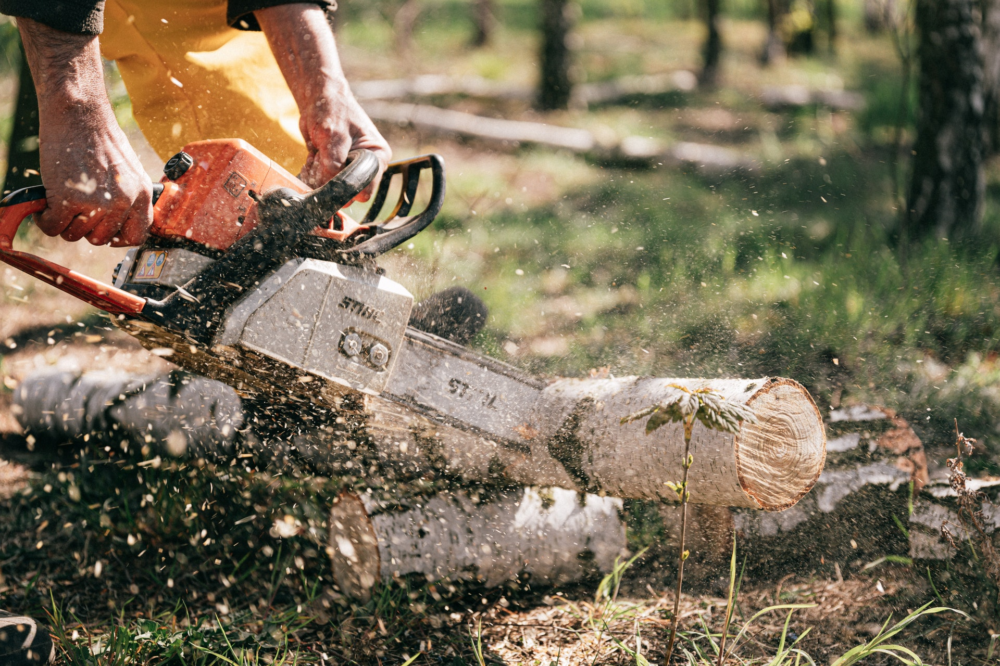
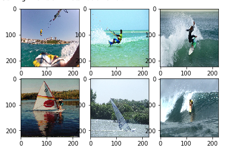

In this item, I want to share with you the core idea behind transfer learning. We will solve a simple classification problem where we will try to correctly classify surfing, windsurfing and kitesurfing images but you can easily solve different problems relying on described steps


Transfer learning is a very important and broad research problem. In general, it relies on transferring domain knowledge from one solved task to another unsolved one (but somehow related to the solved task). Consider following educational example - let's say you know how to ride a bike and you'd like to learn how to ride a scooter then it should be easier as there are some common principles like knowing that probably you should hold handlebar. Another example - if you know how to code then probably you are capable of fixing your auntie's computer, right? 

Here we will focus on the usage of transfer learning in computer vision problems. We will take advantage of one of the models with clever architectures (ResNet, MobileNet, Inception, etc.) that were trained on ImageNet dataset. ImageNet consists of enormous amount of images and each labeled with one of 1000 classes of various kind (e.g. `black widow` , `cassette player`  or `containership` but I can't see anything related to `surfing`). Those models are doing extremely well in dealing with recognizing classes on the provided image. Using pre-trained models would be especially beneficial when you have a very limited dataset. It may be even impossible to get a well-performing network from scratch. We can say that such models consist of 2 parts - feature extractor and classifier. We want to utilize feature extractor and replace classifier as we will classify 3 different classes instead of 1000. We want to keep feature extractor, especially first layers due to way convolutional layers work - they learn hierarchical representation and that means first layer will learn to find very general features like vertical or horizontal lines, next layers may learn something more complex like circles and so on. The last layers will be most elaborate and that's fine as long as our problem is similar to problem solved with a pre-trained model, if not then still we can benefit from such model by for example unfreezing some fraction of the layers.

## Prepare dataset



We need to create a dataset that will be used for solving our problem. If you don't have a dataset then you can just google for some of the widely available crawlers fetching images from google images or rely on services for that like Microsoft's `Bing Image Search API` ([great tutorial on creating dataset](https://www.pyimagesearch.com/2018/04/09/how-to-quickly-build-a-deep-learning-image-dataset/)). I'll go with Bing Image Search API.

I've fetched 90 images of windsurfing, 82 of kitesurfing, and 98 of surfing. They are separated and the number of images of each class isn't equal but overall that's good enough.

 I've stored them accordingly in `dataset/windsurfing`, `dataset/kitesurfing`, `dataset/surfing`. 

Plot some images:

```python
import glob, random, os
from keras.preprocessing import image

base_path = "dataset"
img_list = glob.glob(os.path.join(base_path, '*/*.jpg'))

for i, img_path in enumerate(random.sample(img_list, 6)):
    img = image.load_img(img_path, target_size=(IMG_SIZE, IMG_SIZE))
    img = image.img_to_array(img, dtype=np.uint8)

    plt.subplot(2, 3, i+1)
    plt.imshow(img.squeeze())
```



Split data into training (80%) and testing (20%) set. With ImageDataGenerator we can normalise images by setting value for each pixel between `0` and `1` - original value with range `0` to `255` would make it much harder for a network to converge. 

```python
from tensorflow.keras.preprocessing.image import ImageDataGenerator

data_gen = ImageDataGenerator(
    rescale=1./255,
    validation_split=0.2
)

train_generator = data_gen.flow_from_directory(
    base_path,
    target_size=(IMG_SIZE, IMG_SIZE),
    class_mode='categorical',
    subset='training',
    seed=37
)

validation_generator = data_gen.flow_from_directory(
    base_path,
    target_size=(IMG_SIZE, IMG_SIZE),
    class_mode='categorical',
    subset='validation',
    seed=37
)
```

## Download model with pre-trained weights

Then we download the model with pre-trained weights. Let's pick MobileNetV2. `include_top` should be set to `False` because we don't want its classifier which is the last layer with 1000 classes compatible with ImageNet - we need to create our own classifier. Besides, let's freeze weights of a downloaded model so that we will train just our own classifier layers and downloaded weights will remain the same. 

```python
base_model = tf.keras.applications.MobileNetV2(
    input_shape=IMG_SHAPE,
    include_top=False,
    weights='imagenet'
)

base_model.trainable = False
```

Create custom layers so that last one fits our outputs which is 3 neurons (respectively for surfing, windsurfing, kitesurfing)

```python
model = tf.keras.Sequential([
    base_model,
    keras.layers.GlobalAveragePooling2D(),
    keras.layers.Dense(64, activation='relu'),
    keras.layers.Dense(3, activation='sigmoid')
])

model.compile(lr=0.005, loss='binary_crossentropy', optimizer='adam', metrics=['acc'])
model.summary()
```

## Train and validate

```python
batch_size = 16
epochs = 10
steps_per_epoch = train_generator.n // batch_size
validation_steps = validation_generator.n // batch_size

history = model.fit_generator(
    train_generator, 
    steps_per_epoch = steps_per_epoch,
    epochs=epochs,                             
    validation_data=validation_generator, 
    validation_steps=validation_steps
)
```

Train the network for a few epochs and check how validation loss and accuracy behave in order to prevent overfitting. Dataset is pretty small and after 10 epochs model reaches ~90% of validation accuracy. 

One of the further improvements you can do is to unfreeze some of the layers and train a model for a few more epochs.

Then save your model to file so you can use it later. 

```python
tf.keras.models.save_model(model, "blog_model.h5")
```

I highly encourage you to take advantage of created model and use it in your android application ([check out my tutorial on that](/blog/image-classification-tensorflowlite-android/)). To transform such model to be mobile friendly convert it to TensorFlow Lite and you are ready to go. However [most of architectures can't be used directly on mobile devices](/blog/are-we-ready-for-deep-learning-on-mobile-devices/) due to lack of support for some operators as well as memory constraints but if you go with some that are simple enough or were intended for embedded devices like MobileNet then it shouldn't be a problem.

```python
converter = tf.lite.TFLiteConverter.from_keras_model_file("blog_model.h5")
tflite_model = converter.convert()
open("blog_model.tflite", "wb").write(tflite_model)
```
