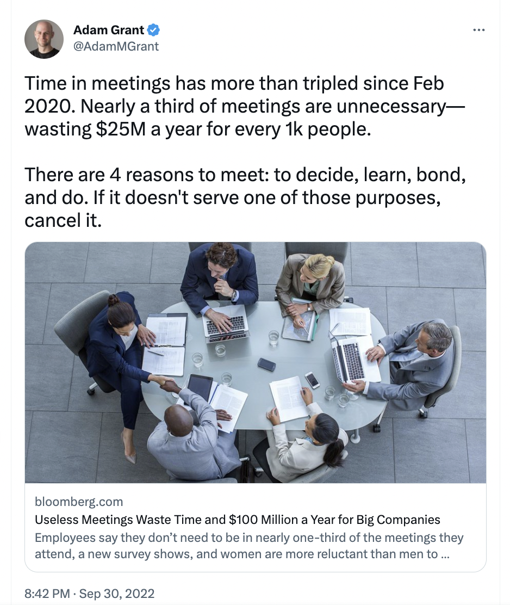

If you have just begun your manager’s career, probably there are many questions in your mind - what to start with, where to find the best solutions, what is the most important element in the process, how to take care of people in your team etc. One may say that there is no better way than practice, but it does not have to be the only way. Some answers can be found in the books. 

If you are a first time manager and **you are not sure what your responsibilities are, how to organise your work, what is the priority, how to communicate with people in your team or to what extend your should control or supervise your team’s work, it might be worth taking a look at the books below.** I believe you can find there inspirations, guidelines, motivations and true reflections of yourself. **These books can support you, cheer you up and give advice when you do not know which direction to go.** 

## **\#1 *The New One Minute Manager*, Ken Blanchard & Spencer Johnson** 

Micromanagement is never the answer. If you need high quality work and cooperation in your team, you can take advantage of **three simple techniques: one minute goal, one minute praising and one minute reprimand.** 

**💪 *One-minute goal*** - people should always see the target and know what they want to complete. **They should understand which goal has the biggest impact. As a manager your task will be helping people in the team to see and clarify their goal.** The goal definition and deadline should take maximum one paragraph so that you will be able to read and analyse it in one minute. When goals are concisely defined you can just take a quick look at them and focus on the most important things to do. The effects criteria and expectations are clear for both sides and you can manage your time wisely and effectively.

**🙌 *One-minut praising*** - people in the team should be able to look for solutions to their problem by asking themselves appropriate questions. **The manager’s role is to observe what they do right, appreciate the efforts and encourage to learn further.** It will help team members feel more confident and appreciate the efforts of each other.

**🙏 *One-minute reprimand*** - your role as a manager is also to give feedback about what exactly was done wrong and it should happen just after it takes palce. **What should follows is personal reassurance that the failure or negative behaviour does not affect the overall account of the person. The feedback should not affect your team member’s self-esteem.**

To cut the long story short watch the video below: 

<YouTubeEmbed url='https://www.youtube.com/watch?v=v3NLetsLYu4&t=1s' />

## **\#2 *The First Time Manager*, Loren B. Belker, Jim McCormic, Gary S. Topchik**

Giving a lot of orders and introducing as many changes as you can should not be the priority of a new manager or a leader. The priority is **building confidence and trust** with you your team members. Getting people’s trust takes time. **It is important to individualise your management style depending on the person - everyone needs different amount of control and encouragement.** You will have to push some people, but at the same time you will have people who do not need almost any encouragement because they have very strong internal motivation.

Another significant skill you will have to learn is **delegation**. However, delegation is not about giving people tasks to do when you do not have time for them. **It is more about giving people such tasks that will help them grow. Delegation is also about teaching your team members how to do them and why. Accept the fact that someone else will do tasks in a different way than yours. Accept also the fact that these tasks will not be done perfectly** **\- but it does not mean that are not done well enough.** Keep in mind that you will not be able to delegate every task as some of them are either too confidential or require very specific skillset. 

Let us know focus on meetings. Probably, you will notice during your first leader’s weeks that the number of meetings will be rising. That is why, you have to learn how to mange them wisely.  **The golden rule is to make only these appointments which are really crucial. If you can discuss something via email or Slack or any other online tool, use it.** You do not have to organise a meeting every time you need to talk something over. **Time is money. [As Adam Grant once said  - organise a meeting only when you want to learn something, decide on something, do something or create a bond.](https://www.inc.com/minda-zetlin/adam-grant-wharton-meetings.html)** Otherwise you will just waste your time. 

The authors also talk about firing people which is the element of manager’s job that freaks many people out. **In fact, firing should not be traumatic experience. Sometimes it is equal to giving someone a new chance to grow. In the long run this person will find a better job in a new organisation.** To make firing right you have to keep in mind the whole feedback process that should follow. If you can see that one of your team member’s efficiency is going down, react straight away, organise an 1:1 and talk it over. Create the action points, and then monitor the situation by doing regular follow-ups. **If someone does not make any better, you have to be transparent about the reasons of saying goodbye.** Your job as manger's is to keep your team’s workflow as effective as it can be. 

**To manage people efficiently you have to understand the motivations of people.** For some this will be financial bonus, for others prestige or non-standard projects. You have to ask your people about what motivates them and their development plan and then think how you can match it with your organisation’s goals. **Avoid doing all the talking. Let us your people share their thoughts with you.** 

And last but not least, **in this whole managerial chaos do not forget about yourself.** **Remember that how you feel about yourself affects the way you mange people.** Positive self-talk supports you to be better in your role. It may help you handle the most difficult situations. So, be understanding for yourself. 

**We are not born with managerial skills, but we can learn them.** 

## **\#3 *New Management Psychology*, Tomasz Gordon** 

You are a manager and you are not sure how to communicate with people in your team? You see that your team’s motivation is fading slowly? You would like to understand how to challenge status quo in your team?

One of the tips you will find in this book is **using promoting messages** especially during an onboarding phase. It will help new team members grow roots in the organisation and increase their effectiveness. It is important to notice a value of a team member from the very first weeks. Think about strengths of each team member and use promoting messages every time you have an opportunity to appreciate someone. **What are the examples of promoting messages?  *You are a really important part of our team. I believe you can do this task. I could see during a recruitment process that you would be a great fit here.***  There are many statements you can apply,  **but remember it has to be genuine.** 

Another crucial facet of managing the team is finding and drawing power from the working flow. **The flow is space at work between boredom and stress with challenges for self-development.** How can you as a manager motivate people to take advantage of their flow? You can encourage proactiveness and initiative. You can break your routine by engaging your team into news type of tasks. You can also dose visible portions of knowledge every now and then. Try to plan and present clear steps of career development to your team members. You have to be brave enough to make different decision to help people discover their flow. 

Gordon is also underlying **the importance of tractional analysis in the relations between  mangers and their co-workers.**  

<YouTubeEmbed url='https://www.youtube.com/watch?v=NfIuXG8AN9Y' />

It is important to recognise which ego state is dominant in us, how to use each state consciously and what possible risks they may carry.

* **If you have a parent ego state dominant, you might become a very despotic mentor who look down on your team members, which in consequence may limit their engagement, independence and development.** Your team members might be afraid of asking questions or share their ideas and true feelings with you. 
* **If dominant is adult ego state**, you will be a reasonable observer and you should be able to manage emotions easily without unnecessary judgement. **The key values for a manager with adult ego will be freedom and responsibility of their team.** 
* **And if the child ego state is primary, you may be concerned too much with your own feelings and you may react in uncontrolled way in many situations.**  As a manger to understand better people you work with at first you have to understand the reasons behind your own behaviours and reactions. 

In the book you will also find a handful of useful tips for mentoring, motivation and coaching others. So, if these are the areas you want to develop, it might be a must-read for you. 

## **There always got to be that first time** 

You might be an experienced specialist who has been working independently and successfully for many years, but when you are promoted to a manager’s role, your world (and your work) will change. The ambiguities, concerns and uncertainties will probably lead you to ask yourself many questions as it was in my case. **But remember that this whole managerial vagueness is completely normal. No one was born a manager. We have to learn particular skills to be good at this job and to learn these skills we often need time and we also need people more experienced than us who have already gone this way.** Learning is an infinite process especially for managers because people are changing and what works today does not have to work tomorrow. You have to be nimble to your team and their needs.
