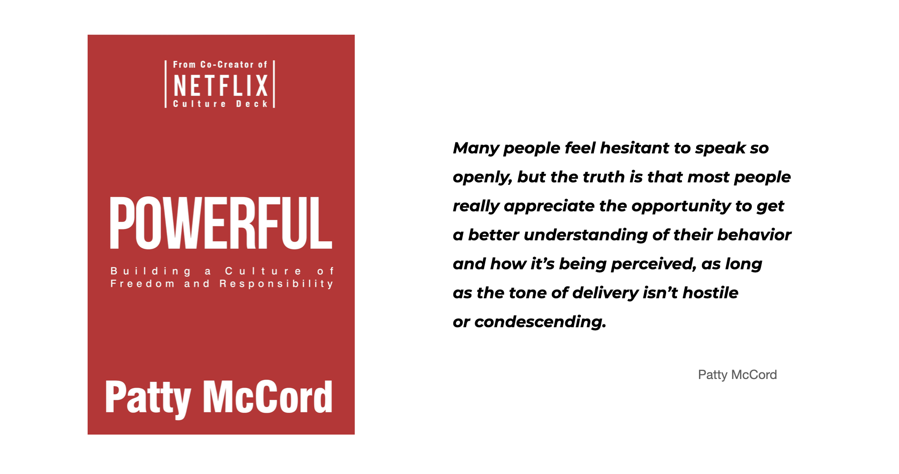
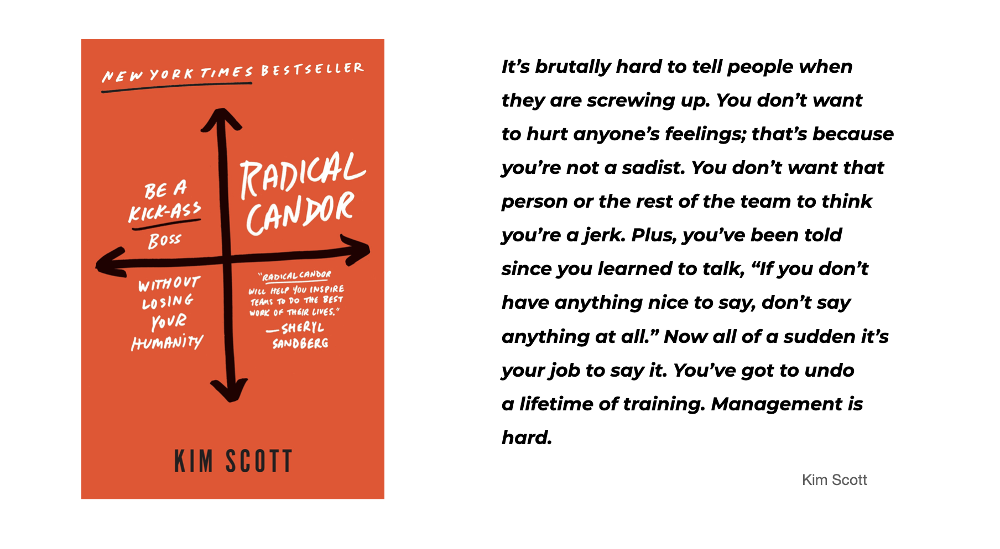
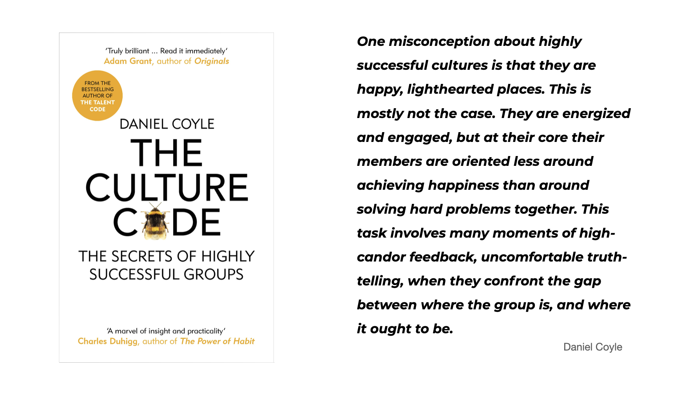

I have come across many books in my life that helped me grow, both personally and professionally. I believe that books are a great source of knowledge and truth, and they have a unique ability to change people’s view completely. The more we read the more aware we become how much wisdom we are still lacking in our experience. At least that is how it works in my case. 

Below I want to share my thoughts on three remarkable books that left a lasting impression on me. Each one carries a powerful and uplifting message, making them an excellent read for anyone passionate about shaping a strong and thriving company culture. These books explore the foundational elements of successful teams and offer practical advice on creating environments where people genuinely thrive.

What’s especially compelling about these publications is how they challenge conventional approaches to teamwork, highlighting the importance of feedback, trust, responsibility, and appreciation. They present actionable insights and fresh perspectives that can shift the way we think about team dynamics and workplace collaboration.

Whether you’re a leader looking to inspire your team, an HR professional seeking innovative ideas, or simply someone who wants to foster a more supportive and effective workplace, these books have something to offer. Dive in, and you may just find new ways to enhance your approach to building successful teams.

## **[Powerful: Building a Culture of Freedom and Responsibility,](https://pattymccord.com/book/) Patty McCord**

Patty McCords wrote a book about creating the unique and high-performing culture based on her engagement at Netflix. I really enjoyed this read. The content is approachable and practical. As stated in the book, very few companies try new forms of leadership and probably that is why we can find the Netfilx culture inspiring and fresh with a people-centered approach where trust and responsibility play the main roles.

The special place is devoted to feedback where employees share information openly, broadly and deliberately. You provide open, helpful, timely feedback to your colleagues no matter what role you have in the organisation. **Patty McCord shows that strong teams learn faster and work better if they can make giving and receiving feedback less stressful and a more normal part of work life.** Feedback is a continuous part of how people in the team communicate and work with one another. It is a large topic in the book.

Considering recruitment needs we have to hire people who can help us solve future problems and these who can support new people. That should be always our goal. You should be always looking for talents. **Being always on the lookout give you also an opportunity to really choose the people you need. What is more, we should not be afraid of saying goodbye to people who do not seem to fit the organisation culture and do not bring any business value.** Some people may say it is brutally honest vision, but at the same time it is very pragmatic and credible. Wise hiring is something every company should focus on. 

Be open and honest, run discussions based on the facts, get right person to do right job, and treat people as the grown-ups - that is how I can sum up the book. Simple, but frequently forgotten rules. 

And if you want to find out more about the Netflix culture, take a look [here.](https://jobs.netflix.com/culture) 

## **[Radical Candor: Be a Kick-Ass Boss Without Losing Your Humanity,](https://www.radicalcandor.com/the-book/) Kim Scott** 

Some people say that the best summary of this book will be “care personally + challenge directly” as the cover image suggests. ***Radical Candor* is about treating everyone in the workplace as a human being first-and-foremost.** Kim Scott presents a number of personal examples and practices that shows the environment in which individuals and business can achieve great results together. It is the volume about giving and receiving honest feedback. 

You must deliver feedback - both the praise and the criticism, so that it leaves no room for ambiguity or misinterpretation. **You are not doing anybody a favour by not telling them when they do bad work.** If anything, it's better to be direct and give them the feedback than to protected their feelings just to stay friends. Radical candor is all about managing a full-feedback approach. Very important point is to avoid the fundamental attribution error - we should always focus on what someone did rather than who they are. The former is something the person can fix. 

Another key aspect of successful team Kim Scott mentions is the diversity. Your team cannot consist only of super-stars. We need **a healthy mix of different people**, but we should never forget about the highest performers in the end as it is too easy sometimes to focus too much on these employees who have a mediocre impact on your team’s success and need our support. Always remember about those who bring the most value to your organisation. And if you can see they start to perform worse, do not ignore it. 

This books is full of personal stories and anecdotes with a piece of good advice every aspiring manager may want to get. It is the book about the art of managing people and teams. It covers many aspects of day-to-day managing. 

## **[The Culture Code: The Secrets of Highly Successful Groups,](http://danielcoyle.com/the-culture-code/) Daniel Coyle**

*The Culture Code* deciphers the secrets of highly successful groups like SEALS, Team Six, IDEO, San Antonio Spurs, Pixar, etc. According to Daniel Coyle you have to work 3 different skills to achieve the highest team performance. **You can see how the most successful team perceive obstacles, vulnerability and empathy.** Each chapter explores one skill at a time: building security, sharing vulnerability and establishing purpose. 

Coyle emphasises that a strong culture sets up an environment where a team can deal with uncomfortable truth-telling and be candid with each other. When people make themselves vulnerable by sharing information about themselves, they build connections and makes it possible for everyone on the team to contribute. Loyalty and high quality working cultures only emerge when team members feel safe.

But the book is not only about the team’s performance, it is also about the leader’s roles. T**he book shows how important is to question how your actions in everyday life impact the team you work with.** The richness of real-life stories and examples of amazing groups makes *The Culture Code* practical and at the same time inspiring. Honest and authentic leadership is required that listens and serves rather than talks and orders.

One may say the book is full of old ideas and topics - and that is true. But at the same time these topics are urgent and relevant as ever.

## **Three books, one idea behind** 

Although the examples in the books often draw from renowned companies like Google, Apple, Twitter, PIXAR, and other well-known Silicon Valley startups, the concepts and practices they discuss are universally applicable to most workplaces. **From my own experience, I’ve reached the same conclusion as the authors: the foundation of a successful team lies in fostering honest, trusting, and supportive relationships. These books focus on practical strategies to help you build that kind of culture within your team, no matter your organization’s size or industry.**
