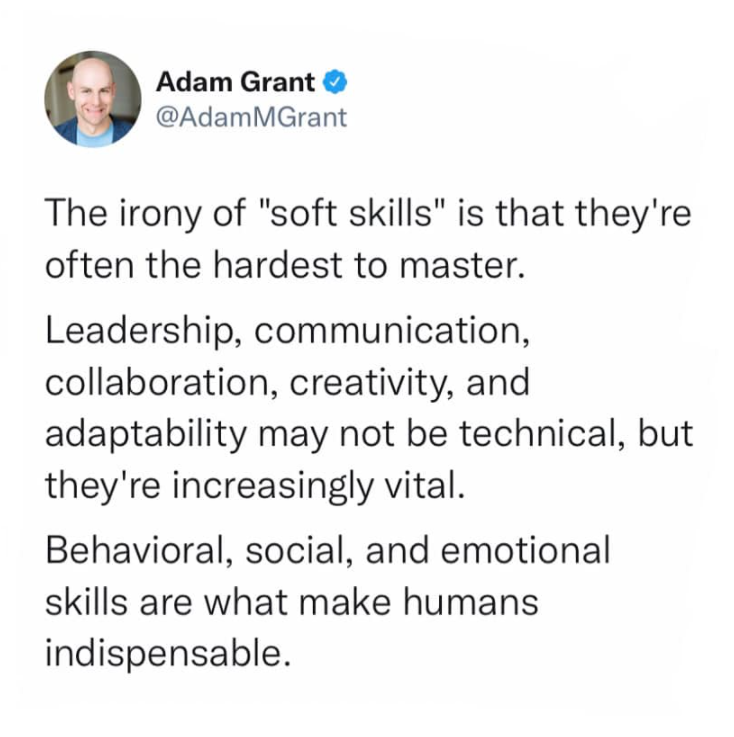
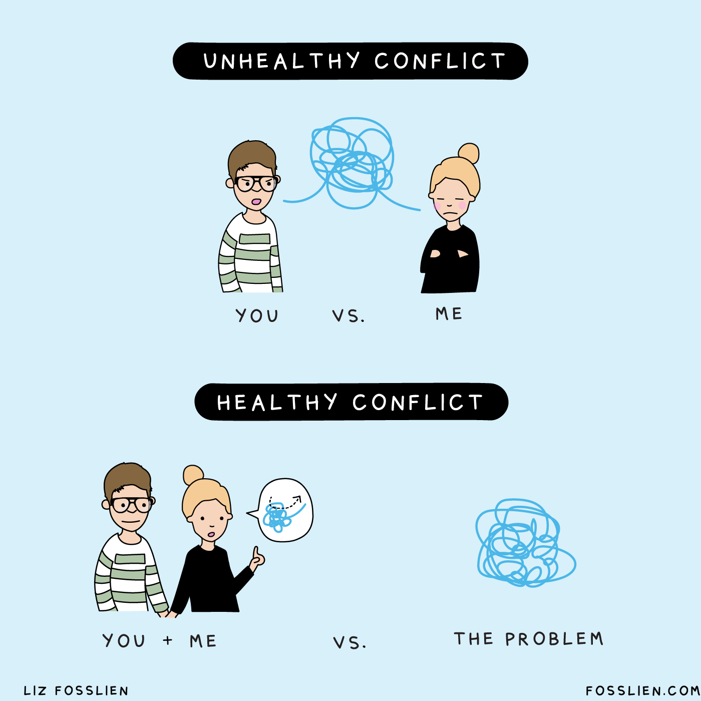
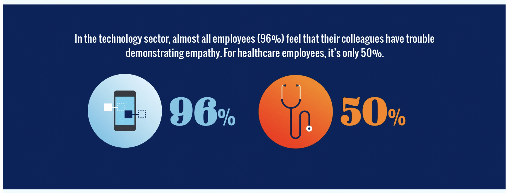
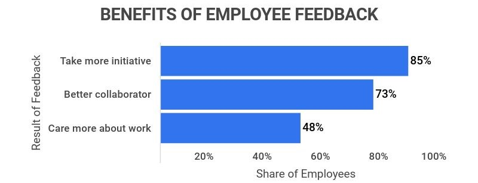

Harold M. Messmer, Executive Chairman at Robert Half International Inc., said once that **your career success in the
workplace of today - independent of technical expertise - depends on the quality of your people skills**. Interpersonal
skills (also known as soft skills or people skills) are essential for effective communication, collaboration, and
building meaningful relationships with others. These skills are crucial in both personal and professional contexts and
play a significant role in shaping the quality of our interactions with individuals and groups. 

However, while looking
at some industries including IT I still can see that interpersonal skills are often undermined and presented as less
important than technical knowledge. I am on the other side of this and believe that software development teams really
need interpersonal skills in many workalike situations and they sometimes need them even more than pure technical
knowledge.

## **1. Communication is the key**

Strong interpersonal skills enable individuals to communicate clearly and efficiently. Software engineers who have
well-developed interpersonal skills can convey their thoughts, ideas, and emotions effectively, leading to better
understanding and reducing the chances of misunderstandings with other team members or clients.

**The report [State of Business Communication: The Backbone of Business Is
Broken ](https://www.agilitypr.com/pr-news/public-relations/bad-connection-study-finds-poor-communication-costs-businesses-1-2-trillion-annually)shows that up to a $1.2 trillion annual loss among businesses is due to ineffective communication.** 

Leaders estimate teams lose the equivalent of nearly an entire workday (7.47 hours) each week to poor communication—or approximately $12,506 per
employee every year. These numbers are pretty scary and I suppose many companies do note even realise how much poor
communication costs them year by year. Apart from increased costs poor communication impacts profoundly productivity,
morale, and growth, and sometimes leads to reputational erosion.

## **2. Conflict resolution ability**

Inevitably, conflicts arise in various settings and interpersonal skills help in resolving them constructively and
finding solutions that satisfy all parties involved. Some disagreements can as well arise during the development
process. Conflict resolution is an integral part of the [software development process](/blog/what-are-the-stages-of-app-development/), primarily because software
development projects often involve teams with diverse perspectives, backgrounds, and roles. Conflicts can arise due to
differences in opinions, goals, priorities, and approaches to
problem-solving.

Source: https://www.fosslien.com/images

Addressing conflicts effectively is essential for fostering collaboration and ensuring project success. Regular design
reviews and brainstorming sessions can provide a platform to identify and resolve potential conflicts early in the
process. Conflicts may arise also during code reviews and quality assurance when team members have differing opinions
about coding standards and best practices. Or during the deployment phase if there are concerns about stability,
performance, or security. **Actively listening to all perspectives to understand the root cause of the conflict as well
as ensuring that all team members understand project goals, roles, and expectations can really minimize
misunderstandings.**

## **3. Empathy in client-dev relationship**

We all know that interpersonal skills are closely tied to emotional intelligence, which involves understanding and
managing one's emotions and those of others. High levels of empathy in turn contributes to better decision-making,
self-awareness, and social awareness while working in a team.

In customer-facing roles, empathy is essential for delivering exceptional client service. Software developers who can
empathize with the clients are more likely to meet business requirements and enhance satisfaction. **You should
understand when you and the specific task fit in in the client’s organization and how it contributes to the client’s
vision. High emotional intelligence contributes to better decision-making and better awareness of what our clients need
and why they need it.** As a software developer you solve real problems and you work with real people - don’t forget
about that.

Source: https://info.businessolver.com/empathy-industry-spectrum

**Remember that empathy allows developers not only to put themselves in the shoes of clients, but also the end-users,
and it allows to understand their preferences.** This understanding helps in creating software that truly addresses user
requirements and delivers a better user experience.

## **4. Feedback in leader’s roles** 

Effective [team leaders must possess excellent interpersonal skills](https://www.forbes.com/sites/baldwin/2023/07/30/inflation-insurance-for-retirees-what-does-it-cost/?)
to inspire and motivate their team members. **Interpersonal skills enable leaders to act as coaches, providing guidance
and constructive feedback to help team members grow and develop their skills.** As a leader you have to ensure that your
team understands their obligations by using clear written and verbal communication.

Important information can get misconstrued when team leader’s communication skills are inadequate. In consequence it may
lead relationships to deteriorate and create barriers to progress. **When leaders are skilful in communicating
feedback - that benefits the whole organization.** What is more, they have to discuss the project and its progress not
only with their team members, but also with upper management and other stakeholders to meet the business goals and
requirements. They use the feedback to implement changes in their work and motivate people they work with.

When delivered constructively and thoughtfully, feedback has the potential to drive high performance and enhance the
overall success of the team.

Source: https://www.zippia.com/advice/employee-feedback-statistics

## **What matters are people** 

Overall strong interpersonal skills are crucial for successful teamwork and collaboration. Software developers (and
people in general) who can communicate openly, listen actively, and understand others' perspectives are more likely to
work harmoniously in groups and achieve common goals. Good interpersonal skills help in building positive and healthy
relationships with friends, family, colleagues, and even strangers.

**While looking for talents at bright inventions we pay a lot of attention to “soft skills” possessed by candidates.**
Assessing them during the recruitment process is crucial because these skills play a significant role in a final success
in a job. **Interpersonal skills such as empathy, active listening or feedback processing help our team members
understand client’s needs or concerns and adjust to their challenges.** What is more, team members who share our
company's values tend to perform better and contribute positively to the workplace culture. These skills complement our
team’s technical knowledge and are often what differentiates us from many companies in IT industry.
