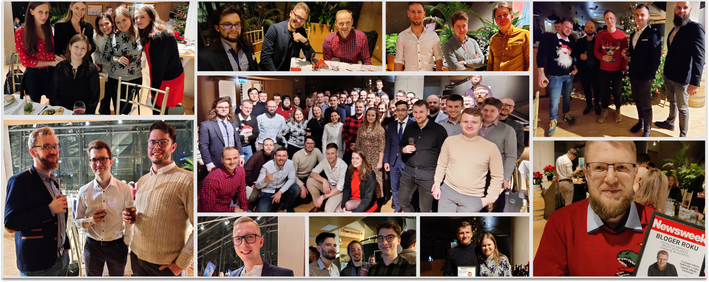

**We have decided to stop for a moment and think about our bright culture. We asked people to answer a simple yet meaningful question – Why do you work at Bright Inventions? Our Bright Team submitted over 40 answers and let me be clear – the participation was voluntary. No one was forced and never will be to write some puff pieces.**

[In 2019 we also asked the team why they work at Bright.](/blog/31-reasons-why-we-love-working-at-Bright-Inventions/) Back then our team consisted of around 20 members. Now we have over 80 people on board! Thus it is time for new perspectives.

## Why do you work at Bright Inventions?

People around me are super excited about what they do.

1. You are quickly recognized and valued for a job well done.
2. The trust and flexibility we're given.
3. Transparency and the absence of workplace politics.
4. The culture of knowledge sharing.
5. Building products that are used and appreciated by users.
6. The mature process of software development. The team is highly skilled and experienced. We focus 100% on quality.
7. We are partners to our clients and bring something more to the table than lines of code.
8. People treat each other with respect and you can feel that they do work that really gives them satisfaction.
9. I experience constant self-development: professional and personal as well.
10. People inspire me to grow.
11. A clear path to self-development.
12. No-corporation atmosphere.
13. Hybrid work.
14. Working on international projects with clients from countries like Israel, the UK, the USA or Germany.
15. Multiple celebrations and great team retreats.
16. The project I work on is meaningful and gives possibilities to develop myself.
17. Stability and security – during the pandemic the team grew twice.
18. Nothing is forced here. You don’t feel the pressure to spend time with the team, but you actually just want to know the people because they are kind and helpful. 
19. Taking care of the employees.
20. Great atmosphere in the office, everyone is friendly and you feel like a part of the family.
21. You can get a ton of help not only regarding your work. You can get advice about taxes, buying an apartment, a bike or how to do Crossfit. People are just open to help and to share knowledge. 
22. Human approach – your teammates understand that you can sometimes feel under the weather, have a sleepless night with your child or simply have a bad day. And they will offer you nothing but support.
23. Coffee talks – regular talks to just discuss things worth sharing.
24. I like having an influence on what technology I use.
25. English classes.
26. Autonomy, no micromanagement.
27. Direct contact with clients.
28. I have challenges that I want to take up.
29. Competitive salary.
30. Friendly atmosphere – we meet after work because we want to.
31. Training together – yoga, swimming, jogging and MTB together not only to spend time with each other but to stay healthy and in shape.
32. We have after-work retreats that are actually employee initiatives like hackathons, running races, Board Game Fridays or a chess tournament.
33. Abilities to work on more than one project or change a project. A great option to prevent burnout which is a common issue in the software development sector. 
34. Down to earth people, even senior developers or partners.
35. Work-life balance. The management knows that people need to relax after work and that working isn’t anyone’s whole life.
36. Flexibility.
37. Transparent communication within the team.
38. Even though I've been working here for 1 month, it feels like I've been working here forever (in a good way).
39. Big impact on the projects.
40. Kudos culture. I just feel appreciation and like to appreciate others.
41. Office library with books about software development, UX and marketing.
42. Bright lunches.
43. Flat structure.
44. Sharing is caring and here it is not just a phrase, that is a way of work.
45. The management crew is very competent and flexible in terms of employer-employee relations.
46. Internal workshops about AWS, UX, Kotlin and more.
47. Mentoring opportunities.
48. Positive attitude.
49. Openness.
50. Kind people around me. Just like that.

Kudos for the whole Bright Team for sharing these insights.