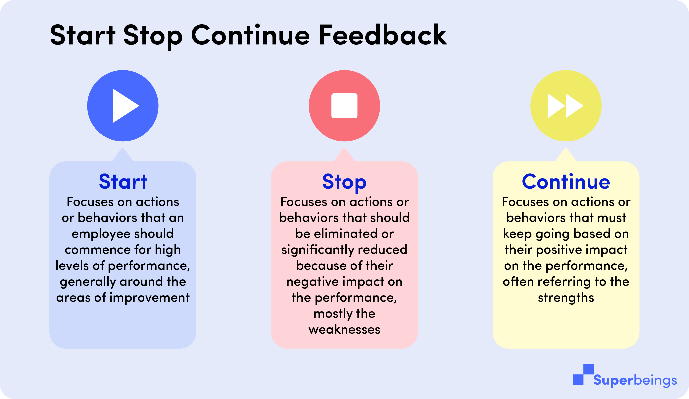
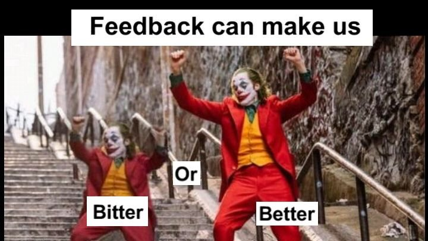

The main goal of feedback is helping people to grow, to develop their skills and make them feel better in the long term. Sad to say when it comes to giving feedback, we often do not know how to do it. We tend to use feedback thoughtlessly and in result it irritates or demoralises people instead of pushing them forward. **If you are not sure how to introduce feedback into your team’s routine or you just do not feel sure about giving and getting feedback, you may take advantage of the models and examples below.** These are feedback methods that work well in many organisations and they help to take immediate action without causing too much of an ‘ouch’ factor. Let us take a look.

## **1. Feedback in (peer) mentoring** 

Feedback can become your team’s reality if you just implement a few simple steps and start treating it as a part of your daily mentoring process. There are two ways of doing that. **You can either take a very transparent approach where the recipient knows exactly from whom the feedback is coming from or if you are not sure how to process - you can start with some indirect team’s feedback session during which participants are writing their feedback on paper anonymously.** There should be usually two/three questions each team member is answering to or statements they have to finish e.g.

1. I want to appreciate your … 
2. I am having trouble when you … 
3. It would help me a lot if you can…. 

**You can also use a simple method *[START, STOP, CONTINUE](https://www.superbeings.ai/blog/how-to-use-start-stop-continue-feedback).*** In the end each team member is reading aloud the answers they got.

**What to remember?** If you are a manager/mentor, try to identify behaviours that have a positive impact on your team’s cooperation and those which hamper the work. Describe to your team the observations you have and help your feedbackee to introduce new patterns of behaviours. If you are a team member, don’t cross personal or social boundaries. Remember that the aim here is to learn and improve teamwork and communication among you and your colleagues. 

If you want to know more about this model, take a look at [the theory of team coaching](https://www.researchgate.net/publication/253963423_A_Theory_of_Team_Coaching) by Hackman and Wageman. 

## **2. Jurgen Appelo’s model** 

That is the model in which you can find both substantive and behavioural elements which connect past activities with recommendations for the future. **The example below includes some elements of FECE feedback model i.e. F - facts, E- emotions, C-consequences, E- expectations (in Polish this model is called FUKO). Through a whole conversation the feedback giver navigates the feedbackee in a right direction.** 

**Give the context of your assessment →** *Yesterday in the evening I was checking your tasks status in JIRA. I don’t want you to wait for my remarks till you finish as the way you described the tasks is not the same we agreed on recently.* Then we should move on to the facts. Remember not focus on your own emotional interpretations.

**Point out precise elements that are under or above your expectations →** *In JIRA I cannot see your tasks with a needed level of detail which we discussed on our last meeting. I can see the tasks which are described very roughly.* 

**Add some emotions and say how you feel about the fedbackee’s behaviour** → *When I saw them I just thought about Marek, our new colleague. What he would think about tasks described so superficially. He is new and everything is unknown to him. He should learn good patterns from the day one. I a a bit disappointed as we have been talking about that a dew times.* 

**Say what kind of impact the behaviour has →** *It is crucial for me that the work in our team goes smoothly and effectively. You should describe the tasks in such a way that it is clear to each and every person. It is really essential to me.* 

**Add some recommendations →** *Please add in your last tasks all necessary details about the scenario, step and expected result. And please add the reference as this task comes form the one your were working in last week.*

**What to remember?** Remember it is not about criticising, but about meeting the organisation’s and team’s standards. Recognise and avoid [the most common common mistakes during your feedback meetings](https://brightinventions.pl/blog/8-mistakes-you-make-while-giving-constructive-feedback). 

<h2>Corrective feedback does not equal criticising </h2>
The purpose is to improve performance and results. This can be through praise of good work, or constructive feedback when there is an issue that needs to be resolved.

## **3. SBI-DB-II Model**  

**SBI-DB is an acronym of a papular feedback formula Situation-Behaviour-Impact-Desired-Behaviour Improved-Impact.** And how does it work? 

**At first capture the situation →** *Yesterday at daily you were behaving differently than usual. Can we talk about it?* 

**Then describe a behaviour →** *You were not listening to Marta while she was telling us about her problem with the task. You were interrupting her all the time.*

**Describe the impact →** *This caused she felt ignored and misunderstood. The way you talked to her was really harsh. For me it was also uncomfortable.*

**The last element is saying what you expect →** *It would be great if you pay more attention to the way you communicate things to other team members. You may disagree with someone, but you should still talk about their ideas with full respect. It is important that everyone feels support in a team.*

**Say what the improved impact may look like →** T*hanks to that you will also improve teamwork and engagement. People will talk about problems they come across more openly.* 

**What to remember?** This formula is commonly used in many organisations. The key is to determine what is the desired behaviour and what makes it unique. It is also important to make sure the person we give feedback understands the behaviour in the same way.  

<GiphyEmbed url='https://giphy.com/gifs/TheDemocrats-democrats-dnc-dncgif-4fCxl9t8Dlj99OE3Ce' />

## **4. Feedforward**

The model feedforward is **focused on best in the future and indicates how we can avoid problems in the future.** Therefore, we can also use it as a preventive measure.

**The practical example may look like**: *Please, check every report at least twice. You may do it  next week in the morning when you are fresh and rested. Practice that and you will see it will help you avoid spelling mistakes. Or maybe you can think about some other solutions?*

The goal of this model is question - **how I can be better in a particular relation?** As Marshall Goldsmith says that **feedforward model helps to focus more on a solution**. Keep in mind four rules: 

* leave the past behind,
* tell the truth,
* show support and avoid cynicism,
* focus on what you can improve and avoid judging. 

**What to remember?** To make the best use of this model you can regularly give yourself feedforward feedback. Just follow a few simple steps: 

ask yourself how you can be better in a relations with someone **→** listen carefully what the other person have to say **→** think about what you heard **→**  thank for the feedback you received **→** come back with the response **→** ask for support people around you **→** change yourself **→** practice and reinforce the change.  

<GiphyEmbed url='https://giphy.com/gifs/closershow-america-race-3ohs7UUn0xTJ7KYZK8' />

## **5. Green feedback** 

Green feedback takes something form Finish schooling and long-life learning philosophy. I**t is focused on building quality standards in someone’s behaviours which makes their work more effective in the long term. It is a fully conscious process.** It is also solution oriented and reinforces good behaviour patterns. It should be always the trigger for further learning. 

The structure of green feedback looks as follows: 

**Strength** → *Your strength in our last project was asking very thorough questions to the client.*

**Learning recommendation** → *Next time please focus also on more detailed analysis of the solution that you can propose after the discussion. Use the information you get from the client to show him during the demo you know the product very well and you make the best decision you can.*

The first element should be an example of positive behaviour or work content based on facts. We emphasise what someone is doing well and what brings value to the team, organisation or clients. **We do not talk about preferences - this feedback is not about whether we like something or not. We may not like some strategies or approaches, but the point is whether they work well in our industry well.** You may not like Chopin’s classical music, but it does mean he is not a great composer.

**The second element depends on either we deal with less or more experienced person.** In case of less experienced person we can propose some instruction, manual with action points or best practices which can be implemented by someone at their work. In case of more experienced people we can use some inspirational or mentoring questions which are the first two for further auto reflection or analysis that lets for discovering some hidden potential. 

**What to remember?** Green feedback is a great model to show what you love about someone’s performance or behaviours (even if it is a small part of their work) and at the same time it gives space to say why the behaviour pattern should be kept and how to expand it in the future. 

## **Five models but one goal** 

When we look at the models above we can see some implementation differences, but in fact what they have in common is the goal of optimisation and enhancing someone’s work quality, work standards, efficiency or engagement. Feedback should be a natural and integral element of our daily work. **The key factor in giving it should be ensuring that the recipient has no doubts about their behaviour assessment (whether it is positive or negative) and also knows what ought to be done to change it or improve it.** By sharing feedback with your colleagues or employees you show that you take care of their development. You also share your own experience with them. Thanks to that they can avoid mistakes that you learned the hard way. **If you can see that someone in your team is not performing to their potential and beyond, and you know how to help, juts say it.** There is no other way than hearing “thank you” in the end.
