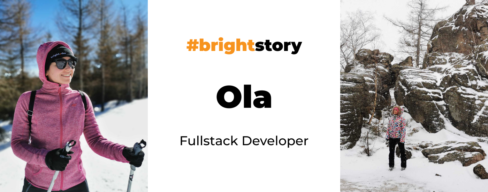
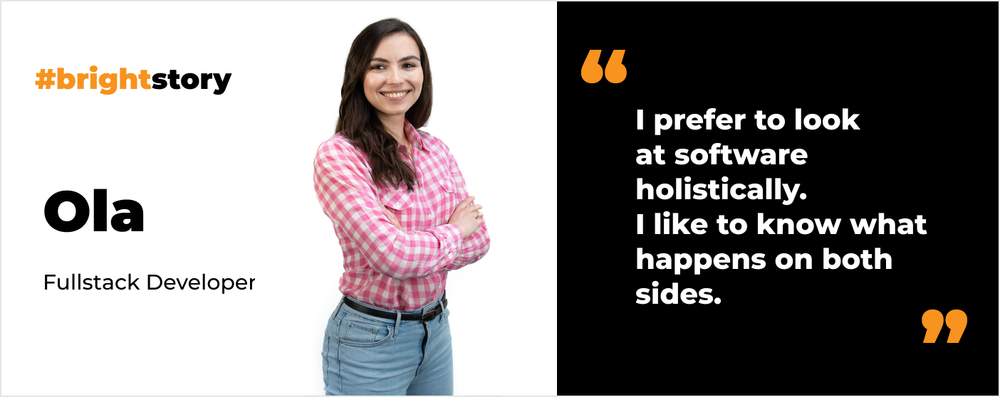
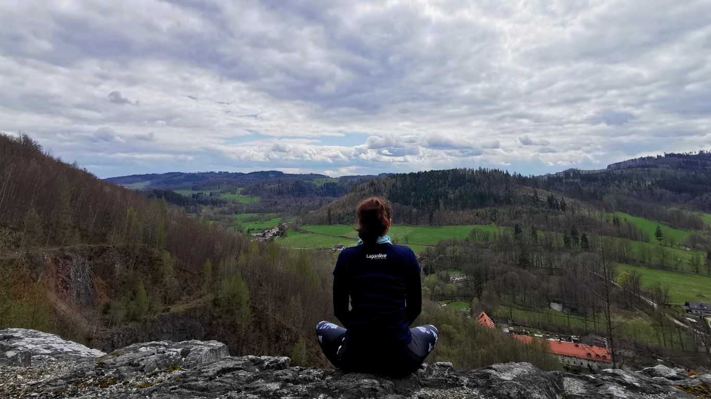
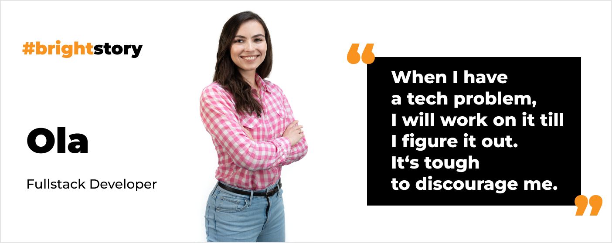

**Ola has been a programmer for over 4 years, starting her career with Java. She sets goals and always reaches them. She has practiced swimming and played the transverse flute most of her life. Do you want to know how she does it? Read the interview.**

## You’re a Civil Engineer by profession. Why did you change your career to software development?

Because I’ve found out that **[software development](/) fits my character and personality even more**.

In my school times, I had a great math teacher, who awoke my passion for mathematical riddles and solving complex tasks. What’s important – getting joy and satisfaction out of it.

In programming, **I can see that something I’ve implemented works fine as code and does its job in real life**. That’s truly rewarding. The software industry is evolving so quickly that you must work hard to keep up. By choosing it I knew I would constantly develop too.

What I really like about it, is that **by working as a software developer you get to know many other industries too** – from the restaurant business to the space industry. In IT there is no place for boredom.

## Have you ever regretted spending years on getting a Civil Engineering degree?

Never. I believe that the path I made to become a software developer was the way it was supposed to be. Moreover, **studying civil engineering had hardened me** – especially all those sleepless nights spent on my laptop working on projects. 🙂

## You are a fullstack. Did you start from the backend or frontend?

I started my career as a **backend developer**. I first worked with **Java**. Then I got a chance at work to develop as a frontend dev as well. So I learned **TypeScript and Angular**. I realized that **I prefer to look at software holistically**. I like to know what happens on both sides.

## How did you get at Bright Inventions?

I actually **have heard a lot of great things about Bright Inventions** from [Maja](/about-us/maja/). She works here and has been my friend since middle school. She even sent me a Bright Inventions job offer in 2020 saying “Isn’t that you?”. 😏 In fact, I read the requirements and I really felt like it was written for me.

However, at that time I didn’t feel like changing a job, so I passed the offer to [Maciej](/about-us/maciej-n/), a friend of mine. He applied and joined the team before me. Since then he started to tell me how awesome it was here and that I should join. I got the courage to make a change. **Joining Bright Inventions became my dream that came true in 2021**. 

## Wow. I had no idea. Let the record show that the marketing department didn’t force you to tell this story. 😄 And how do you recall your job interview?

Great. I had a job interview with [Michał](/about-us/michal-k/) (mostly), [Piotr](/about-us/piotr/), and [Ula](/about-us/ula/). It’s hard to really call it an interview. **It was like a conversation with other programmers**. I felt that **everyone wanted to get to know me**. This looked totally different compared to my previous interviews. I didn’t feel during the whole meeting (which lasted over 2 hours) that I was being evaluated in any way. Obviously, I had to be, but no one made me feel that I was.

Even if I didn’t know the answer to a question or hadn’t worked with some tools or frameworks, I felt that they didn’t take that against me. I would recommend anyone to attend the interview at Bright Inventions. 😊

<h2>Do you want to join Ola?</h2>
Join our team and work on projects such as the Ethereum blockchain platform, accounting software, or web therapy applications. Work with clients from Israel, Germany, or Norway!
<a href="/career"><button>Check our career opportunities</button></a>

## You live and work almost 600 km from our office in Gdańsk. Do you feel that distance?

Not at all. When I log in to work every morning, I join our Slack community. We’ve got various Slack channels and a lot is going on there. I can feel the friendly atmosphere even through the internet. **I don’t need to be at the office to feel like at the office**.

Naturally, it's nice to visit our office from time to time. Sometimes I miss kitchen conversations, spending offline time with colleagues, etc. However, **I don’t feel any distance between me and the office on a daily basis**.

## Tell us more about a project you work on.

I am a part of a team working on the **German [Relevo](/projects/eco-friendly-app) app**. Thanks to the app users can order a pizza or buy a meal and coffee for takeout in **reusable packages**. **The goal is to limit plastic waste**. The idea behind the project is really cool. We develop **iOS and Android apps** for end users. We also have **two frontend web apps**. One is for the client to manage all the restaurants that cooperate with them. Another is for the actual restaurants.

The backend is developed in Node.js, we use the NestJS framework. The frontend is done in React. The team consists of 6 people including mobile developers and fullstack devs. Our PM, Mateusz, watches over the whole development process.

## What are the challenges of this project?

One of the technical challenges is **developing an offline mode**. This is something we are working on currently. 

For me, **a challenge is backward compatibility too**. I’ve never worked with mobile apps before, so maintaining backward compatibility is something new. It changed the way I worked. Now I have to ensure that my release won’t affect previous versions of the apps. You need to have everything under control. 

## You play the transverse flute. Why did you choose this instrument?

One day at a school assembly, probably at the beginning of the school year, my teacher played the transverse flute. **Once I heard it I was enchanted by this sound**. I remember it clearly, even though I was 7 then. The idea was planted in my mind that I could play too. I started to practice a couple of years later, in 5th grade. 

Music is still an important part of my life. I used to play a lot of sonatas and etudes. **Nowadays, I play mostly movie scores and top songs** in a duo with my husband who is a guitarist. Guitar and transverse flute aren’t a typical match, but it works out well for us. 😊

## You are a swimmer, having competed for years. Does being an athlete influence your work?

Definitely. When you train for swimming, you have two workouts a day. The first one before school, the second after. So I had to wake up at 5 am. Besides, I had other extra activities like flute lessons. Thanks to all of that **I learned discipline**. Having so much going on during the day didn’t affect my school performance. It might sound like bragging, but I was always getting top grades. I believe **having less time helped me actually to manage it better**. 

Also, you have to be engaged and persistent to go on like that. **I stay focused on my goals and relentlessly try to reach them**. That’s really helpful at my work. **When I have a tech problem, I will work on it till I figure it out.** It‘s tough to discourage me. 

## Do you have some work goals for 2023? Is there anything you want to learn?

I just want to be a better programmer. I'm currently at a point where I feel a little overwhelmed by a variety of things I would like to learn immediately. Yet I need to stay organized. So for 2023, the plan is to **expand my programming skills** using React and become **more confident in DevOps staff**.

## An athlete and a musician… Are you a fullstack in life too? ;) Are you untalented in something?

Nothing comes to my mind right now. 😀 When I decide to learn something, I do it. I think **talent is not the main factor, our character is**. With hard work, you can achieve anything you want.

<h2>Join Ola!</h2>
Join our team and work on projects such as the Ethereum blockchain platform, accounting software, or web therapy applications. Work with clients from Israel, Germany, or Norway!
<a href="/career"><button>Check our career opportunities</button></a>

