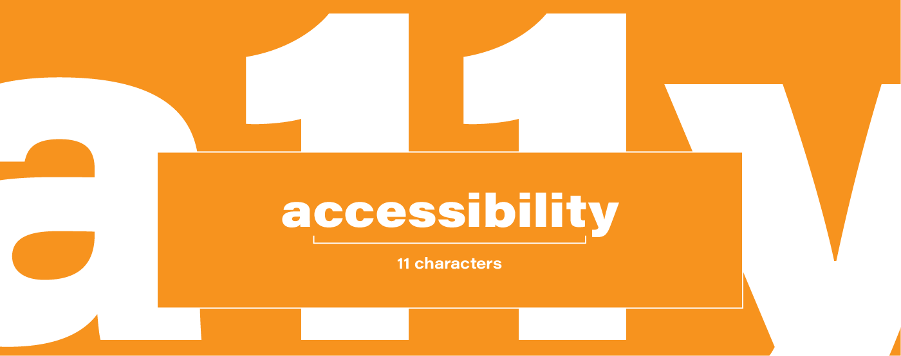
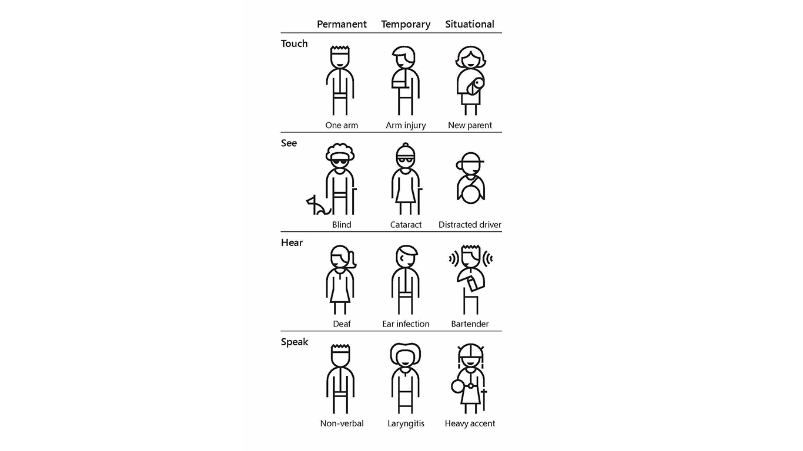

What does accessibility mean in 2023? Is accessibility just another trend? Is a11y just another buzzword? A11y stands for accessibility (there are 11 letters between the first one and the last one, hence a11y). It is essential for developers and designers, who want to create high quality digital products. This means providing an equal chance of getting the same user experience, no matter who the user is and what their capabilities are. How to achieve this? Let me share with you some do’s and don’ts.

## Why even bother?

### Part of society

First and foremost, people with disabilities are a part of our society and everyone deserves equal access to information. Creating inaccessible products means excluding [16% of the population](https://www.who.int/news-room/fact-sheets/detail/disability-and-health#:~:text=An%20estimated%201.3%20billion%20people%20%E2%80%93%20or%2016%25%20of%20the%20global,diseases%20and%20people%20living%20longer.). **Every decision we make can lower the barriers to interact with products**. It can also help with the sense of belonging to digital society. Designing with a11y in mind enables and draws on the full range of human diversity, thanks to which we can all help each other. 

### We are designing for future us

We are not only designing for people with disabilities, but also for our future us. How come? You never know where life takes you. And I’m not saying you’ll get in an accident and end up with some sort of disability (but hey, it might happen). But you need to keep in mind **that there are scenarios in which we are temporarily, or even situationally, impaired**. Take a look below:

Source: [Toolkit Inclusive 101](https://www.microsoft.com/design/inclusive/)

**The same solutions that work for deaf people might be useful for people who are working in a loud environment such as a pub**. Or let’s say you went to an eye doctor and were given some eye drops that impair your vision for 2 or 3 hours and now you want to get a bus home. You need to buy a ticket first, you are looking for an app on your phone, but you’ll notice that you can’t see properly because of those drops. The setting for people with vision impairment will come in handy.

### Business wise

There is also a business value to it and don’t get me wrong, I’m not trying to monetize anyone here, but sometimes you need to convince the business side and this argument will most likely speak to them. Inclusive design opens up a wider range of recipients (the 16% I mentioned earlier).  Also, **studies show that people with disabilities are the most loyal customers**. On the other hand, it’s hard not to be loyal to the one and only product that answers your needs. 

### Law

And if that does not convince anyone, there is also a legal aspect of it. You see, in the past few years **accessibility changed from a requirement to an obligation**. Almost all over the world. USA has [The Americans with Disabilities Act (ADA)](https://adata.org/learn-about-ada), Canada - [ACA](https://www.canada.ca/en/employment-social-development/programs/accessible-canada.html), Australia - [DDA](https://humanrights.gov.au/our-work/employers/disability-discrimination), Europe - directive on [the accessibility of the websites and mobile applications of public sector bodies](https://eur-lex.europa.eu/legal-content/PL/TXT/?uri=CELEX%3A32016L2102) and there are more to come. But it all can be summed up by saying that everyone deserves an equal chance getting information and actively **blocking someone’s access to civil rights is unethical**.

## What can I do?

### Colour and contrast

* Many dyslexic users are **sensitive to the bright, high contrast colours**. They can make words swirl and blur together.
* But **don’t make the contrast too low**. Still have in mind people with visual impairments.
* Some users may experience sensitivity to sensory information such as colours which can cause anxiety or pain. Use a colour **contrast ratio of at least 4.5:1** for text and test it with your users to get the right balance. You can check contrast [here](https://color.adobe.com/create/color-contrast-analyzer) or use a [Figma plugin](https://www.figma.com/community/plugin/732603254453395948/Stark)

### Write in plain language 

Writing in clear, plain language will mean your content is understood by more people.

* Users on the spectrum might **take idioms literally**. 
* People who use Sign Language might consider it their first language, spoken language being their second language. Sentence structure differs a lot between those two languages. **Use visual content** (headings, bullet points, images, videos) **to support text**.
* **Fewer words are better** for someone who has trouble reading. Use bullet points to help guide a dyslexic user through your content. 
* Clear, simple information is important. If your service needs to warn users about the consequence of their actions, make sure you **give them enough information to make the correct decision**, so they can continue confidently.
* Not knowing what will happen after clicking a button or link can cause users stress and anxiety. **Descriptive buttons and links will help users know what to expect** and give them a sense of control.

### Pay attention to layout

* **Don’t create a wall of text.** Lots of unbroken text can be hard to focus on making it frustrating to read. Breaking text down into simple sentences and using bullets for important points will make your content easier to understand.
* Complex and cluttered layouts can be overwhelming for users to process. **Make your layout predictable and consistent**. Put common components such as navigation and search on the top of a page in a highly visible area.
* Users who have English as their second language may find it tiring or difficult to read lots of text. A logical layout can help users judge **what content they need to read in order to complete their task**.
* A **consistent layout** will help someone with dyslexia navigate a screen. It will help draw their eyes to relevant content and build familiarity and confidence as they go.
* Users of screen magnifiers can miss content like side columns if they are not expected. Particularly if they use the tab key to move between links and form elements. **Place features in a logical order where users would expect them to be**.

### Educate yourself 

Remember, **you’re not the user**. It’s best to test your solutions with actual users who struggle, but even they won’t be able to answer all questions nor needs. So, here are some links you might find useful, while diving into the accessibility aspect of designing the user experience:

* https://www.w3.org/standards/webdesign/accessibility - the classic WAG standards developed by the one and only W3
* https://www.a11yproject.com/ - they have come up with a checklist based on WCAG standards
* https://www.microsoft.com/design/inclusive/ - get familiar with the inclusive toolkit manual or check out the activities that might be useful during workshops
* https://www.nngroup.com/topic/accessibility/ - my source of knowledge when it comes to anything in ui/ux design
* https://www.accessibility.uxdesign.cc/ - a very down to earth ebook on accessibility, which you can download for free
* https://ukhomeoffice.github.io/accessibility-posters/ **\- Make sure to check out lovely posters with do’s and don’t in regards to ux/ui design, which inspired me to write this blog post. I mentioned some of them here, but they point out many more aspects!**
