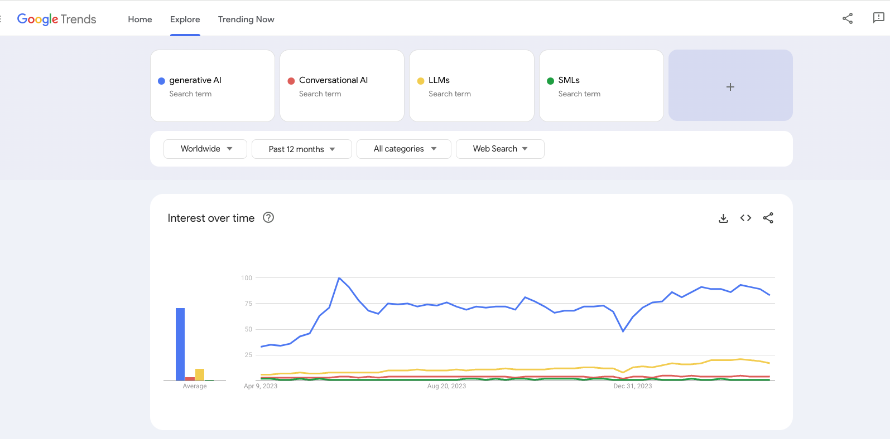

**A single title packed with many concepts and abbreviations – don't worry, we'll explain everything and help you navigate through the complex world of AI. Our concise guide includes examples of real implementations to illustrate these technologies in action.**

Google Trends reveals that Generative AI is the most discussed buzzword: 

It makes sense since Generative AI represents the broadest category. It encompasses all AI systems designed to generate new content that could plausibly have been created by a human.

