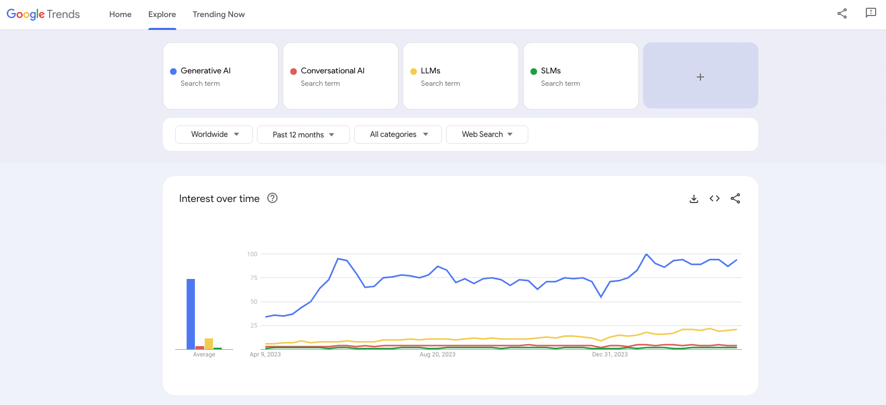
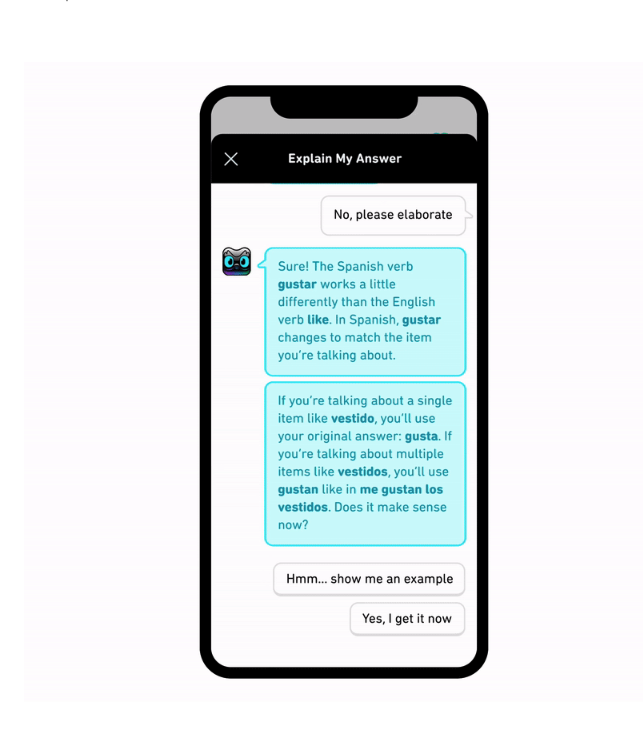
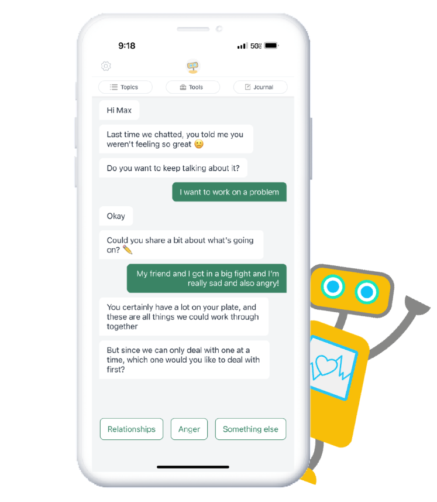
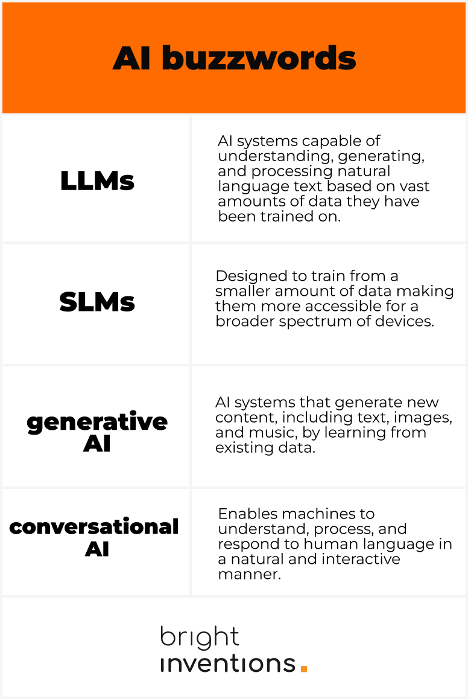

**A single title packed with many concepts and abbreviations – don't worry, we'll explain everything and help you navigate through the complex world of AI. Our concise guide includes examples of real implementations to illustrate these technologies in action.**

Google Trends reveals that Generative AI is the most discussed buzzword: 

It makes sense since Generative AI represents the broadest category. It encompasses all AI systems designed to generate new content that could plausibly have been created by a human.

## Understanding Generative AI

Generative AI is designed to create new content or data that resembles authentic, human-generated material. These systems can produce a wide variety of outputs, including text, images, music, and even video, based on the patterns and structures they have learned from their training data.

### Example of Generative AI – Own Knowledge Base Chatbot

Do you have tons of content regarding your product or solution? You can transform them into a chatbot assisting your customers and alleviating some burden from the support team.

Or maybe you want to use the chatbot internally to support your marketing and sales in content generation based on the content you already have on your website. That’s the case of the chatbot our team has developed internally.

Our internal chatbots process information on our webpage, including hundreds of blog posts, providing the fastest access to content generated by dozens of people over a decade. The preview below shows the real use case of our chatbot (with PlugBear):

It’s easier than you might think to set up a basic chatbot based on your knowledge. My colleague, Rafał Hofman, has prepared a tutorial on [how to create your own knowledge-based chatbot in just 5 minutes](/blog/how-to-build-gpt-assistant/). This guide provides all the essential information you need to set up your chatbot, thereby integrating Generative AI (with OpenAI) into your operations.

## Large Language Models and Small Language Models

Language Models are specific types of Generative AI that focus on processing and generating text.

### Large Language Models (LLMs) 

LLMs understand, generate, and process natural language text. These models are trained on vast amounts of textual data, enabling them to comprehend context, generate coherent and relevant text, and perform various language-based tasks such as translation, summarization, and question-answering.

Read more about the technical aspects of building LLM applications: 
[Build LLM application with RAG](/blog/build-llm-application-with-rag-langchain/)

### Small Language Models (SLMs)

SMLs serve the same purpose as Large Language Models (LLMs), yet they are trained on a smaller amount of data. Therefore, they require significantly fewer computational resources compared to LLMs. Despite their smaller size, SLMs aim to maintain a high level of performance on various natural language processing tasks, including text generation, classification, and translation. Choosing SLMs can make your application more accessible on a broader spectrum of devices, or even enable offline functionality.

### Example of language models in use – Duolingo 

<blockquote><h2>Explain My Answer</h2>
Explain My Answer offers learners the chance to learn more about their response in a lesson (whether their answer was correct or incorrect!) By tapping a button after certain exercise types, learners can enter a chat with Duo to get a simple explanation on why their answer was right or wrong, and ask for examples or further clarification.
<footer>Duolingo Blog</footer></blockquote>

Source: [Duolingo blog](https://blog.duolingo.com/duolingo-max/)

## Conversational AI – definition

Finally, Conversational AI is an application of AI technologies, often leveraging LLMs, SLMs, or a combination of different AI models, to simulate human-like conversations. By using natural language processing (NLP), machine learning, and sometimes speech recognition technologies it results in understanding, processing, and responding to human language in a way that is both meaningful and contextually relevant.

Conversational AI enables computers to simulate human-like conversations. This encompasses a range of applications, including chatbots, voice assistants, and interactive voice response (IVR) systems. 

### Example of Conversational AI – Weabot (mental health chatbot)

<blockquote><h2>Woebot</h2>
Woebot is the evidence-based, AI-powered digital companion at the heart of our platform that delivers personalized, in-the-moment support through chat-based conversations and techniques. Woebot is the world’s first relational agent to create a bond with people that is comparable to that achieved by human therapists.* Woebot digitizes concepts based on Cognitive Behavioral Therapy and is informed by the way clinicians move through a session.
<footer>woebothealth.com</footer></blockquote>

## AI buzzwords – a cheat sheet

