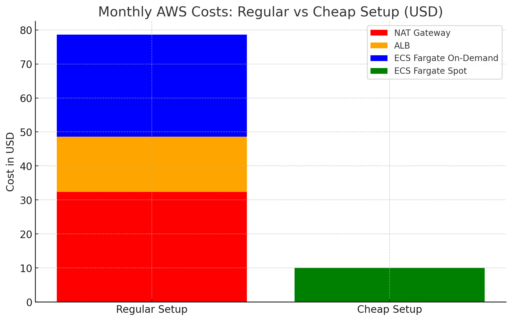

There's plenty of ways to run a docker image in AWS. Custom EC2 images, ElasticBeanstalk, ECS Classic and Fargate and
finally EKS.
We have a lot of articles and guidelines for production best practices. However, not all workloads require the same
levels of resiliency, security or robustness. Sometimes, all we want is an easy and economical way to run a webserver.
In this article, you'll find how to run a web service in ECS Fargate cheaply using aws-cdk:

## Network

For most custom workloads in AWS, we need VPC. Creating one with aws-cdk takes few lines of code. However, to
reduce costs, we need to make sure that we have no Nat Gateways:

```typescript
const vpc = new Vpc(this, 'Vpc', {
  natGateways: 0 // $30 a month
})
```

Each NAT Gateway instance costs around $30 a month. When we run multiple services in a single VPC, the cost will be
minuscule in comparison. However, when we run a single service, that's a major portion of the total. 

## Fargate service

Without NAT Gateways for our workloads to be able to talk to the internet, they have to be in a public subnet
and have a public IP address.

To save additional money, we'll use FARGATE_SPOT capacity provider. This offers a variable rate, up to 70% discount vs
on demand instances.

```typescript
const task = new FargateTaskDefinition(this, 'task')

const service = new FargateService(this, 'Service', {
  cluster: new Cluster(this, 'Cluster', { vpc }),
  assignPublicIp: true,
  vpcSubnets: {
    subnetType: SubnetType.PUBLIC
  },
  taskDefinition: task,
  capacityProviderStrategies: [{
    capacityProvider: 'FARGATE_SPOT', // 70% discount
    weight: 1
  }]
});
```

## Example workload

A web service usually accepts HTTP traffic on a specified port. Let's use http-server for demonstration purposes:

```typescript
const backend = task.addContainer('backend', {
  image: ContainerImage.fromRegistry("node:20-alpine"),
  command: ['npx', 'http-server'],
  workingDirectory: '/srv',
  portMappings: [{
    containerPort: 8080
  }]
})
```

Note that our container name in the task is `backend`. We also expose port `8080` to other containers running in the
task.

## HTTPS is a must these days

We should never expose any web service without HTTPS. In a typical setup, we would either use an AWS Load Balancer or
AWS API Gateway. The cost of ALB is roughly $16 a month. API gateway would be cheaper. However, it would add complexity
to our solution.

Let's use [Caddy](https://caddyserver.com/) which can act as reverse-proxy with automatic HTTPS coverage.

```typescript
 const hostedZone = HostedZone.fromLookup(this, 'tutorial.bright.dev', {
  domainName: 'tutorial.bright.dev'
});

const baseUrl = new URL(`https://cheap-ecs-fargate.${hostedZone.zoneName}`);

task.addContainer('caddy', {
  image: ContainerImage.fromRegistry('caddy:2-alpine'),
  command: [
    'caddy', 'reverse-proxy', '--from', baseUrl.hostname, '--to', '127.0.0.1:8080'
  ],
  portMappings: [{
    containerPort: 80
  }, {
    containerPort: 443
  }],
}).addContainerDependencies({
  container: backend,
  condition: ContainerDependencyCondition.START
})
```

As you can see, we configure caddy container to reverse-proxy traffic to our web service.
The caddy container will also listen on both HTTP and HTTPS ports.

## Expose services publicly

Finally, for our service to be reachable from the internet, we need to configure DNS to point to our task instance
public ip.

However, given that we use a spot instance, which can and will often be replaced by AWS, we should automatically
update our DNS entry whenever the task is restarted. Thankfully, there's a
construct `@raykrueger/cdk-fargate-public-dns` available that will do it for us:

```typescript
service.connections.allowFromAnyIpv4(Port.tcp(80), 'Http')
service.connections.allowFromAnyIpv4(Port.tcp(443), 'Https')

new PublicIPSupport(this, 'PublicIPSupport', {
  cluster,
  service,
  dnsConfig: {
    domainName: baseUrl.hostname,
    hostzedZone: hostedZone.hostedZoneId
  }
})
```

## Summary

The above setup is not suited for the majority of production use. However, for non-production isolated use, it can
significantly reduce your monthly bill:



The full example can be found
in [GitHub repository](https://github.com/bright/bright-cheap-ecs-fargate-https).
