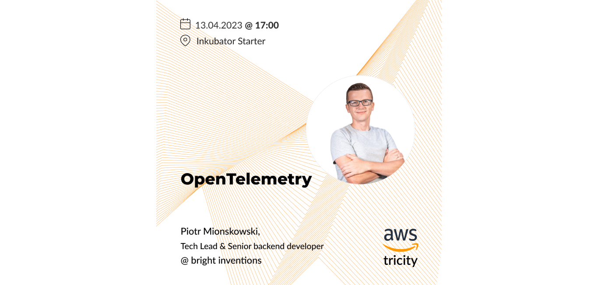
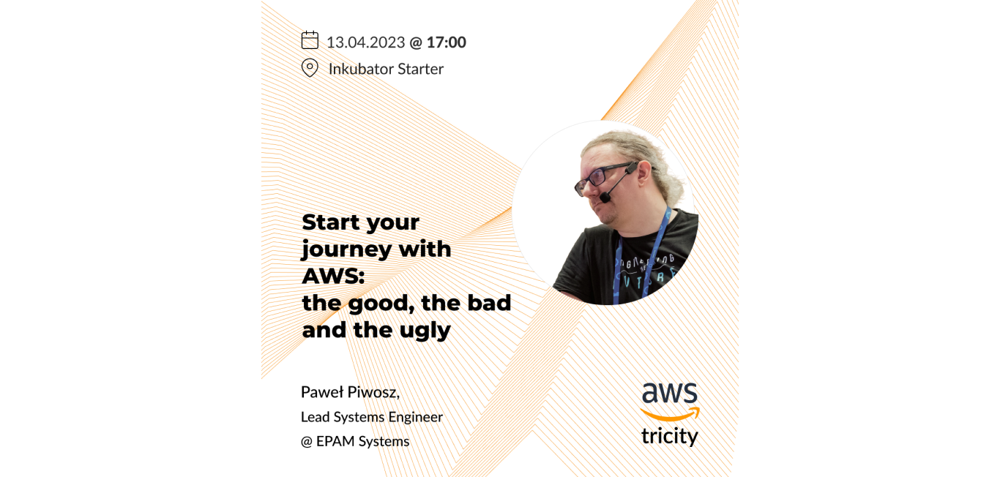
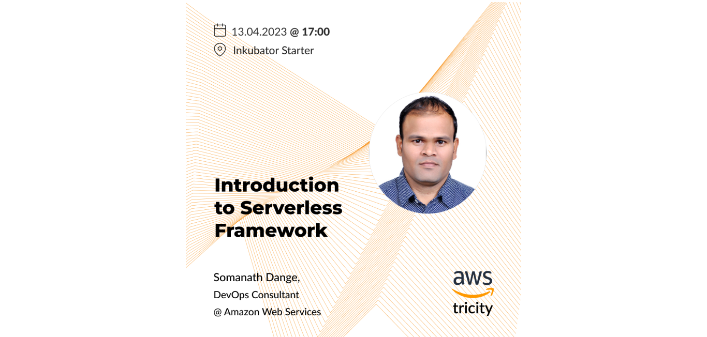
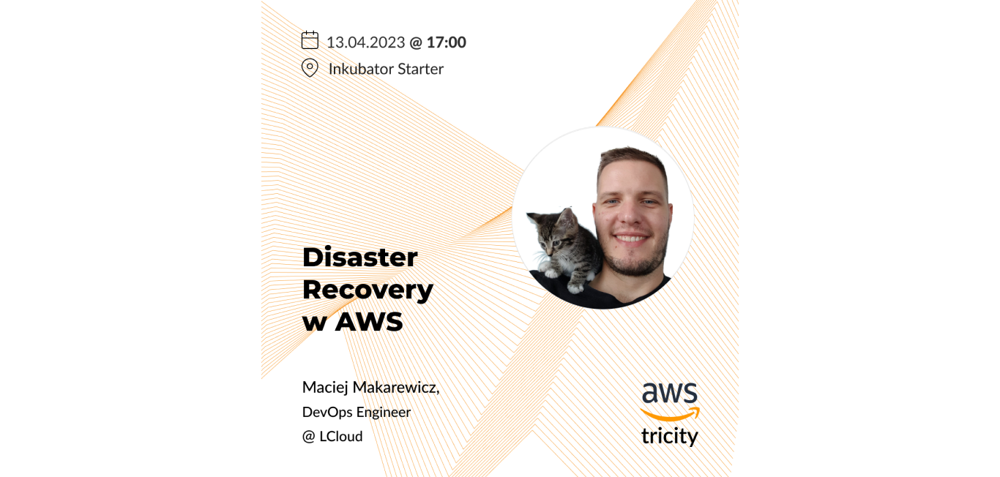

**Smart migration to AWS, introduction to Serverless Framework, Disaster recovery & OpenTelemetry. These are the topic of the AWS Tricity meetup which will take place onsite in Gdańsk Entrepreneurship Incubator STARTER on April 13 at 5 PM. The event is free. Sign up and join!**

<h2>Register to AWS Tricity Meetup</h2>
We've got a limited number of free tickets. Register for free now!
<a href="https://www.meetup.com/aws-tricity/events/292549246/"><button>sign up for AWS Tricity</button></a>

## AWS Tricity agenda:

April 13, 2023, Gdańsk Entrepreneurship Incubator STARTER

**5.00 pm** Welcome & registration

**5.10 pm** Meetup Intro - Piotr Mionskowski

**5.15 pm** Paweł Piwosz, Lead Systems Engineer, Epam Systems **"Start your journey with AWS - the good, the bad and the ugly"** \[presentation in Polish]

**5.50 pm** Somanath Dange, DevOps Consultant, AWS **"Introduction to Serverless Framework"** \[presentation in English]

**6.20 pm** Coffee & snacks break

**6.30 pm** Maciej Makarewicz, DevOps, LCloud **"Nie takie katastrofy w IT straszne, czyli słów kilka o AWS Disaster Recovery"** \[presentation in Polish] (English: Disasters aren’t as scary as they seem. A few words about AWS Disaster Recovery)

**7.05 pm** Piotr Mionskowski, Tech Lead, Bright Inventions **"OpenTelemetry"** \[held in Polish]

**7.30 pm** Discussion Panel \[held in Polish]

**8.10 pm** Hot pizza, cold beer & networking

## Meet our speakers

4 speakers will share AWS insights with attendees:

### [Piotr Mionskowski](https://www.linkedin.com/in/piotr-mionskowski-b2858516/), Partner and Team Leader @ Bright Inventions

Piotr is a senior fullstack developer and tech lead with over 12 years of professional experience in backend APIs, distributed systems, backend frameworks, and databases. He possesses an exceptional ability to learn almost every new technology that appears. Always up-to-date. Always focused.

Piotr has mastered the art of writing SOLID code and finding the answers to the most unexpected problems. Keeping a client's product operational and running is always of huge importance. He sometimes called himself “A Man Dancing with the Code” because for him programming does not come down to writing code. It is something more – it is an art in which programmers are sculptors who always should ask the question “Why”. A great fan of TDD and pair programming.

More o his presentation:

**OpenTelemetry**

OpenTelemetry enables new opportunities for monitoring production systems. With a set of standardized APIs, we can decouple our systems from monitoring products and have a common language to speak cross-platforms. I’m going to talk & demonstrate where Opentelemetry shines and where we should look for a different tool.

### [Paweł Piwosz](https://www.linkedin.com/in/pawelpiwosz), DevOps Institute Ambassador, AWS Community Builder & CD.Foundation Ambassador

DevOps, leader, mentor, trainer. His main focus in DevOps is CALMS as a framework. He tries to build a better understanding of DevOps as a company’s “driving force”.

More on his presentation:

**Start your journey with AWS - the good, the bad and the ugly**

The story is about whether migration to AWS (or any cloud in general) is a solution to all problems. What are the things we need to have under control, so we won’t be surprised by an extremely high invoice from AWS? Or what’s worst - by a “request” from a hacker for some bitcoins.

### [Somanath Dange](https://www.linkedin.com/in/somanath-dange/), DevOps Consultant @ Amazon Web Services

He has a total of 11.5 years of experience working in the IT industry as a DevOps Engineer. He has good experience working with AWS Cloud, solving complex problems. He has worked on many DevOps tools like terraform, GitLab, GitHub, Docker, Jenkins. His interest is in Cloud and he loves working on Cloud.

More on his presentation:

**Introduction to Serverless Framework:**

* What is serverless framework?
* How to leverage serverless framework to deploy resources to AWS Cloud?
* Code walkthrough.
* Short Demo.
* Q&A.

### [Maciej Makarewicz](https://www.linkedin.com/in/maciej-makarewicz-5889abb5/), DevOps Engineer @ LCloud, owner @ Makaron-IT

Maciej provides computer service and consulting in cloud services and DevOps methodologies. In the IT industry for more than 10 years, a natural ability to expand his knowledge of computer science and electronics led him to complete an engineering degree in Bydgoszcz in Electronics and Telecommunications, followed by a master's degree in Computer Science at Gdansk University of Technology. 

Professionally, he is involved in spreading DevOps knowledge and designing solutions in the AWS cloud and GCP. He strives to expand his knowledge of cloud services and share his knowledge with others. Privately passionate about sports, especially basketball, calisthenics, and swimming. In addition to sports, he is interested in shooting and growing plants.

More on his presentation:

**Nie takie katastrofy w IT straszne, czyli słów kilka o AWS Disaster Recovery** 
(English: Disasters aren’t as scary as they seem. A few words about AWS Disaster Recovery)

* The general context of disaster recovery.
* Exploring disaster recovery options at AWS.
* Disaster recovery testing.
* Explaining AWS Disaster Recovery + case study.
* Live presentation showing practical operations with DR.

## Join Tricity AWS community

If you are from Tricity (Poland), join or [AWS Tricity Facebook group](https://www.facebook.com/groups/679812723195646). Get AWS insights, info about meetups and free [AWS workshops](https://www.facebook.com/events/1303096523786948/?ref=newsfeed) that we regularly organize.

AWS meetup is powered by Bright Inventions, a software development agency based in Gdańsk. Bright Inventions gathers DevOps enthusiasts to share knowledge about AWS. The company is on its way to becoming AWS Partner (fingers crossed). 🙂

<h2>Register to AWS Tricity Meetup</h2>
We've got a limited number of free tickets. Register for free now!
<a href="https://www.meetup.com/aws-tricity/events/292549246/"><button>sign up for AWS Tricity</button></a>

