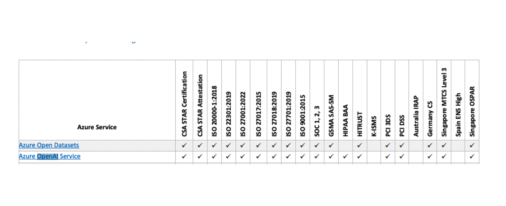
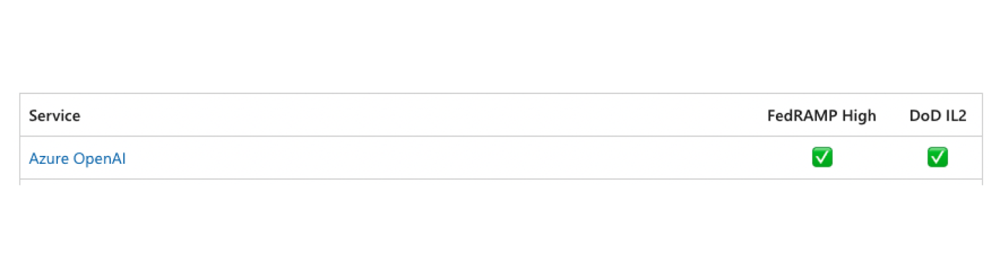

In my last blog post I have been exploring [OpenAI API service](/blog/openai-api-privacy-policies-explained/). As have
said, OpenAI API guarantees the best data control and privacy within all their offerings. When considering Open API for
integration, Azure OpenAI is often mentioned. Some say that we have better privacy controls with Azure OpenAI when
building Enterprise solutions. Is that true? Let’s dive into Azure Open AI Privacy Policy.

## Azure Service Trust Portal

Similar to the [OpenAI Trust Portal](https://trust.openai.com/), we have an information page of Microsoft about [privacy and compliance with different regulations](https://servicetrust.microsoft.com/). If you plan to research privacy and data protection within Azure, I think it is a good place to start.

## OpenAI Azure Service

Even though OpenAI is a separate company, Azure still offers OpenAI Azure service. What is important to note is that although the services are controlled by Microsoft, they do not interact with each other:

<blockquote>
    
The Azure OpenAI Service is fully controlled by Microsoft; Microsoft hosts the OpenAI models in Microsoft’s Azure environment and the Service does NOT interact with any services operated by OpenAI (e.g. ChatGPT, or the OpenAI API).

    <footer>[Microsoft OpenAI service privacy](https://learn.microsoft.com/en-us/legal/cognitive-services/openai/data-privacy)</footer>
</blockquote>

OpenAI and Azure have established a [partnership](https://openai.com/blog/openai-and-microsoft-extend-partnership), so probably that is the reason why Azure OpenAI Service offering exists. Azure ensures that our data aren’t accessible to Open AI or 3rd parties

<blockquote>
    

Your prompts (inputs) and completions (outputs), your embeddings, and your training data:
are NOT available to other customers.
are NOT available to OpenAI.
are NOT used to improve OpenAI models.
are NOT used to improve any Microsoft or 3rd party products or services.
are NOT used for automatically improving Azure OpenAI models for your use in your resource (The models are stateless, unless you explicitly fine-tune models with your training data).
Your fine-tuned Azure OpenAI models are available exclusively for your use.

    <footer>[Microsoft OpenAI service privacy](https://learn.microsoft.com/en-us/legal/cognitive-services/openai/data-privacy)</footer>
</blockquote>

**Shortly, it means that our data is not used to train models.**

Similar to OpenAI, we have 30 days data retention policy:

<blockquote>
    
To detect and mitigate abuse, Azure OpenAI stores all prompts and generated content securely for up to thirty (30) days. (No prompts or completions are stored if the customer is approved for and elects to configure abuse monitoring off, as described below.)

    <footer>[Microsoft OpenAI service privacy](https://learn.microsoft.com/en-us/legal/cognitive-services/openai/data-privacy)</footer>
</blockquote>

Also, when it comes to who can access this data we receive info that only authorized Microsoft employees have access:

<blockquote>
    
The human reviewers are authorized Microsoft employees who access the data via point wise queries using request IDs, Secure Access Workstations (SAWs), and Just-In-Time (JIT) request approval granted by team managers. For Azure OpenAI Service deployed in the European Economic Area, the authorized Microsoft employees are located in the European Economic Area.

    <footer>[Microsoft OpenAI service privacy](https://learn.microsoft.com/en-us/legal/cognitive-services/openai/data-privacy)</footer>
</blockquote>

In Azure, similar to OpenAI, you also are eligible for zero data retention:

<blockquote>
    
To address these concerns, Microsoft allows customers who meet additional Limited Access eligibility criteria and attest to specific use cases to apply to modify the Azure OpenAI content management features by completing this form.

    <footer>[Microsoft OpenAI service privacy](https://learn.microsoft.com/en-us/legal/cognitive-services/openai/data-privacy)</footer>
</blockquote>

What is different compared to OpenAI Api service is that with Azure you can control underlying network resources and
privacy:

<blockquote>
    
Being on Azure, it comes along with many additional functionalities like Network Isolation, Azure AD based Authentication/Authorization, Billing, etc.

    <footer>[Microsoft Q&A](https://learn.microsoft.com/en-us/answers/questions/1396203/is-there-a-difference-between-openai-chatgpt-enter)</footer>
</blockquote>

The data you send is not shared with OpenAI, you stay within the borders of one vendor, so if you are already using
Azure services these are valid points to consider to stay with them

<blockquote>
    
… are NOT available to OpenAI.

    <footer>\[Microsoft OpenAI service privacy](https://learn.microsoft.com/en-us/legal/cognitive-services/openai/data-privacy)</footer>
</blockquote>

Under this link we can see [compliance of Azure Services as of December 2023](https://servicetrust.microsoft.com/DocumentPage/7adf2d9e-d7b5-4e71-bad8-713e6a183cf3):

As you can see, there is more compliance offerings mentioned compared tor OpenAI - we can see ISO or PCI compliance
which also might be important for your use case. Also, Azure OpenAI has FedRAMP High and DoD IL2 compliance which make
it eligible for use with US government apps.

For GDPR compliance, when doing the research, it was not fully clear if the solution was compliant or not.

Generally, Microsoft employees say that regarding GDPR compliance:

<blockquote>
    
Microsoft takes data privacy and security very seriously, and has implemented measures to ensure that personally identifiable information (PII) is not shared with OpenAI during the usage of Azure OpenAI Service.  And I completely understand your concern regarding GDPR and privacy compliance. Microsoft takes data privacy seriously, and Azure services, including OpenAI, are designed to adhere to GDPR regulations. 

    <footer>[Microsoft Q&A](https://learn.microsoft.com/en-us/answers/questions/1339718/is-the-azure-open-api-in-compliance-with-gdpr-regu)</footer>
</blockquote>

In another thread though, we can read that Azure OpenAI cannot be used with any personal data (GDPR):

<blockquote>
    
I got confirmation from Microsoft Support that Azure OpenAI is a Preview and therefore the exclusion clause in the Microsoft Products and Services Data Protection Addendum applies. This means that Azure OpenAI cannot be used with any personal data (GDPR) as the necessary compliance requirements for DPAs are not fulfilled. 

    <footer>[Microsoft Q&A](https://learn.microsoft.com/en-us/answers/questions/1361952/does-azure-openai-fall-under-the-dpa)</footer>
</blockquote>

In the FAQs page of one of the 3rd party services using Azure OpenAI, we can read about GDPR as well:

<blockquote>
    

Is the usage of AI by 360L GDPR-compliant?
Yes. We are using Microsoft Azure Open AI technology, Microsoft Azure is already one of our sub-processors and it's GDPR compliant. The use of its Open AI services does not alter the contract and Data Protection Agreement (DPA) provisions we have in place.
 

    <footer>[360 learning Q&A](https://support.360learning.com/hc/en-us/articles/17562881836564-AI-data-usage-protection-and-privacy)</footer>
</blockquote>

So somehow it might suggest that it is possible to get GDPR compliant with Azure OpenAI service. I could not find any
specific, clear information about GDPR compliance on Azure resources though.
What is interesting, the Microsoft Copilot offering (which is also another Azure service using AI & LLM under the hood)
states that it is GDPR compliant:

<blockquote>
    

Microsoft Copilot for Microsoft 365 is compliant with our existing privacy, security, and compliance commitments to Microsoft 365 commercial customers, including the General Data Protection Regulation (GDPR) and European Union (EU) Data Boundary.
Your control over your data is reinforced by Microsoft's commitment to comply with broadly applicable privacy laws, such as the GDPR, and privacy standards, such as ISO/IEC 27018, the world’s first international code of practice for cloud privacy.
 

    <footer>[Microsoft 365 copilot](https://learn.microsoft.com/en-us/microsoft-365-copilot/microsoft-365-copilot-privacy)</footer>
</blockquote>

Last but not least, in contrary to OpenAI on Azure you can select which region LLM is hosted in. It is important for
some countries' compliance. A list of all regions that are eligible
is [here](https://learn.microsoft.com/en-us/azure/ai-services/openai/concepts/models#model-summary-table-and-region-availability).

This was the last blog post of my series. We have gone through most of the OpenAI offerings and analyzed Azure OpenAI
service offerings. That
includes [ChatGPT Free, Plus](/blog/openai-chatgpt-free-plus-privacy-policies-explained/), [Team, Enterprise](/blog/openai-chatgpt-team-enterprise-privacy-policies-explained/), [Open AI API](/blog/openai-api-privacy-policies-explained/)
and Azure OpenAI service offerings. What is important is to always adjust the technology used for your use case.
Hopefully, my blog posts helped you a little in understanding how data is handled with the most popular LLM offering in
the market. This is important as more and more apps, employers, companies, etc. will use AI to disrupt the world.