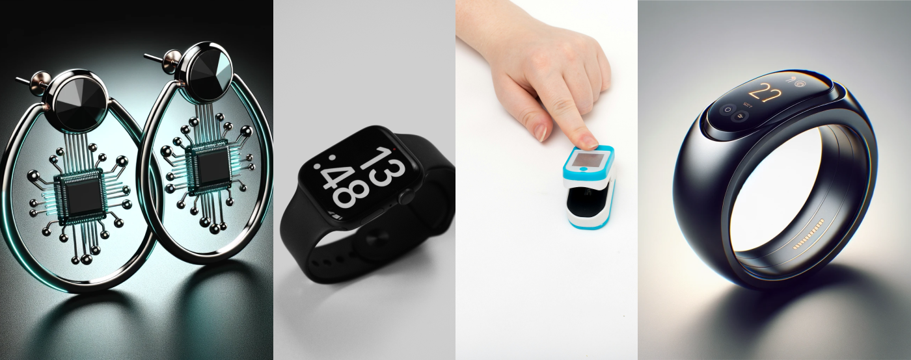

**Smart earrings, tattoos, smart socks, robot pets, and more... Discover the types of smart healthcare devices transforming patient care with the Internet of Things (IoT). Also, meet HealthTech companies that are behind these devices. The list is continuously updated.**

## Healthcare wearables

### Multi-functional smartwatch

They monitor stress levels, movement disorders, sleep tracking, blood pressure, heart disease.
Due to their widespread popularity, these devices have the potential to evolve from mere fitness trackers to healthcare tools accessible to the masses.

Companies: Brands like Fitbit and Garmin specialize in such devices.

### Smart ring

Smart rings have shown promise in areas such as sign language recognition and the early detection of COVID-19 and other viral infections. They are also utilized for early detection and prevention of burnout and other mental disorders. 

Companies: Oura, Motiv, Ringly, and Nuanic are examples of companies that have developed smart rings, providing insights into human well-being.

### Smart earrings

Researchers at the University of Washington are developing smart earrings capable of monitoring signs of stress, eating, exercise, and ovulation.

Companies: this technology is mostly developed at universities.

### Smart bracelet

A smart bracelet can as many wearables track vital signs. High-performance athletic wearables provide detailed insights into recovery, strain, and sleep, designed primarily for athletes and fitness enthusiasts. 

Companies: Fitbit, Garmin, Whoop specializes in athletic and lifestyle wearables. 

### Smart tattoos

Smart tattoos offer a promising future in the realm of personalized medicine including continuous health monitoring in a non-invasive and virtually unnoticeable manner.

Companies: smart tattoos are still in the experimental stage, undergoing research.

### Smart headband

Smart headbands are designed to monitor brain activity, stress levels, and sleep patterns. They often utilize sensors to collect data that can aid meditation, improve sleep, and manage neurological conditions.

Companies: Muse and Emotiv produce headbands that are widely used in neurofeedback and mental health improvement applications.

### Smart belt

Wearable devices that monitor physical fitness, track posture, and even alert users to health issues like irregular breathing or heart rates. They can also provide haptic feedback for posture correction.

Companies: WELT is an example of a company that has developed smart belts with health tracking.

### Smart Socks

Smart socks monitor foot temperature, helping to detect early signs of inflammation or injury. Smart socks can also help with the fall prevention.

Companies such as Siren and Palarum offer smart socks. 

### Smart shoe insoles

Smart shoe insoles are designed to fit inside footwear and provide real-time feedback on walking and running patterns. This technology is a proactive tool in diabetic foot ulcer prevention, helping to maintain foot health and mobility in patients with diabetes.

Companies: Digitsole, Orpyx, Nurvv are leading smart shoe insoles providers.

### Smart Contact Lenses

Connected contact lenses are innovative devices designed to monitor physiological conditions, like glucose levels or intraocular pressure, or to provide augmented reality displays.

Companies: Companies like Alcon and Mojo Vision are pioneering this technology, aiming to merge vision correction with digital data display or health monitoring functionalities.

### Smart glasses

These devices are particularly valuable for providing real-time patient data display, assisting with surgical procedures through augmented reality overlays, and improving accessibility for the visually impaired by enhancing residual vision or reading text aloud.

Companies: Vuzix and Google, Apple are key players in the development of smart glasses.

<YouTubeEmbed url='https://www.youtube.com/watch?v=2ts7Gxx2uc8' />

### Fall-detection devices

These devices use sensors to detect falls among patients and the elderly, alerting caregivers and emergency services automatically.

Companies: Lifeline develops fall-detection devices and sensors.

https://www.lifeline.com/

### Smart Bandages

They monitor wound conditions, such as moisture and temperature, and can deliver targeted drug treatments to improve healing processes.

Companies: This technology is still mostly in the prototype phase; if you know companies that are developing smart bandages, let us know in the comments.

## Remote patient monitoring & diagnostics devices

### Pulse oximeter

It monitors the oxygen saturation of the patient’s blood and displays the percentage of blood loaded with oxygen.

Companies: Masimo, iHealth are examples of companies developing smart pulse oximeter

### Bluetooth Thermometer

Modern thermometer devices not only read a patient's temperature remotely but also send the data to the app that evaluates them.

Companies: ihealth, Withings and Kinsa are examples of companies developing smart thermometers.

### Sphygmomanometer (electronic blood pressure monitor)

These devices often feature wireless connectivity, enabling easy tracking and management of blood pressure readings.

Companies: Omron, Withings and Qardio are examples of companies at the forefront of developing smart sphygmomanometers.

### Spirometer

Devcies designed to measure lung function and help diagnose, monitor, and treat respiratory conditions such as asthma, COPD (chronic obstructive pulmonary disease), and cystic fibrosis. 

Companies: NuovoAir, AioCare are examples of companies known for developing innovative smart spirometers.

### Stethoscope

It enables real-time and remote medical examinations that don’t have to be conducted by doctors. Caregivers not only can record a patient’s beating heart but even “broadcast” it live to the doctor.

Check companies developing smart home stethoscopes: Stethome, Feelix@Home.

### Smart Cardiac monitor

These are medical devices that continuously measure and record heart activity, providing essential data for detecting heart conditions such as arrhythmias, heart attacks, and other cardiovascular issues. Their “smart versions” can be utilised by patients in home settings.

Companies: SmartHeart is an example of a company manufacturing home cardiac monitors.

### Smart Scale 

Smart scales that not only measure weight but also track body composition, including muscle mass and body fat percentage.

Companies: Withings, Fitbit and Xiaomi are examples of companies selling  smart scales

### Sleep Monitors

Devices that track sleep patterns and quality, providing insights into sleep cycles, disturbances, and overall sleep health.

Companies: Fitbit, Philips, and Withings are notable producers of sleep monitoring devices that integrate with other health tracking systems.

### Skin Cancer Detection Device

A device that utilizes spectroscopy to evaluate skin lesions and detect potential skin cancers, recommending further analysis when necessary.

Company: DermaSensor is leading the way with this innovative approach to early skin cancer detection.

<YouTubeEmbed url='https://youtu.be/0wQreIXmS8Y' />

## Chronic disease management devices

### Artificial pancreas

Medtronic and Insulet are known for their development of artificial pancreas systems that automatically adjust insulin levels in diabetic patients.

Companies: Medtronic, Insulet are developing artificial pancreas

### Smart Pillbox

Smart pillboxes help manage medication schedules and ensure adherence to prescriptions and provides alerts whenever something is due.

Companies: Tinylogics, and PillDrill are developing smart pillbox.

### Smart med dispenser

A smart medication dispenser intelligently manages and dispenses prescribed drugs, ensuring that patients take the correct dosage at the right times, thereby improving adherence and overall treatment efficacy.

Companies: Hero is one of the companies developing smart dispensers.

### Smart Inhalers

Devices that help manage respiratory conditions like asthma or COPD by tracking usage patterns and medication adherence, and sometimes providing feedback on inhalation technique.

Companies: Propeller Health and Teva Pharmaceuticals offer advanced connected inhaler systems that sync with mobile apps for real-time monitoring.

### Glucose Monitoring Systems

They provide continuous or flash monitoring of blood glucose levels, helping individuals with diabetes manage their condition more effectively.

Companies: Dexcom and Abbott Laboratories are leading manufacturers of CGM (continuous glucose monitoring) systems, offering devices that deliver real-time glucose readings and trend data.

### Wearable Device to Track Epilepsy

This wearable technology is focused on monitoring and analyzing symptoms of epilepsy, aiding in the effective management of the condition.

Company: Neurava is at the forefront of developing these innovative wearable devices.

### Wearable for monitoring of chronic kidney disease

A wearable device for the arm that uses non-invasive methods to prevent and monitor chronic kidney diseases, offering a new approach to managing this widespread health issue.

Company: Metyos is pioneering this technology with its cutting-edge wearable device.

### Devices for Chronic Pain

Description: Devices designed to deliver neuromodulation therapy, effectively managing chronic pain conditions and improving quality of life.

Company: Nalu Medical is known for its advanced pain management devices.

### Gloves Reducing Hand Tremors

These gloves are engineered to stabilize hand movements for patients with Parkinson’s disease, helping to reduce tremors and improve daily functionality.

Company: Various is in the development stages for this type of assistive technology.

## Healthcare assistance devices

### AI Voice Assistant

AI-driven voice assistants to help manage health by providing medication reminders, scheduling doctor’s appointments, and offering health advice.

Companies: Nuance and Orbita offer AI voice assistants.

### Assistive Robot

Robots can assist staff in hospitals by automating routine tasks like fetching and delivering supplies.

Company: Diligent Robotics is an example of the company developing robots supporting hospital staff.

### Robot Pet

Companies like Joy for All create robotic pets designed to provide companionship for the elderly, which can help reduce stress and provide emotional support.

Company: Joy for All offers pets for emotional support.

<YouTubeEmbed url='https://youtu.be/W2hs1ar_lvE' />

### Smart Carpet

They are designed to enhance elderly care by detecting falls and unusual walking patterns, and alerting caregivers to potential issues.

Company: SensFloor by Future-Shape is a notable example of this technology. 

### Digital Mirror

It provides health and beauty insights, integrates with other health devices, and supports teleconsultation.

Companies: CareOS ang Neurologic develop smart mirrors.

<YouTubeEmbed url='https://youtu.be/J9o6_YlxlvA' />

## FemTech

### Breast Self-Examination Device

A device specifically designed to enable women to perform regular breast self-examinations at home, which is crucial for early detection of breast cancer.

Company: Glooma and Dotplot are aim to empower women to monitor their breast health effectively.

### Devices for urinary incontinence treatment

 These devices can include wearable sensors that detect moisture and send alerts to a smartphone app, allowing users to track incidents and patterns. Some advanced systems also offer pelvic floor training programs to strengthen muscles and reduce incidents of leaks.

Companies: Elvie and INNOVO are notable in the field of devices for urinary incontinence.

<InstagramEmbed url='https://www.instagram.com/p/C5l4d-Bpyrl/?utm_source=ig_web_copy_link&igsh=MzRlODBiNWFlZA==' />

### Fertility Tracker Devices

These devices often track physiological markers such as basal body temperature, hormone levels, or menstrual cycle patterns to predict ovulation and optimize the chances of conception.

Companies: Ava, Kegg and Clearblue are leading manufacturers in this sector. 

### Breastfeeding Monitor

Devices designed to assist nursing mothers by tracking breastfeeding sessions, monitoring the baby’s intake, and analyzing feeding patterns. This information helps mothers manage their feeding schedules and ensures adequate nutrition for the baby.

Companies: Coro is one of the pioneers in breastfeeding monitoring.
https://www.corobaby.com/

### Smart breast pump

Modern breast pumps connected to a dedicated app enable monitoring of milk volume, tracking of pumping sessions, and offer guidance to optimize the pumping experience.

Companies: Elvie, Willow and Freemie offer smart breast pumps.

### Hot flush relief bracelet

A piece of smart jewelry that automatically tracks hot flashes for women experiencing menopause, offering relief by triggering cooling at the onset of a flush.

Companies: Grace is the manufacturer developing bracelets for women with menopause.