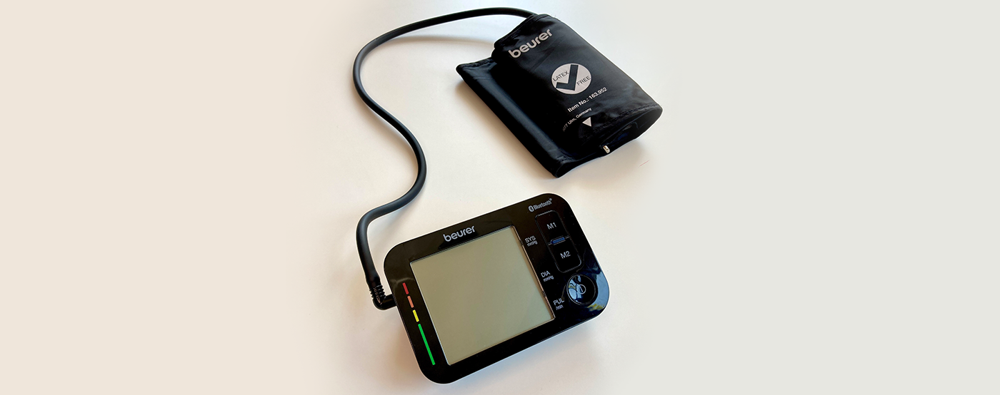
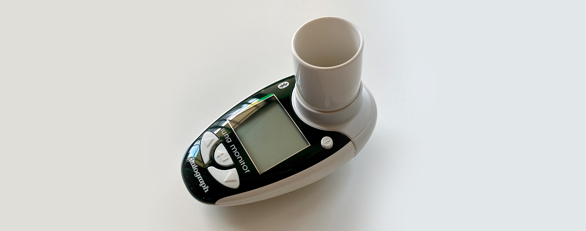
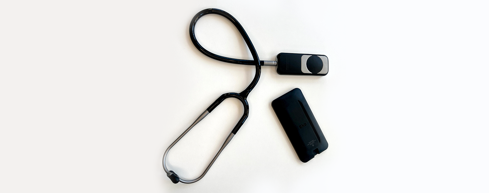
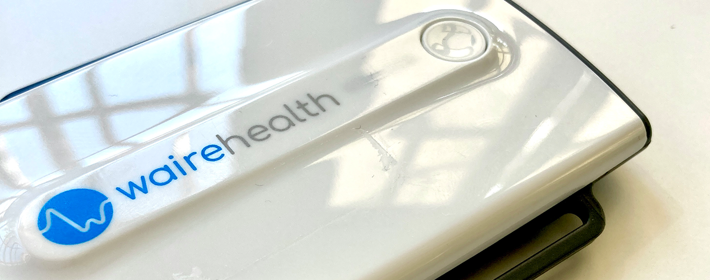
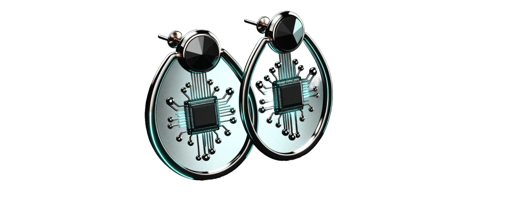

**Smart earrings, tattoos, smart socks, robot pets, and more... Discover the types of smart healthcare devices transforming patient care with the Internet of Things (IoT). Also, meet HealthTech companies that are behind these devices. The list is continuously updated.**

## Healthcare wearables

### Multi-functional smartwatch

They monitor stress levels, movement disorders, sleep tracking, blood pressure, heart disease.
Due to their widespread popularity, these devices have the potential to evolve from mere fitness trackers to healthcare tools accessible to the masses.

Companies: Brands like Fitbit and Garmin specialize in such devices.

### Smart ring

Smart rings have shown promise in areas such as sign language recognition and the early detection of COVID-19 and other viral infections. They are also utilized for early detection and prevention of burnout and other mental disorders. 

Companies: Oura, Motiv, Ringly, and Nuanic are examples of companies that have developed smart rings, providing insights into human well-being.

### Smart earrings

Researchers at the University of Washington are developing smart earrings capable of monitoring signs of stress, eating, exercise, and ovulation.

Companies: this technology is mostly developed at universities.

### Smart bracelet

A smart bracelet can as many wearables track vital signs. High-performance athletic wearables provide detailed insights into recovery, strain, and sleep, designed primarily for athletes and fitness enthusiasts. 

Companies: Fitbit, Garmin, Whoop specializes in athletic and lifestyle wearables. 

### Bluetooth Thermometer

* Another healthcare device that has become crucial during the pandemic.
* Modern thermometer devices not only read a patient's temperature remotely but also send the data to the app that evaluates them.

### Sphygmomanometer

* It is a well-known blood pressure monitor.
* Modern versions of these devices can connect to the app which enables sending the data about blood pressure to the medical staff.

### Spirometer

* It measures the volume of air inhaled and exhaled by human’s lungs.
* It’s another device that helps to diagnose COVID-19 infection. 
* Apart from that, it tests lung functionality, reasons for shortness of breath and other issues related to breathing.
* Modern hand-held spirometers can be used by patients on a daily basis.
* It is a helpful tool, especially for patients with chronic diseases like asthma who have to monitor their condition every day. Thanks to the app connected to the device doctors can monitor a patient's state in real time.

### Stethoscope

* Known as the number one of doctor’s gadgets, it can now be used remotely by other caregivers at care homes and nursing homes. 
* It enables real-time and remote medical examinations that don’t have to be conducted by doctors. Caregivers not only can record a patient’s beating heart but even “broadcast” it live to the doctor.
* Digital stethoscopes gather a very unique set of data which must be verified by doctors. Bluetooth connection enables transferring the data to an app which analyses them and informs a doctor about the results. 

### Wearable vital sign arm monitor

* Patients wear a device for example on their arm and doctors as well as caregivers can monitor the vital signs in real-time, 24 hours a day.
* These types of devices are especially beneficial for older patients because they are easy to use. Patients just have to wear it and have the app around.
* They help to prevent circulatory diseases that are [a leading cause of death globally](https://www.who.int/news-room/fact-sheets/detail/cardiovascular-diseases-(cvds)).
* However, they might not be that convenient to wear 24 hours a day compared to other smaller smart devices.

### Smartwatch

* Popular fitness gadget that can also be a part of medical remote care systems.
* They monitor stress levels, movement disorders, sleep tracking, blood pressure, heart disease.
* Due to their widespread popularity, these devices have the potential to evolve from mere fitness trackers to healthcare tools accessible to the masses. However, they may face some competition in this journey.

## Smart healthcare devices of the future

The future of digital health is closely connected with wearable healthcare devices that can non-invasively collect data 24 hours a day. The smaller these devices are, the better. Not only do they tend to have longer battery lives, but research also shows promise in [utilizing human body heat as a power source](https://scitechdaily.com/new-wearable-device-turns-your-body-into-a-biological-battery/).

### Smart ring

Image generated by DALL-E.

* Smart rings seem like smaller versions of smartwatches, but calling them that is an understatement.
* Their discreet form factor and the capability to collect data unobtrusively allow for the capturing of more comprehensive health data.
* Smart rings have also shown promise in areas such as [sign language recognition](https://dl.acm.org/doi/10.1145/3597638.3614491) and the [early detection of COVID-1](https://www.fiercehealthcare.com/tech/ucsf-launches-study-to-use-wearable-data-from-oura-ring-for-early-covid-19-detection)9 and other viral infections.

### Smart earrings

Image generated by DALL-E.

* Researchers at the University of Washington are developing smart earrings capable of monitoring signs of stress, eating, exercise, and ovulation.
* These earrings continuously measure fever, indicating if the body is fighting an infection.
* Studies show these earrings are more accurate at sensing skin temperature than smartwatches, making them potentially better for measuring ovulation and period tracking. FemTech companies are likely to explore these prototypes for integration with their applications.

## Challenges in implementing smart devices in healthcare systems

Gathering data from these devices isn’t a challenge. T**he challenge is to develop the right application that will not only analyze the data but will respond with a solution that may save a life**. For example, healthcare apps that we have created at Bright Inventions can instruct patients and caregivers to call an ambulance based on alarming data provided by the devices. 

Healthcare wearables are advancing in detecting various diseases early, including cardiovascular diseases, hypertension, muscle disorders, and neurocognitive disorders. Research also focuses on the development of wearables for the early detection of Alzheimer's and other neurodegenerative diseases​. Moreover, the future of smart devices in healthcare diagnostics looks promising with applications leveraging Generative AI.

Diabetics also wait for the moment when smartwatches and rings will be able to measure blood glucose but [that's still not a reality](https://www.theverge.com/2024/2/21/24079495/smartwatch-smart-ring-blood-glucose-monitoring-diabetes-fda).

If you are looking for a [healthcare software development company](/our-areas/healthcare-software-development/) to develop applications enabling remote patient monitoring with healthcare devices, make sure that **the software team that you are about to hire has deep knowledge of software as well as hardware**. These two elements are crucial in developing solutions for remote patient monitoring.

Contact us if you want to discuss your product’s challenges. [Schedule a free consultation in 48 hours](/start-project/)!