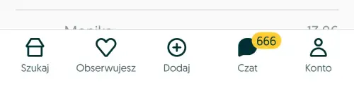

New feature for yesterday, too long backlog of bug tasks and this crazy new crash that started occurring randomly out of nowhere... No wonder that there is no time to focus on security aspects of our apps.
But lets break this vicious cycle now and dive into fundamental practice for securing your app: **Certificate pinning**.

## Someone is looking
Main reason for Certificate pinning implementation is so called Man in the middle attack. Not only does it allow malicious user to reverse engineer our APIs and test for vulnerabilities but also leaves possibility for intercepting data of our users. You can test this right away on your own app with use of SSL/TLS proxy like good old [Charles](https://www.charlesproxy.com) or [Proxyman](https://proxyman.com) (my current go to) or any other SSL/TLS proxy out there.

Here for example I could not only read but also substitute data retrieved by some popular classified advertisements portal ending up with funnily looking tabBar:

<center>

</center>
<center>

</center>


## Pinning tiers
So what is this whole certificate, how to pin it and even where to pin it? Lets start with TLS itself... TLS or Transport Layer Security is a protocol that stands in between server and client which allows for those two entities to negotiate secure connection and verify identity of the server that client talks to. This is being made with help of Server trust which is based on certificate chain. This chain typically consist of three parts:
* Root CA - long lived trusted anchor which is typically preinstalled on your device
* Intermediate CA - Issued by trusted root CA and used to sign leaf certificates
* Leaf certificate - end certificate, one that was granted for your server

Now whenever we want to connect to our server over https we will first negotiate encrypted connection with use of certificate chain. Client app will verify that it comes from the trusted root (which is handled at the system level) and connect. This predicate can be broken if malicious actor is able to force system to trust its own root CA with which fake certificate can be made. Alternatively such actor might be able to access private keys lower in the trust chain, eg intermediate CA (first case is exactly how TLS proxies works) and pretend to be our trusted server.

We can prevent such issue from happening by verifying that certificate we receive in our chain is known and trusted to us. This is similar to how platforms comes preinstalled with trusted root certificates but we will be verifying our own server certificate instead. This verification process is what we call Certificate pinning and we can pin any of the certificate in the chain. We will stick however to leaf certificate as it gives as certainty to whom we speak to.

### Not only certificates
Besides pinning entire certificate we can also pin certificate fingerprint or public key of private/public key pair used to sign certificate. Pinning certificate fingerprint can be more compact yet less verbose, there is no much difference here as compared to pinning whole certificate. 

Pinning public key gives as little bit of flexibility depending on how our certificate is being created since it can be refreshed with the same private/public key pair, but more on that later...

## How to pin
Certificate pinning in principle is very simple:
* During connection with server we are presented with authentication challenge
* Challenge contains host name and certificate chain
* We can check if leaf certificate in challenge is matching one that we expect

There are plenty networking libraries that can handle certificate pinning out of the box like [Alamofire](https://github.com/Alamofire/Alamofire/) (see their [docs](https://github.com/Alamofire/Alamofire/blob/master/Documentation/AdvancedUsage.md#security)) and for standard use cases those do the job well.

Lets go deeper and implement simple pinning ourselves to get better understanding of what is going on.

### Retrieving certificate for your domain
Starting point is to get actual certificate we want to pin. You can either reach to team managing domain for the certificate or you can get certificate currently used in production with openssl command. You can use example below for that purpose. Just exchange `<pinned_domain>` with actual domain for which you want to retrieve certificate.

```sh
openssl s_client -connect <pinned_domain>:443 -showcerts </dev/null 2>/dev/null \
| awk '/-----BEGIN CERTIFICATE-----/{i++} i==1 {print}' > leaf.pem
```

You will need this certificate later on to actually pin to it. Save those as a resources in your project. I have chosen structured folder directory to easily store and retrieve certificates. Structure is like this: `Certificates/<host>/<certificate_type>.der` (eg `Cetificate/bright.dev/leaf.der`). In order to make it work (xcode bundling resources keeping folder structure) you also need to make `Certificates` and actual (blue) folder in the project and not xcode group.

Now you can access those pinned certificates in the runtime retrieving them from Bundle like below:

```swift
import Foundation
import Security

func certificates(matchingHost host: String) -> [SecCertificate] {
    guard let resourceURL = Bundle.main.resourceURL else { return [] }
    
    let certificatesURL = resourceURL
        .appendingPathComponent("Certificates", conformingTo: .directory)
        .appendingPathComponent(host, conformingTo: .directory)
    
    do {
        let certificateUrls = try FileManager.default.contentsOfDirectory(
            at: certificatesURL,
            includingPropertiesForKeys: [.isRegularFileKey]
        )
        let certificates = certificateUrls.compactMap { file -> Certificate? in
            let fileType = file.pathExtension
            guard fileType == "pem",
                  let data = try? Data(contentsOf: file),
                  let secCert = SecCertificateCreateWithData(nil, data as CFData)
            else { return nil }

            return secCert
        }
        return certificates
    } catch {
        return []
    }
}
```

Here we have encountered Security framework for the first time. It might seem cumbersome and not Swifty - see that we created `SecCertificate object using SecCertificateCreateWithData. This is pretty old and crusty API, so lets get used to it... 😅

### Validating certificate
We have now our certificate added to the project - lets *pin* it!

In order to pin certificate we need to tap into previously mentioned `Authentication Challenge`. Fortunately there is really simple way of doing so with use of `URLSessionDelegate`. There are few steps to tackle in order to pin certificate:
1. Conform to and assign `URLSessionDelegate` to session object
2. Implement [urlSession(_:didReceive:completionHandler:)](https://developer.apple.com/documentation/foundation/urlsessiondelegate/urlsession(_:didreceive:completionhandler:)) delegate method. See that you can use callback or async variant.
3. Check host for which authentication challenge is being made 
4. Get trusted certificates for the given host (this is where you retrieve certificate eg from bundled resources). 
5. Handle fallback when no trusted certificate found. Either go with default platform behavior or cancel challenge all together (depending on your use case).
6. Retrieve leaf certificate from server trust (`SecTrust`) object.
7. Check if leaf certificate from authentication challenge is known and trusted to us.


```swift
extension NetworkManager {
    func setupSession {
        // #1 Assign delegate to the session object
        URLSession.shared.delegate = self
    }
}

// #1.1 Ofc you need to implement delegate
extension NetworkManager: URLSessionDelegate {
    // #2 Implement authentication challenge delegate method
    func urlSession(
        _ session: URLSession,
        didReceive challenge: URLAuthenticationChallenge
    ) async -> (URLSession.AuthChallengeDisposition, URLCredential?) {
        // #3 Checking host for the challenge
        let host = challenge.protectionSpace.host
        
        // #4 Get trusted certificate for host
        let trustedCertificates = certificates(matchingHost: host)

        if trustedCertificates.isEmpty {
            // #5 Fallback when no trusted certificate found
            return (.cancelAuthenticationChallenge, nil)
        }
        
        // #6 Retrieve leaf certificate from trust object
        guard let trust = challenge.protectionSpace.serverTrust,
              let chain = SecTrustCopyCertificateChain(trust) as? [SecCertificate],
              let leaf = chain.first,
              // #7 Validate that leaf is one of our trusted certificates
              trustedCertificates.contains(leaf)
        else { return (.cancelAuthenticationChallenge, nil) }
        
        return (.performDefaultHandling, nil)
    }
}
```

As simple as that, with just a few lines of code we have protected our app from malicious actors trying to intercept our communication. It can't be that simple, can it? 

## Where the devil sleeps
Issue that lies in this simple method is that certificates needs to be refreshed. For leaf certificates this happens relatively often - every year. This means that when we refresh our certificate which is pinned we also have to update app as well (remember - it was embedded as part of the app). This seems quite inconvenient both from perspective of release process as well as for our clients. Not only will they be interrupted by required update, but with raised deployment target we could leave behind older version of the app completely broken.

<center>

</center>

## What to do next? 
Maybe we could pin certificate lower in the chain? It gives as more time, but inevitably at some point it also needs to be refreshed and pinning it is potentially less secure. There is also possibility to utilize public key pinning - in case we control certificate creation and reuse same key pair for new certificate creation, then our refreshed certificate can be still pinned with same public key. This is however not always the truth (eg certificate creation and refresh is managed by platform we use). Moreover it is a good practice and recommendation to rotate public/private key pair regularly so if we stick to such good practices wew still need to update app with new pinned public key.
But maybe we could somehow update our app with latest certificates remotely? How about safety of such solution, is it even possible?
Fortunately there are some solutions for this problem and we could name a few:
* [Background updates](https://developer.apple.com/documentation/usernotifications/pushing-background-updates-to-your-app) - with use of APNS
* [CloudKit database](https://developer.apple.com/documentation/cloudkitjs/cloudkit/database) - and its public database

No solution is 100% secure and this is always a game of cat and mouse, but using one of the above methods allows us to leverage security of platform (iOS) in order to update our pinning without updating app itself. From perspective of security of our app if underlying system is compromised, then there is not much to be securing anyway, right?

With the example of CloudKit database, we can use its [publicCloudDatabase](https://developer.apple.com/documentation/cloudkitjs/cloudkit/container/1628710-publicclouddatabase) as a mean of distribution of updated certificates. Public database does not require our users to be signed into iCloud, so it is solution available to all of our users. Not only that, but we could even use cloudKit subscriptions to refresh state almost instantly. This is solution I have chosen for one of our clients. Not only this makes it much safer for their users as we check identity of server we talk to, but also much easier to maintain the product in the long term making it accessible even for users with older version of the app.

## Attribution
I would like to make a tribute to one of my favorite articles which was main inspiration for cloudKit usage in certificate pinning: [Secret Management on iOS](https://nshipster.com/secrets/) by [Mattt](https://nshipster.com/authors/mattt/).