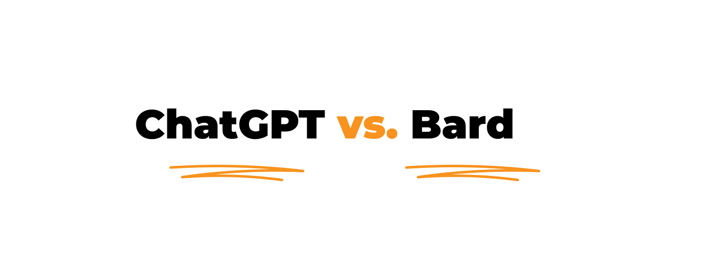
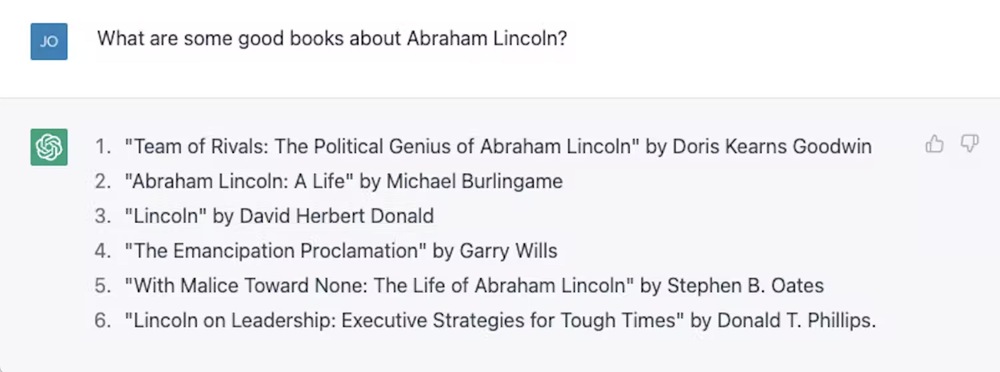

**ChatGPT-4 or Bard AI? What is better? After Google released a beta version of Bard we finally have more data to compare. The article is regularly updated. Feel free to bookmark/pocket it for later.**

## AI chat got into mainstream

It’s not something new to include AI in software development. However, products like ChatGPT moved AI to the mainstream and showed globally its potential. If you think about implementing AI chats in your software products, first **check out the main differences between the two best-known AI chats** at the moment.

<h2>Do you want to use AI in your software?</h2>
Contact us if you want to enhance your software with AI to shorten development time and stay ahead of your competition.
<a href="/start-project"><button>let's talk about your product</button></a>

## Finally, Bard AI is here (if you are in the US or UK)

March 2023 is full of more exciting updates about ChatGPT and Bard AI:

* ChatGPT-4 is released for Plus subscribers. It costs $20 a month.
* Bard AI beta version is released for users from US and UK.

As a result, we’ve got bigger possibilities to compare both solutions.

## Bard vs ChatGPT language models

Bard is powered by [LaMDA](https://blog.google/technology/ai/lamda/). However, ChatGPT is based on [GPT](https://platform.openai.com/docs/models/gpt-3). What does it mean for us – users? Putting aside technology differences, from users' perspective Bard should provide more up-to-date information.

LaMDA 👉 Provides **real-time responses** and has access to up-to-date information and data.

GPT-4 👉 Don’t provide real-time data. **Its knowledge doesn’t go beyond September 2021**.

## Integration with search engines

**Chat-GPT** is available while using the **Edge** browser and **Bing** search engine. So everything stays in the Microsoft family. 

**Bard** beta is exclusively available with the **Google** search engine. However, various browsers support it, including **Chrome, Safari, Firefox** or **Opera**. 

Will implementing ChatGPT with Bing be a first step to becoming a real competition against Google? Many have tried, but no one succeeded (yet?).

 

Source: [Digital 2023 Global Overview Report](https://datareportal.com/reports/digital-2023-global-overview-report)

Data from the recent “Digital 2023 Global Overview Report'' shows a clear dominance. However, **AI might make the competition exciting for the first time in 20 years**.

<YouTubeEmbed url='https://www.youtube.com/watch?v=yMpj33Y95ZU' />

Adding an AI chat solution to Google seems essential to stay ahead of competitors. However, there might be **reasons why Google didn’t rush into that**, even though they definitely worked hard on their own AI chat solution.

According to the promotional material provided by Google, we can assume that Bard will take over a SERP (search engine results page) position zero (a top position of the organic search results).

<TwitterEmbed url='https://twitter.com/sundarpichai/status/1622674382069059591' />

It might make it even harder to organically build your website traffic. And what about advertisers? Where will be their place in this new equation?

<h2>The challenge behind Bard</h2>
Figuring a way that will satisfy advertisers, publishers and generally content creators might be more challenging than building the Bard itself.

## Which one is better for programmers?

Unfortunately, I didn’t have a chance to test Bard AI yet. But there is more and more information from users, who has access to it, that Bard is reluctant to generate code. As we know ChatGPT has no problem with that. Obviously, the code quality is another issue. It still should be assessed by a developer.

However, at the moment is hard to see Bard as a handful tool for software developers.

## ChatGPT and Bard prices

ChatGPT-4 is available in the Plus subscribers plan which costs $20 a month. When it comes to Bard - not many people have access to it at the moment. However, assuming that it is going to be a part of our Google search experience, then it might be free(?).

## Last but not least – ChatGPT and Bard both make mistakes 😉

Let’s start with ChatGPT which is widely used across the globe. Let us show you one example of ChatGPT's problematic response:

Source: [https://theconversation.com/](https://theconversation.com/chatgpt-is-great-youre-just-using-it-wrong-198848)

Take a look at number 4. Garry Wills didn't write the ”Emancipation Proclamation”. Abraham Lincoln did.

When it comes to Bard not many people had the opportunity to test its “truthfulness”. Yet Google offered help. Thanks to the official promo material we could see that the [bot made mistake](https://www.scmp.com/news/world/united-states-canada/article/3209563/googles-chatgpt-rival-bard-gives-wrong-answer-ad-sending-shares-diving). Whether Google wants it or not we can be sure that any data from AI chats should be verified by a human. 

## Using AI in software development

We will **continue to observe the development of ChatGPT as well as the beginnings of Bard**. We will let you know how you could implement it for your business. **If you want to know more about using AI in your software products, just [contact us](/start-project/) and book a free consultation**.

<h2>Looking for AI software experts?</h2>
Let's talk about AI in your business. Contact us and we will get back to you in 48 hours.
<a href="/start-project"><button>let's talk about AI</button></a>

