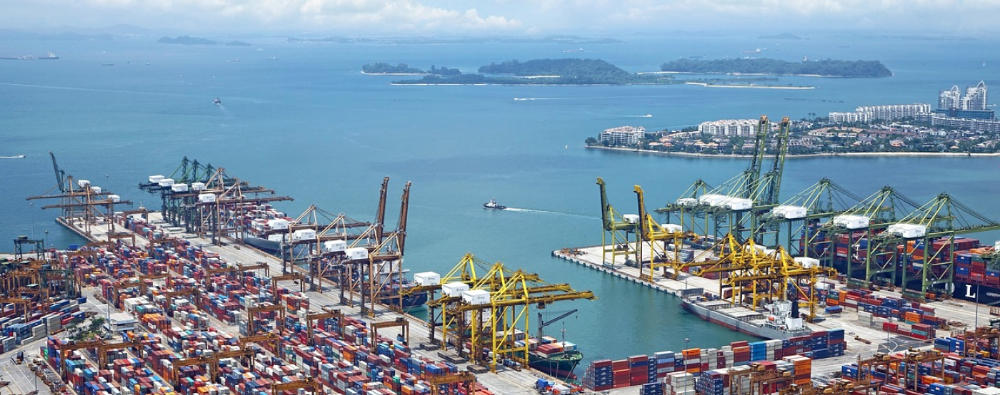
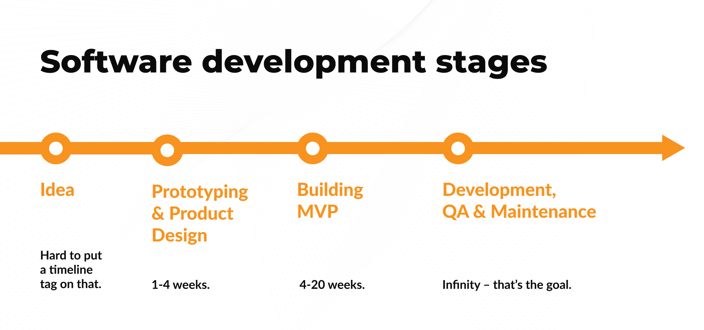

**Do you feel that it's time to digitize your company’s operations? Should you have a dedicated app developed or maybe it’s better to use existing solutions on the market? Check how to make that decision. Find out how long it takes to build a customized solution for logistics and why it’s smart to start from MVP (Minimal Viable Product).**

- - -

## Table of contents

[Digital transformation for the logistics industry](/blog/digital-transformation-guide-for-logistics/#digital-transformation-for-the-logistics-industry)

[When you should build your own customized solution for logistics](/blog/digital-transformation-guide-for-logistics/#when-you-should-build-your-own-customized-solution-for-logistics)

[Example of digital transformation in logistics (case study)](/blog/digital-transformation-guide-for-logistics/#example-of-digital-transformation-in-logistics-case-study)

[Examples of challenges in the logistics industry that tech can solve](/blog/digital-transformation-guide-for-logistics/#examples-of-challenges-in-the-logistics-industry-that-tech-can-solve)

[The road from the idea to the launch (including MVP)](/blog/digital-transformation-guide-for-logistics/#the-road-from-the-idea-to-the-launch-including-mvp)

[Logistics MVP stack for 2023](/blog/digital-transformation-guide-for-logistics/#logistics-industry-mvp-stack-for-2023)

[How much does it cost to hire a software agency to build MVP for logistics?](/blog/digital-transformation-guide-for-logistics/#how-much-does-it-cost-to-hire-a-software-agency-to-build-mvp-for-logistics)

- - -

## Digital transformation for the logistics industry

Digital transformation refers to the implementation of technology to improve various aspects of an organization's operations, business processes, products, services, and customer experiences. Moving into digital with your company documents, processes and data can help to speed up daily operations, secure fragile information and analyze the data to make more business-oriented decisions.

### There are two typical ways to digitalize your company operations:

* You can look for available on the market digital software tools (off-the-shelf software).
* Or hire a software agency to build a customized solution just for you.

## When you should build your own customized solution for logistics

For some companies, off-the-shelf software will be perfectly fine. In some cases, it won’t be enough though. So, when should you consider building something unique for your company?

* When you are a large organization that requires a multifunctional platform to meet the diverse needs of various departments and stakeholders.
* When you have tested other solutions and identified missing features that are crucial for your operations.
* When you have the financial resources, and development capabilities (internal or outsourced) to build something completely suited for your company’s needs.

## Example of digital transformation in logistics (case study)

Read the case study of a [customized solution for forwarding company in the light road transport sector](/projects/transportation-management-system/) (up to 3.5 tons of the permissible total weight).

## Examples of challenges in the logistics industry that tech can solve

### A weak internet connection

Internet connection is often not sufficient for daily operations in the logistics industry. Especially for drivers. It shouldn’t stop others to collaborate with drivers, e.g. freight forwarders. That's why an app built for the logistics industry often should have an offline mode. 

For example, an app used for drivers-freight forwarders communication should enable to share of vehicle localization even offline. Apps that are built around offline functionality are called [offline-first apps](/blog/offline-first-app-guide-for-startups-app-owners-case-studies/). 

### Paperwork and docs sharing

Permits, reports, photos, sheets – there is lots of paperwork associated with logistics operations. Technology enables a full digitalization of all documentation. 

Not only can you store documents in the cloud, but you can also share them with your colleagues, supervisors, and clients. Thanks to the offline mode, mentioned earlier, you can even store data offline. Then they will be synchronized when the internet connection is restored.

### Route Optimization

Everyone in the road transportation industry desires to lower the number of empty vehicles on the road. In 2021 [1 in 5 road freight journeys in the EU were performed by empty vehicles](https://ec.europa.eu/eurostat/statistics-explained/index.php?title=Road_freight_transport_by_journey_characteristics#Empty_runnings). 

Algorithms based on AI can optimize the route to find loads for empty vehicles more effectively. For example, dedicated software matches an empty vehicle with the load nearby enabling the driver to quickly pick up the load on the road and minimize the length of the journey with an empty vehicle.

### Lack of cargo security

[Foods products are one of the cargo groups with the highest share in tonne-kilometers](https://ec.europa.eu/eurostat/statistics-explained/index.php?title=Road_freight_transport_by_type_of_goods) transported by road in the EU in 2021. Technologies like GPS, IoT sensors, blockchain, or tamper-evident seals give an opportunity to secure food products (and others), reduce the risk of theft or tampering, and ensure the safe delivery of goods to their intended destinations. 

If you want to go deeper into [smart packaging](https://brightinventions.pl/blog/how-to-build-mvp-for-smart-packaging-solution/), which also takes care of cargo security, read our other blog post.

### A large scope of the possible end users

Logistics companies hire employees with different backgrounds, expectations, and technological expertise. Customized development gives a better option to design a solution that answers all employees’ needs. In this case, end users are represented by various groups with different expertise such as drivers, warehouse workers, freight forwarders, supply chain analysts, dispatchers, packaging specialists, and many more.

## The road from the idea to the launch (including MVP)

The typical app development flow estimates that MVP will be launched within a few months. It’s crucial because we should validate the MVP as soon as possible to minimize the costs. However every product is different, so the software development stages should depend on the particular solution.

### App Development Stages (including MVP phase):

#### The idea for a product

Verify the idea's business potential and define the target group. Choose key features to include in MVP.

#### MVP Prototyping (1-4 weeks)

Create visual representations and mockups of the solution.

#### Building and launching the MVP (4-20 weeks)

Develop the Minimum Viable Product and start gathering users.

#### Product Development, QA & Maintenance based on MVP

Continuously deploy new features, prioritize stability, and analyze user behavior for improvements.

If you want to dive deeper into [software development stages](/blog/what-are-the-stages-of-app-development/), read our other blog post.

<EbookDynamic sectionTitle='Want to grasp the ins and outs of MVP?' ebookName='From-MVP-to-a-Final-Product.pdf' ebookDescription='Read the free ebook about MVP development. Check out how you can start to digitize your company’s operations fast and with a lower budget.' ebookImage='/images/mvp_ebook_cover.png' ebookAlt='ebook mvp cover' />

## Logistics MVP stack for 2023

Every project is different and may require another stack approach. At Bright Inventions we always adapt technologies to the budget and time requirements our clients have. 

The stack listed below is a typical group of tools and programming languages we recommend (but as mentioned, recommendations may change!).

**Frontend**: TypeScript, React.

**Backend**: Node.js, PostgreSQL, NestJS, AWS.

**Android development**: Kotlin.

**iOS development**: Swift.

**Project management & documentation**: Jira, Github.

**Product design**: Figma, Miro.

**Analytics**: MixPanel, Google Analytics 4.

## How much does it cost to hire a software agency to build MVP for logistics?

There is no simple answer to this question. There are many aspects [MVP development agency](/our-areas/mvp-development/) has to consider before giving you a quote. The best way is to book a consultation and discuss your idea for a product, then you will receive the estimation.
