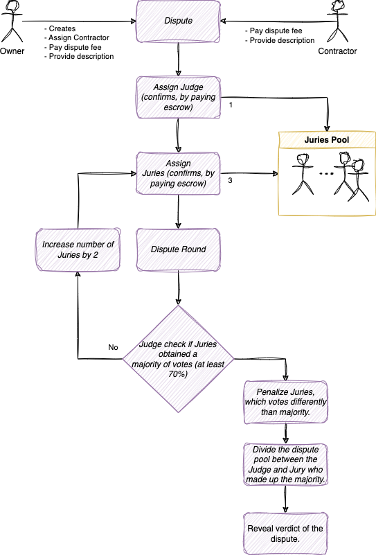

**In the innovative world of blockchain technology, smart contracts are revolutionizing how we think about legal agreements and dispute resolution. Bright Disputes is a  decentralized application (dApp) designed to address and resolve conflicts on Substrate-based blockchains. Let's delve into how this solution, encapsulated in smart contract code written in the programming language Ink!, promises to bring fairness and privacy to the forefront of digital disagreements.**

### **Understanding the Participants**

In the realm of Bright Disputes, there are several key roles:

* Owner: This is the individual who initiates a dispute.
* Contractor: The party involved in the dispute, typically against whom the dispute is raised.
* Judge: The entity responsible for tallying votes.
* Jury: Those who vote in the dispute, supporting one side or the other.

The process begins when an Owner raises a dispute, naming a Contractor to participate. Both parties are required to provide their perspectives on the conflict and pay the necessary fees to proceed. This initiates the dispute resolution process in earnest.

### Appointing the Arbiters

A Judge and Jury are then randomly selected by the smart contract from a pool of candidates. They are tasked with assessing the case impartially. To confirm their roles, both Judge and Jury must place an escrow—a security deposit of sorts, ensuring they take their duties seriously.

### The Voting Phase

After confirmation, the Jury votes in secrecy. Their votes are encrypted, ensuring that only the Judge can decrypt and count them. This phase is critical and relies on [zk-SNARKs (Zero-Knowledge Succinct Non-Interactive Argument of Knowledge)](/blog/zk-snarks-in-substrate-part-1/) to maintain the privacy of the voting process.

### Reaching a Verdict

The Judge counts the votes and determines if there is a decisive majority (at least 70%). If not, the voting round is repeated with an increased by 2 Jury size. Throughout this process, the votes remain confidential, upholding the integrity of the system.

### Ensuring Fairness and Honesty

To maintain honesty, zk-SNARKs are employed once more to prove the accuracy of the Judge's vote counting. This technology is pivotal, particularly when votes are too close to call, and rounds need to be repeated.

### Rewarding Justice

Once a verdict is reached, the Judge and those Juries who were in the majority receive a portion of the dispute pool as compensation for their service. Conversely, Juries who found themselves in the minority are penalized by forfeiting their escrows. This not only rewards consensus but also discourages frivolous or dishonest voting.

### Integration with Job Advertising Platforms

Bright Disputes is not just a theoretical construct but has practical applications. It can be seamlessly integrated with job advertising platforms like SubFunds, allowing for disputes to be raised and resolved within the ecosystem where contractors and clients interact. This was illustrated in the use case involving Bob (the job advertiser), Alice (the contractor), and Charlie (the judge).

### The Technical Prowess of Bright Disputes

From a development standpoint, the most intriguing aspect of Bright Disputes is the implementation of zk-SNARKs within the Substrate framework. The privacy this technology affords is paramount in ensuring that Jury votes remain encrypted and that the Judge's integrity is beyond reproach.

### User Interaction with Bright Disputes

For those involved, interacting with Bright Disputes is made user-friendly through a command-line interface (CLI) and the Polkadot.js dApp. This ensures that all parties, regardless of their technical expertise, can participate in the dispute resolution process.

### Conclusion

Bright Disputes stands as a testament to blockchain's potential in addressing complex challenges like dispute resolution. By leveraging the transparency and immutability of blockchain with the privacy of zk-SNARKs, Bright Disputes offers a secure, fair, and confidential platform for resolving disputes in the digital age.