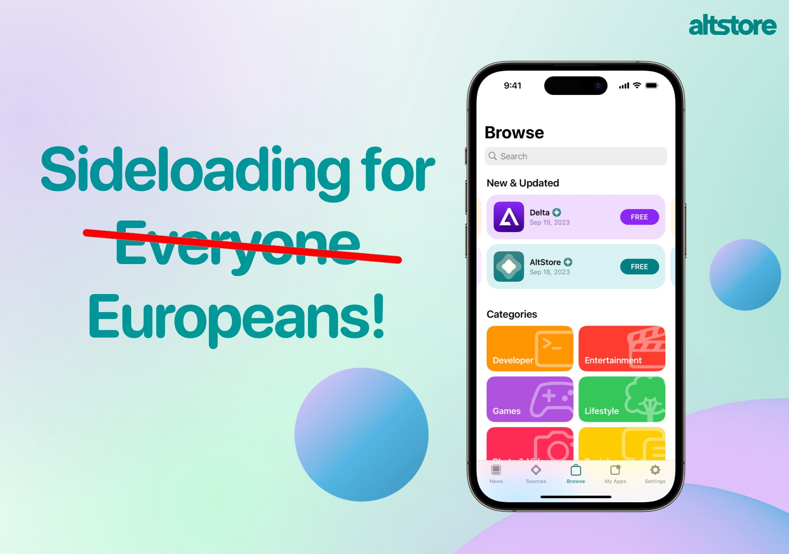
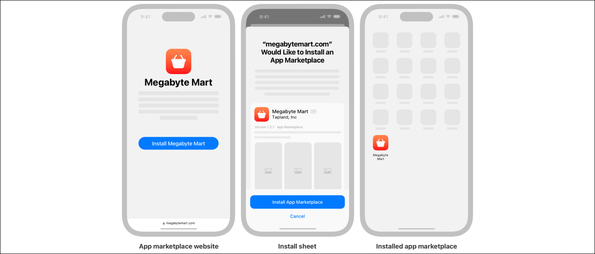
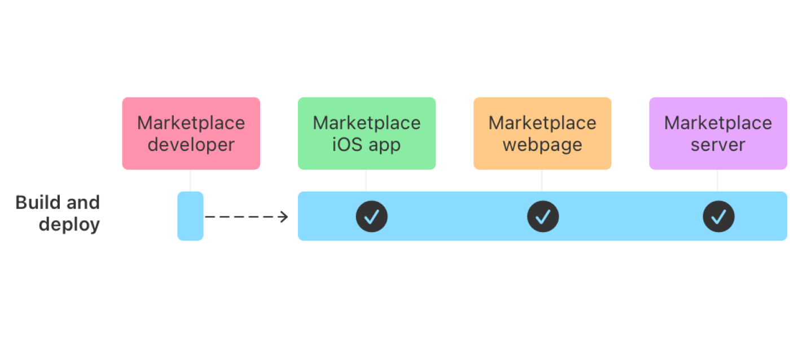
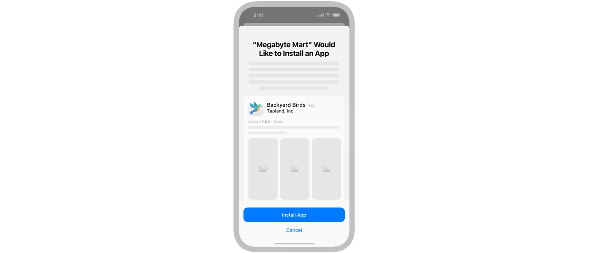

**Apple is forced by the EU to introduce the ability to install apps by alternative marketplaces other than AppStore. What does it mean for iOS developers and app owners? In this article, I will cover the main tech and business requirements to set up your marketplace.** 

The directive, called the **Digital Markets Act (DMA)**, which **will be effective in March 2024**, implies on Apple some major changes, the most important ones are:

* make it possible to install apps by the alternative marketplace;
* allow external payment providers;
* allow users to use alternative browser engines.

**This article covers the first of the implications, which is alternative marketplaces.**

Source: https://twitter.com/altstoreio/status/1750598337533747445

## What is an alternative marketplace?

Currently, iOS allows users to install apps from AppStore, Testflight or by Enterprise and MDM programs. **Alternative marketplace will be a completely new method of installing apps in iOS, but Apple doesn’t just open iOS for installing any app from any source known i.e. as sideloading.**

**To install an app from an alternative marketplace, users will have to first install an alternative marketplace app developed by an entitled marketplace developer**. After installing the marketplace app, they will be able to browse and install apps from it like they currently do through the AppStore app.

To become a marketplace developer, **multiple requirements need to be met**. A developer needs to accept new business terms, request the “Alternative App Marketplace Entitlement (EU)” and meet multiple criteria required by Apple. One of these requirements is providing “a stand-by letter of credit from an A-rated (or equivalent by S&P, Fitch, or Moody’s) financial Institution of €1,000,000 to establish adequate financial means in order to guarantee support for your developers and users”.

See: https://developer.apple.com/support/alternative-app-marketplace-in-the-eu/ & https://developer.apple.com/support/dma-and-apps-in-the-eu/#ios-app-eu 

Considering that you will meet all the requirements and Apple will agree to grant you such entitlement, the rest of the work is building a marketplace app and providing apps for it.

Source: https://developer.apple.com/documentation/appdistribution/creating-an-alternative-app-marketplace#Distribute-the-marketplace-app-on-the-web

## Submitting apps for alternative marketplaces

To distribute an app through an alternative marketplace, **app developers will still need to submit them through AppStore connect**. It will be required to pass a new review called “Notarization for iOS apps” that will check “platform integrity and protecting users”.

Notarization for iOS apps will focus on Functionality, Safety, Security, Privacy and Accuracy. Apple doesn’t mention that apps must comply with the “Human Interface Guideline”. Apps distributed on the AppStore will still need to meet Apple’s high standards and pass the normal review.

See: https://developer.apple.com/support/dma-and-apps-in-the-eu/#notarization-for-ios-apps

After passing notarization, **developers will need to obtain a security token from the marketplace owner to make their app available in a specific marketplace**.

It will be possible to make one binary available in the AppStore and multiple alternative marketplaces. App developers will be able to branch their code based on the installation (AppStore / TestFlight / Enterprise / Alternative Marketplace). 

It’s important to note that **iPad-only apps can’t be distributed through an alternative marketplace**, they need to support the iPhone too.

## Building an alternative marketplace

To set up a marketplace you will need to provide:

* marketplace webpage for letting people download the marketplace app;
* webserver for storing app data received from AppStore Connect and facilitating a secure app installation by communicating with iOS;
* dedicated iOS marketplace app.

source: https://developer.apple.com/documentation/appdistribution/creating-an-alternative-app-marketplace

**Marketplace iOS apps will be a new type of app that will be distributed by external webpage**. A special URL scheme will be used to perform an iOS app installation and that’s the only way of distributing and installing it.

Although the app will be distributed over an external webpage, **it will be required to do a setup with AppStore connect to obtain an “alternative distribution package”**. The process repeats with any update to the marketplace app, but can be automated with webhooks.

## MarketplaceKit

iOS 17.4 introduces a new framework called [MarketplaceKit](https://developer.apple.com/documentation/marketplacekit/) that will allow creation a marketplace app. It provides tools for requesting an installation of apps distributed over your marketplace, performing updates, restoring and retrieving licenses.

At a glance, the new API consists of:

* `AppLibrary` - the essential class to manage the installation and discovery of marketplace-hosted apps. See: https://developer.apple.com/documentation/marketplacekit/applibrary 
* `App License Delivery SDK` - for vending licenses from your webserver and handle DRM
* ​​MarketplaceExtension - “An extension that facilitates authentication, installation, and launching a marketplace with deep links.” See: https://developer.apple.com/documentation/marketplacekit/marketplaceextension 
* `Marketplacekit/ActionButton` - a special button for performing the actual installation to ensure that the process of installation was initiated by the marketplace app.

Apps using `MarketplaceKit` will need a special entitlement com.apple.developer.marketplace.app-installation without adding it, **iOS ignores calls to some parts of new API.**

The new API looks pretty straightforward, the developer will need to build an UI and call specific methods to list available apps, and request installs or updates. The rest will be handled by the iOS operating system along with webserver provided by the marketplace owner. 

More details about SDK can be found in the `MarketplaceKit` documentation https://developer.apple.com/documentation/marketplacekit

Source: https://developer.apple.com/documentation/appdistribution/creating-an-alternative-app-marketplace

`MarketplaceKit` is also useful for app developers that want to distribute their apps over multiple marketplaces. It also allows app developers to branch their apps based on the marketplace it was installed by.

> Use MarketplaceKit app distributor’s static current property to determine the installation source see https://developer.apple.com/documentation/appdistribution/distributing-your-app-on-an-alternative-marketplace#Branch-your-code-base-depending-on-the-installation

## What does alternative marketplace mean for iOS developers

Theoretically, benefits are lower or zero commission from alternative marketplace owners and a simplified review process. We don’t know how strict Apple will be regarding the review and the commission will depend on the marketplace developer. The downside will be an obviously lower user base covering only users in the EU that will install alternative marketplace app.

Although the technical side doesn’t look complicated, t**he business requirements for creating an alternative marketplace are high**. Becoming an entitled marketplace developer requires meeting some strict requirements. **Due to the requirement of providing a stand-by letter for €1,000,000, this process will be reserved only for big players that can afford this.**

Some companies have already announced that they will create their own marketplace apps. 
Despite some heavy criticism from Tim Sweeney, CEO of Epic Games, he mentioned that they will push to launch their Epic Games Store.

<TwitterEmbed url='https://twitter.com/TimSweeneyEpic/status/1750589570880516402' />

AltStore also announced that they’ve already started working on their marketplace

<TwitterEmbed url='https://twitter.com/altstoreio/status/1750598337533747445' />

I hope that some companies will be able to meet all the requirements and we will see alternative marketplaces soon. It’s a great new opportunity for apps breaking AppStore rules or the ones not willing to pay regular commissions to Apple.