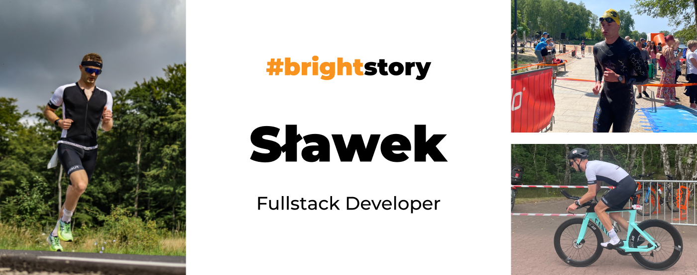
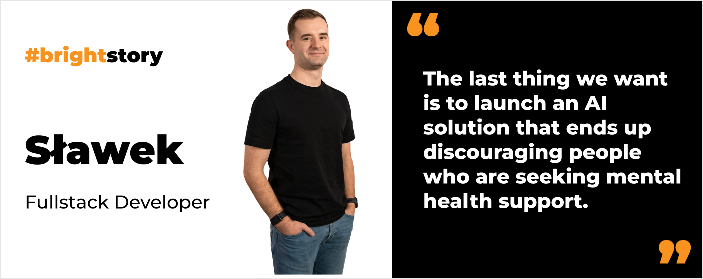

**For all his adolescence, Sławek wanted to be a firefighter. One unfortunate exam day changed his life and steered him towards software development. Now, Sławek is an experienced fullstack developer who embraces numerous changes faced daily at work.**

## Why did you want to become a programmer?

It might come as a surprise to you, but it was never a dream of mine. Throughout my life, **I aspired to be a firefighter**. 

Every choice I made regarding my education, and even how I spent my free time (such as joining a youth firefighter team), was aimed at gaining admission to the State Fire Service College. After completing the Polish Matura exam (the final high school exam), I took the entrance exams for the firefighting college. A deep understanding of mathematics, physics, and chemistry is required, along with physical fitness. Unfortunately, **I didn’t get in because my physical fitness level wasn't up to par on the day of the exam**.

Receiving these unexpected results left me with just a few days to decide on my next steps. If I wanted to pursue higher education elsewhere, I needed to apply quickly. **Since I had always enjoyed physics and math, I decided to study Computer Science**.

## Are you still considering a career as a firefighter?

I thought about it a lot during my first years as a programmer. Now, **this thought crosses my mind from time to time**, but I don't believe it will ever happen.

## Tell us about your recruitment journey to Bright Inventions. I heard it was quite a bumpy road. 😉

I remember visiting the Bright Inventions website and instantly feeling a strong desire to be part of the team. I had a tough technical interview with [Piotr](/about-us/piotr/), followed by another with [Ula](/about-us/ula/) focusing on my soft skills and English proficiency. **The feedback, after the interview, was that my technical and soft skills were satisfactory, but I needed to work on my English**. 

**Accepting this challenge, I immediately signed up for English classes** and attended them three times a week. To my surprise, **Ula didn't forget about me; she reached out after 6 months** to ask if I wanted to redo the interview. This time, my interaction was solely with Ula, concentrating on my English skills. **Finally, I managed to join Bright Inventions**.

## Are you excited about the AI revolution?

For sure, Generative AI is something I am currently responsible for in the project I'm working on. We develop a mental health care application, so we need to approach this methodically. **The last thing we want is to launch an AI solution that ends up discouraging people who are seeking mental health support**, for example, by being ununderstandable by a bot.

That's why we are currently focusing on creating various proofs of concept to determine which areas of the application can truly be enhanced with AI. Before we even begin testing them with users, **we need to identify clear signs of the value that AI can deliver**. The AI-based solutions must be primarily trustworthy for our mental health app users.

## How important is communication with business at your work?

While working with a startup communication with the business side is crucial. Before I joined Bright Inventions, I had a completely different mindset. Here, I learned that **not every problem should be solved with code. The best code is the one that was never written because you don't have to maintain it**.

I think every developer is an advisor as well. Business representatives often seek support from developers; they want to know if they should invest in a particular feature. They don't just expect you to code; **they need your guidance on how to allocate funds in product development, so it won't be wasted**.

When you work with startups, you also need to understand that things change fast. **You shouldn't build a strong attachment to your code**. The feature you are working on might be canceled before you even launch it in production.

## You seem cool about it. Have you always embraced the change?

Not at all. It was a long road for me, working with a startup was a crucial step. At Bright Inventions, **we focus more on finding solutions to solve our client’s problems rather than on the code or technology we use**. Obviously, you need experience to build that mindset and to be able to advise your clients.

## What is your main advice on how to understand clients’ expectations?

My main advice is to **ask clients as many questions as needed**. It often turns out that through the course of questioning, the client gains a better understanding of what they truly need. Together, we can then decide if an idea is worth developing at this very early stage, potentially saving a significant amount of budget.

## Having been on the same project at Bright Inventions for over three years, what keeps your interest alive and how do you stay motivated?

Working with startups brings a lot of challenges; **I never do the same thing every day**. Now, I get to work with AI, which offers the opportunity to delve into new areas of software development. In a startup, every day can present a different 'fire to put out.' And I don’t mean a massive bug on production. **It often involves a spontaneous idea that we need to implement right now**. So, there's no space to be bored here.

## You’ve been a part of Bright Inventions for over 3 years. What do you like about the company?

I appreciate that, despite working remotely, the atmosphere at the company is very friendly and welcoming. The managers are highly accessible, allowing me to ask questions at any time, and any problems are resolved promptly. **I also value transparency and the absence of workplace politics**. We focus solely on our tasks and project challenges, with no toxic games.

What’s great about Bright Inventions is **the emphasis on knowledge sharing**. Even when we are very busy, we always find time to meet and discuss technological novelties and share new learnings.

## What do you do after hours?