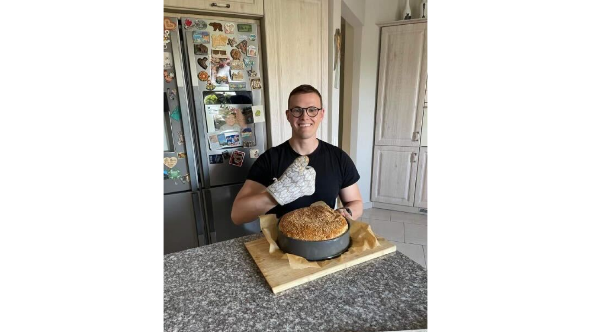
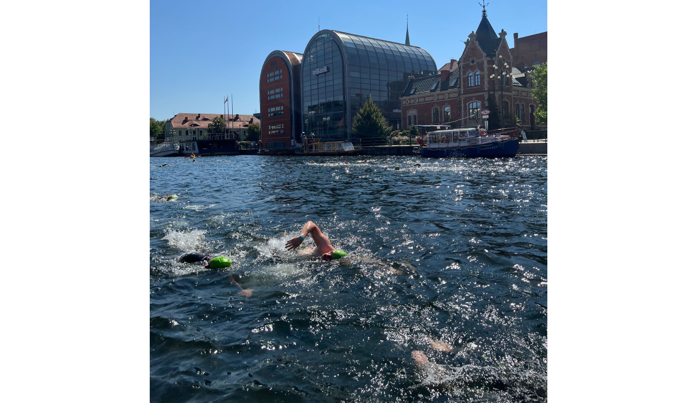

**At 6 am, you’ll find him in a swimming pool getting his daily endorphins for a productive day. Wojtek is a fullstack developer with over 5 years of experience, who loves exploring the business side of any software product. The more challenging the domain the client represents, the more eager he is to support them with his holistic approach. Check out Wojciech’s career journey.**

## How did your passion for programming spark?

It was purely coincidental. I didn’t have a clear career path in mind. I initially chose to study Electronics and Telecommunications, but I found little enjoyment in it. The only classes that truly piqued my interest were mathematics and programming. Consequently, **I decided to switch paths and delve into the fields of Informatics and Econometrics**.

## How did you start to work at Bright Inventions?

**My journey to Bright Inventions has an interesting twist**. Initially, I aimed to work as a frontend developer and accepted a job offer from a different company. However, I still had an interview planned for the position at Bright Inventions. Already landing another job, I didn't approach that interview as thoroughly as I should have. I began working elsewhere, gradually transitioning into a role as a mobile developer, which, while adjacent to frontend work, was different from what I aspired to do. 

**My friend — who also happened to be my college professor — highly recommended Bright Inventions and encouraged me to reapply**. However, it was Ula who reached out to me around 6 months after my failed interview, asking if I was open to trying again. I immediately said “yes” and finally joined the company. This adventure has been ongoing **for almost 4 years now**.

*
Bright Inventions' team — the winners of Challenge Gdańsk triathlon competition.
*

## Frontend or backend — which one is closer to your heart?

I used to distinguish between frontend and backend, but now **I don't separate them anymore**. At Bright Inventions, my position at first was a frontend developer, but I gradually acquired backend skills. Nowadays, I prefer taking a holistic view of the project. **I appreciate a full-stack role because approaching projects comprehensively is more intriguing and better supports the business**.

The only downside of being a full-stack developer is the constant need to learn, and keep up with updates, and news. **It requires a lot of effort to stay in the loop**. Nevertheless, I'm completely fine with it. I've always aimed to grow, so it aligns well with my ambitions.

<h2>Do you want to join Wojciech?</h2>
We are on the lookout for highly skilled professionals. Join us!
<a href="/career/"><button>check our career opportunities</button></a>

## What types of projects do you enjoy the most?

I'm drawn to non-trivial projects with complex domains. **The more intricate the domain, the greater the challenge for a developer**. Simple applications, even with significant revenue, tend to lose their appeal quickly. In complex domains, the intriguing challenges begin right from the architecture design phase.

Currently, **I'm part of a team developing a transport management system for a forwarding company**. This project has numerous moving parts — yet not the typical pivots seen in startups. For instance, we have to ensure compliance with the new highway payment regulations in Germany. **Our system is relied upon daily by our clients, so there's a strong sense of responsibility, which is also incredibly rewarding**.

## So staying close to the business side of the project is important to you?

Yes, **I've reached a stage in my career where I'm particularly passionate about the business aspect of projects**. Immersing myself in the domain background, empathizing with clients and their needs, and actively stepping into their shoes to comprehend their perspectives fuel my drive. 

My goal isn't just to provide excellent services but to tailor them precisely to meet the unique requirements of each client. Whenever I encounter difficulty in understanding a client's needs, I persistently strive to bridge that gap. **I believe that a software developer’s job is to understand the client and they need to do everything in their power to achieve it**.

## I know that soft skills matter to you. Was that always a core of your skillset?

I needed time to discover them. Upon joining Bright Inventions as a junior, I focused extensively on catching up with various technical aspects. At some point, [Mateusz](/about-us/mateusz/) told me that my tech skills were sufficient, but also emphasized the need for improvement in my soft skills. He gave me specific feedback **pointing out some aspects I could improve for example communication with clients, especially while explaining technical aspects of our work to them**. 

**I started to read some books on a subject and observed how Mateusz, [Michał](/about-us/michal/), and other team members navigate daily relations with clients**. Step by step, I felt better at it. Yet, it was a long way; reading one book wouldn't make a difference.

## What do you like to do after hours?

I've recently delved into investment, reading books about it. However, **my enduring passion remains swimming, sparked at Bright Inventions**. I knew how to swim and enjoyed it, but i**t wasn't until Bright offered classes by a professional triathlete that I began swimming regularly**. Two reasons drove me: the opportunity to share the same passion with fellow team members and a practical one — no sports activity led to backaches.

Now, **I swim six times a week, usually at 6 am**. This routine suits me; **by the time work starts, endorphins are already at play, making the day nicer and more manageable**.

One proud moment was outswimming [Michał](/about-us/michal/) in a triathlon. Of course, he swiftly overtook me in the run, but **showcasing my swimming strength was gratifying**.