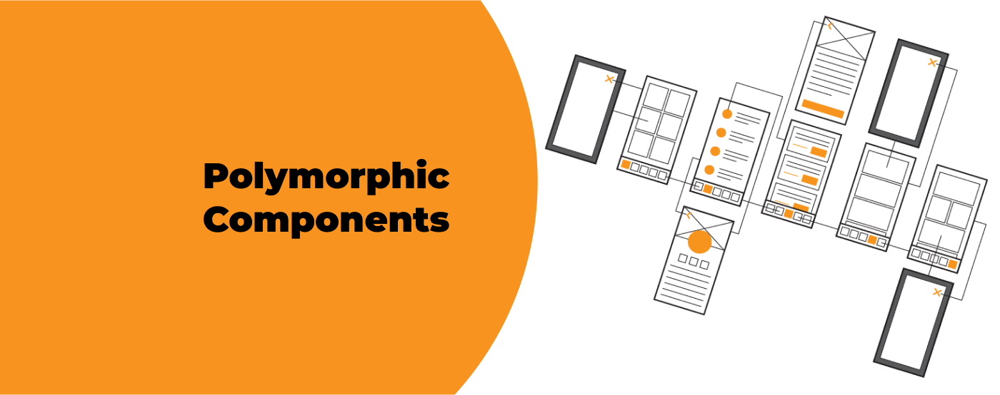

**Do you want to take your React skills to the next level and create more versatile components? Polymorphism is here to save you! It will help you build reusable components, no matter if you're a React rookie or a seasoned pro. Prepare yourself for an expedition through the essentials, advanced techniques, and real-life use cases commonly found in various codebases. Let us embark on this voyage together and unlock the true potential of polymorphism in React!**

<div className="image"></div>

## What Are Polymorphic Components?

**They are versatile React components that can adapt their appearance and behavior based on the context in which they are used**. Unlike traditional components, which are rigidly defined by their structure and styling, polymorphic components allow you to customize their rendering based on the specific requirements of each instance.

<div className="important-info"><h2>Why should you care about polymorphic components?</h2><div>Well, picture this: you're building a web app with various user interface elements, such as buttons, links, or even cards. Instead of creating separate components for each variant of these elements, polymorphic components empower you to build a single, flexible component that can effortlessly transform its appearance and functionality as needed.</div></div>

## The Magic Behind Polymorphic Components

At the core of polymorphic components lies the concept of prop-driven rendering. Instead of relying solely on predefined tags, polymorphic components harness the flexibility of props to dynamically determine their rendering logic. By passing a special prop, often called `as` or `component`, you can specify the underlying HTML tag or a custom React component that the polymorphic component should render as.

This dynamic rendering capability opens up a whole new world of possibilities. Need a button that renders as an anchor tag or even a custom button component? No problem! With polymorphic components, it's as simple as passing the desired tag or component as a prop. This flexibility enables you to reuse a single polymorphic component in various contexts while still maintaining consistency in functionality and styling.

## Unleashing the Potential of Polymorphic Components

Now that we have a solid understanding of how polymorphic components work, let's explore some real-world use cases where these dynamic powerhouses truly shine.

### Button Variants

Imagine you're working on an e-commerce website, and you need to create different types of buttons for various actions like "Add to Cart," "Buy Now," or "Read More." **Instead of creating separate button components for each variant, you can leverage the flexibility of polymorphic components**. With a single polymorphic button component, you can easily customize its appearance and behavior by passing different values to the `as` prop. This way, you can have anchor tags, button tags, or even custom button components rendered on the fly, all while maintaining consistent functionality and styling.

### Navigation Menus

**Polymorphic components can be a game-changer when it comes to building navigation menus**. Let's say you have a horizontal menu that needs to render as an unordered list (`<ul>`) with list items (`<li>`). However, in certain cases, you may need the menu to be a vertical sidebar rendered as a `<nav>` element. By utilizing the power of polymorphic components, you can effortlessly switch between these different rendering styles based on the context. Simply pass the desired tag or component as the `as` prop, and voila! Your navigation menu adapts to any layout requirements you throw at it.

### Typography component

With polymorphic capabilities, the Typography component can adapt its rendering to various text elements, such as `<h1>`, `<p>`, `<span>`, and more. This flexibility allows developers to maintain consistent typography styles while seamlessly adjusting the underlying HTML tag based on the desired semantic structure and design requirements.

These are just a few examples to get your creative gears turning. The beauty of polymorphic components lies in their versatility and adaptability. You're no longer constrained by rigid component structures or forced to create numerous variations of similar components. **With polymorphic components, you can build a robust library of reusable UI elements that effortlessly transform to meet the unique requirements of your applications**.

In the next section, we'll dive into the implementation details and walk through a practical example to solidify your understanding.

## Implementing Polymorphic Components

One practical **example of harnessing the power of polymorphic components is the implementation of a Typography component**. By leveraging polymorphism, this component allows you to create reusable and customizable text elements while maintaining type safety through TypeScript.

```typescript
import React, { ComponentPropsWithoutRef, ElementType } from "react";

export type TypographyProps<T extends ElementType = "span"> = {
  as?: T;
} & ComponentPropsWithoutRef<T>;

export const Typography = <T extends ElementType = "span">({
  as,
  ...rest
}: TypographyProps<T>) => {
  const Element = as || "span";

  return <Element {...rest} />;
};
```

In this example, the Typography component is defined as a generic component that accepts a type parameter `T`, representing the desired HTML tag or component type. The TypographyProps type is defined to extend `ComponentPropsWithoutRef<T>`, which ensures that the component props are correctly inferred and type-checked based on the selected variant.

To use the Typography component, simply specify the desired variant type when rendering:

```typescript
import Typography from './Typography';

const MyComponent = () => {
  return (
    <div>
      <Typography as="h1">Heading 1</Typography>
      <Typography as="p">Lorem ipsum dolor sit amet, consectetur adipiscing elit.</Typography>
      <Typography as="span">This is a span element.</Typography>
    </div>
  );
};
```

With this approach, you can have type-checking and IntelliSense for the attributes specific to each variant. For example, when using `<Typography as="h1">`, you will have type-checking and IntelliSense for the props that are applicable to a heading element.

It's worth mentioning that the addition of TypeScript type checking does not introduce any runtime performance penalties. However, it's important to note that it will increase the compilation time, especially in larger codebases. This is because TypeScript needs to analyze and validate the types throughout your codebase, which can take longer when dealing with intricate type definitions.

### Exploring Slot Component by Radix UI

In our exploration of polymorphic components, we've discovered a game-changing solution: **the Slot component from Radix UI**. **This powerful component enables us to conditionally merge its props onto its immediate child component, providing a seamless way to share styling, functionality, and type checking across different use cases**. Let's dive into how the Slot component empowers us to create dynamic and versatile components in practice.

Consider the example of a Button component using the Slot component:

```typescript
import { ComponentPropsWithoutRef } from 'react';
import { Slot } from '@radix-ui/react-slot';

type ButtonProps = ComponentPropsWithoutRef<'button'> & {
  variantColor: 'primary' | 'secondary' | 'danger';
  asChild?: boolean;
};

export const Button = (props: ButtonProps): JSX.Element => {
  const { variantColor, asChild, ...other } = props;

  const Component = asChild ? Slot : 'button';
  const variantClass = ''; // Conditional className for each variant

  return (
    <Component
      className={variantClass}
      {...other}
    />
  );
};
```

In this example, the Button component accepts the props of a button element, as well as a `variantColor` prop and an optional `asChild` prop. By conditionally assigning the Component variable to either the Slot component or the string 'button', we achieve dynamic rendering based on the `asChild` prop value.

When the `asChild` prop is set to true, the Slot component is used, enabling us to render the Button component as a child of an anchor tag, like this:

```typescript
<Button asChild>
  <a href="example.com">Click Me</a>
</Button>
```

This approach ensures that the Button component retains type checking and IntelliSense for the anchor tag's attributes, providing a seamless development experience while maintaining shared styling and other functionality.

On the other hand, when the `asChild` prop is not provided or set to false, the Button component renders as a regular button element.

```typescript
<Button variantColor="primary" onClick={submitHandler}>Submit</Button>
```

**By leveraging the Slot component, we achieve code reusability, reduced duplication of properties, and the ability to seamlessly switch between different rendering scenarios while maintaining a unified codebase**. 

However, this approach has a noticeable drawback. If your polymorphic component accepts props of a button, then it will pass all of them to the Slot beneath it. It means you can end up with an anchor with `type` or `disabled` attributes, which are not supported. You may consider filtering them out first to now allow that.

## Embrace the Power of Polymorphic Components in Your React Journey

In our fascinating journey exploring polymorphic components in React, we've witnessed the transformative power of flexibility and reusability. By seamlessly switching between different HTML tags or custom component types, we've unlocked a world of dynamic and customizable UI elements. Whether leveraging libraries like Radix UI's Slot component or integrating TypeScript, we've successfully merged the realms of dynamic composition and type safety.

Polymorphic components have proven to be invaluable in streamlining typography management, **ensuring consistency, and eliminating code duplication**. With their ability to effortlessly adapt to different scenarios, they **provide a maintainable and scalable codebase** that developers can enjoy working with. The fusion of flexibility and type safety, facilitated by TypeScript integration, empowers us to build robust and error-free applications.

By embracing the art of polymorphism in React, we open the doors to endless possibilities. Experimenting with different variants, pushing the boundaries of component design, and crafting exceptional user interfaces that effortlessly respond to evolving user needs become our new norm. With polymorphic components as our trusty tools, we embark on a coding adventure filled with innovation and creativity.

Happy coding!
