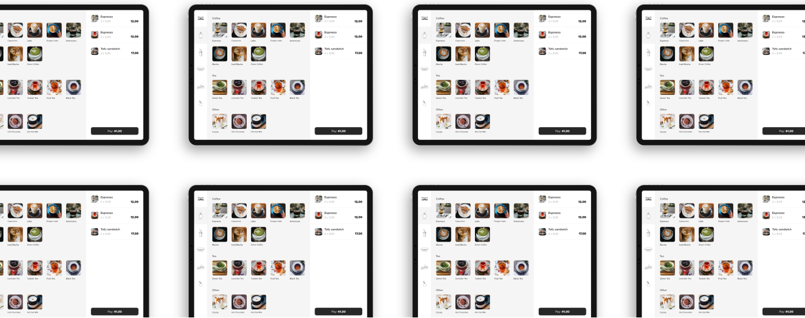
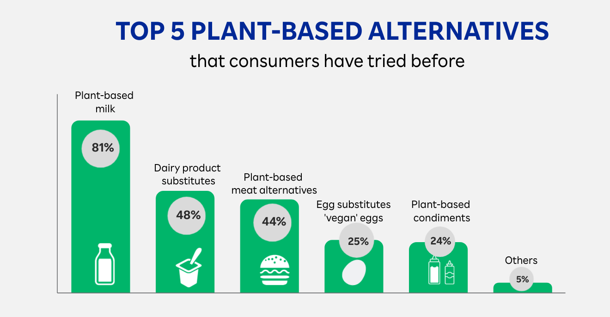
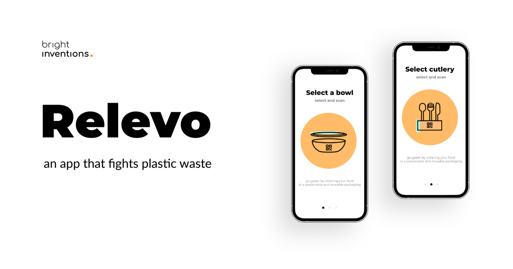
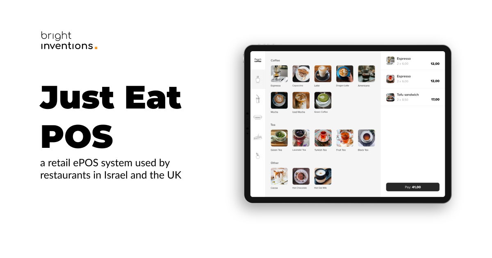

**Food and tech – these two are nowadays closer than you might think. Check out what FoodTech means. Get to know critical areas of food innovations and examples of real FoodTech solutions.**

## What is the FoodTech industry?

Food tech refers to **using technology to improve various aspects of the food industry**, including food production, processing, distribution, and consumption. It encompasses a wide range of applications, from precision agriculture to food safety, and **aims to improve the efficiency, sustainability, and safety of the food system**.

## The global FoodTech market size

According to [Growth Market Reports](https://growthmarketreports.com/report/foodtech-market-global-industry-analysis#:~:text=Report%20Description,forecast%20period%2C%202022%E2%80%932030.), the global food tech market size was valued at USD 233.6 Billion in 2021. In [2019](https://www.statista.com/statistics/1238860/food-tech-market-size-worldwide/) the value was USD 220 Billion. It’s expected to surpass USD 385.7 Billion by 2030. 

### The main reasons for this significant growth of the FoodTech market:

* The rapid growth of online food delivery services.
* The rise of e-commerce food services.
* Greater awareness regarding food quality sources and their health benefits. Consumers pay more and more attention to the product they buy which gives a chance to food tech to deliver healthier product alternatives.
* The increasing popularity of veganism and plant-based products. A global survey conducted in 2021 by [Rakuten](https://insight.rakuten.com/infographic-plant-based-food-alternatives-future-or-present/) found consumers are more and more open to trying vegan alternatives. Especially to milk. Over 80% of consumers tried plant-based milk in 2021.

Source: [Rakuten Insight](https://insight.rakuten.com/infographic-plant-based-food-alternatives-future-or-present/)

## How is a technology used in the food industry?

Let us show you key areas of food tech innovation with some examples:

### Smart Packaging

Developing packaging that can monitor the freshness and safety of food products, and reduce food waste. Also, developing reusable packaging to limit plastic waste for delivery and takeouts.

An actual example of smart packaging solution:

Check [Relevo](/projects/eco-friendly-app/), a smart, deposit-free reusable system that we have helped to develop. This smart FoodTech solution enables restaurant clients to loan reusable packages with food to go. A package is returned by a customer during the next visit to a restaurant.

**Read more about building [MVP for the smart packaging](/blog/how-to-build-mvp-for-smart-packaging-solution/) industry.**

### Food Delivery

Using delivery platforms and logistics technology to improve the efficiency of food delivery and reduce carbon emissions.

Check the food tech case study: an app built by our team for JustEat. 

[Just Eat POS](/projects/system-for-restaurants/) system took care of the whole process of managing restaurant orders: from ordering the meal, providing kitchen staff with details to delivering the order to the client’s table or home.

### Precision Agriculture

Using data analytics, machine learning, and sensors to optimize crop yields, reduce waste, and improve sustainability.

### Food Safety

Using blockchain technology and other tools to track the origin of food products and ensure their safety throughout the supply chain.

### Alternative Proteins

Developing plant-based and cell-based proteins as an alternative to traditional animal-based protein sources.

### Food Processing

Using advanced processing technologies to improve the nutritional content, taste, and texture of food products.

## What is a FoodTech company?

**FoodTech companies specialize in delivering innovations in the food area**. These companies can range from startups to established organizations. They often use cutting-edge technologies like artificial intelligence, the Internet of Things, machine learning, robotics, and blockchain to improve efficiency, sustainability, and food quality. 

The most popular representations of food tech might be global food delivery providers like JustEat, Uber Eats, etc. These are examples of food-related apps that are the most likely to be found on our smartphones.

## How to start your own FoodTech solution?

You might think that having an idea for FoodTech is all you need. In fact, that’s just the beginning. There’s no doubt that you should try to **find an idea for a business that would solve the true need of your consumers**. 

Then it’s time to **validate your idea** to ensure that it has a chance to stand on the market. An effective way to validate your idea is by organizing dedicated **[product workshops](/our-areas/product-workshops/)** with software developers and designers who have launched some similar products in FoodTech. They have market insights and data regarding users.

If you validate your idea positively, **you can start to work on [MVP](/our-areas/mvp-development/)**. You don’t need a big budget to work on that. The idea behind MVP is to launch the product with key features to quickly attract the first users and then develop the product based on their needs. Having MVP can also help to attract investors. 

<h2>Hire experienced FoodTech developers to build MVP</h2>
We launched and scaled FoodTech products for startups and larger organizations. Contact us to estimate your solution.
<a href="/start-project/"><button>estimate your solution now</button></a>

