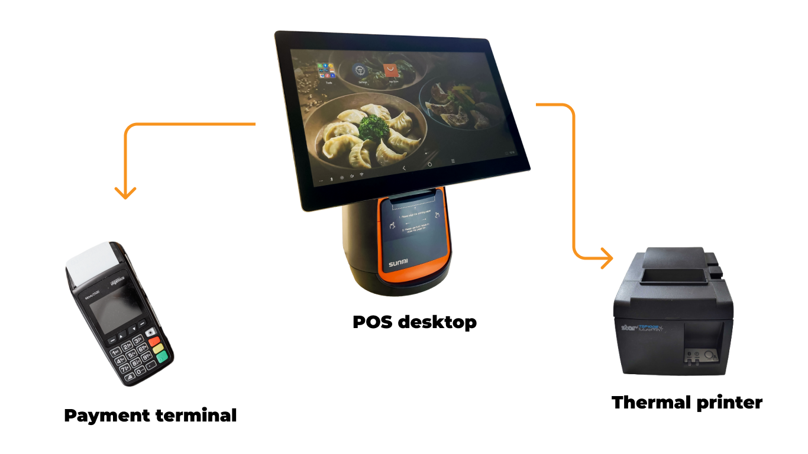
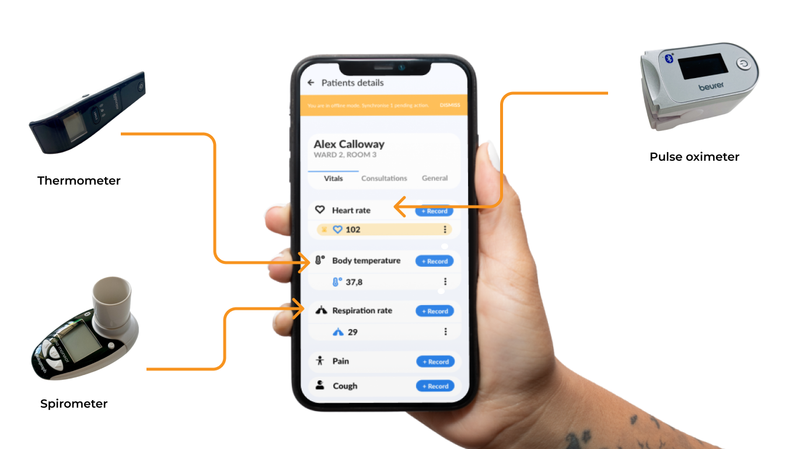
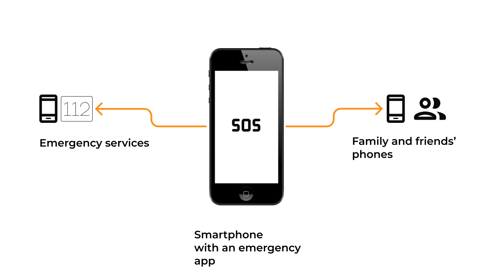

**Are you curious about the use cases for IoT technology? Check out examples of IoT for industries such as retail, restaurants, healthcare, sports, and emergency services. Actual case studies included!**

## IoT for retail and restaurants

The Internet of Things is greatly utilized in the retail and restaurant industry. A perfect example is the **point of sales system which enables a customer to check out at a store or cafe**.

Let’s think about typical devices you could find while checking out in a restaurant. They, in fact, create an **IoT retail network**. There is a Point of Sale desktop (this huge screen that might divide you and a cashier in the restaurant). It's a core of the retail IoT network. **POS desktop** **with a dedicated app** enables one to sum up all clients' orders and send the information about the final costs to the **receipt printer** as well as to the **payment terminal**. 

All of these devices have to be **connected with Bluetooth or WiFi** to enable checkout in every restaurant and practically at every retail business. It wouldn’t happen without IoT.

The fact that you pay with your card and then receive a printed receipt means that you are a “beneficiary” of a retail Internet of Things technology.

**Check out an actual case study – [Just Eat POS applications](/projects/system-for-restaurants) that we built and scaled.**

This IoT network consists of a **thermometer** that measures the body’s temperature and thanks to a Bluetooth connection sends it to the app. The **spirometer** checks the respiration rate and sends data to the app too. Also, we have a **pulse oximeter** that sends data about heart rate. 

The app and modern eHealth devices create a **healthcare IoT network that measures patients' vital signs and processes them in the app**. Now, the **app could send data to a designated doctor who can immediately verify the state of a patient**. IoT is definitely the future of healthcare. Or even the present because that technology already exists!

**Check out an actual case study – [remote patient monitoring app with healthcare devices](/projects/remote-patient-monitoring/) that we helped to develop.**

**Check out an actual case study – [Motivo application for cyclists](/projects/motivo) that we developed.**

## IoT for emergency services

Imagine an app that can send your localization, in emergency situations, to rescue services and close ones. Actually, you don’t need to imagine that. This is possible thanks to IoT.

You don’t have to make a call, pushing one button on your phone would start it all. An **IoT app connects you with chosen devices and emergency services to send SOS messages**.

**Check out an actual case study – [SmartHelp emergency application](/projects/smarthelp) that we developed.**

## Looking for an IoT development company?

The Internet of Things is around us and it influences many industries. If you want to build IoT applications, contact [IoT development company](/our-areas/iot-development) like us and book a free consultation.