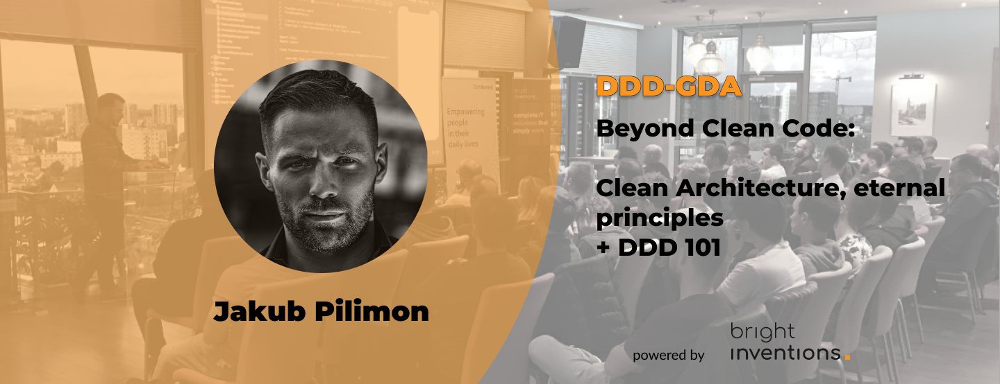

**Mark your calendars for a Domain-Driven Design session with Jakub Pilimon. We hope to see you in Gdańsk on June 15 at 6 PM.**

## Join the DDD-GDA meet-up and dive into the DDD world

During the meeting, we will dive into the world of [Domain-Driven Design (DDD)](/blog/domain-driven-design-explained-by-a-senior-backend-developer/), exploring its foundations and practical applications. Jakub will guide us through a range of topics, including an introduction to DDD, abstract thinking, fighting cognitive bias and stereotypes, overcoming the fear of having many small classes, explaining cohesion to less experienced developers, and more.

## Meet our speaker – the one and only Jakub Pilimon

[Jakub Pilimon](https://www.linkedin.com/in/jakub-pilimon-449b7984/) is an experienced programmer, architect, and trainer. Currently serving as the Principal Technologist at VMware, he also works as a trainer and consultant at Bottega IT Minds. With a focus on engineering, Jakub is a passionate advocate of Domain-Driven Design and an evolutionary approach to software architecture. Outside of work, he enjoys reading popular science literature, engaging in kitesurfing, and going on motorcycle rides.

## See you at the DDD meetup!

Don't miss this opportunity to expand your knowledge and network with fellow enthusiasts in the Tricity DDD community. Join us for an enlightening afternoon filled with valuable insights and thought-provoking discussions. We look forward to seeing you there!

**Date**: June 15 2023, 6 PM

**Where**: Gdańsk, Sztuka Wyboru

**Join waitlist**: https://www.meetup.com/ddd-gda/events/294013722/

**DDD-GDA meetup is powered by Bright Inventions.**
