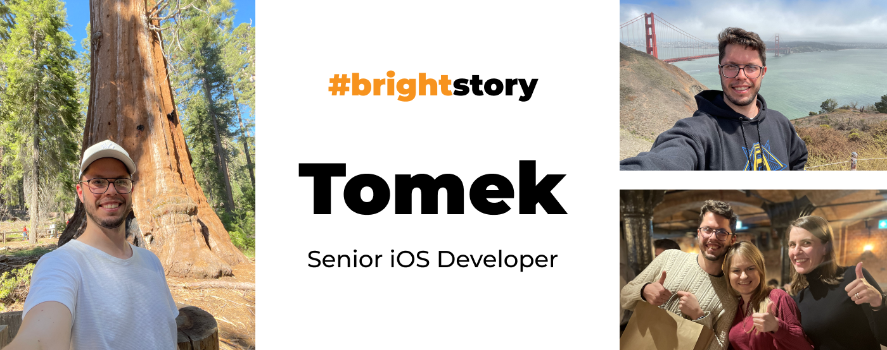
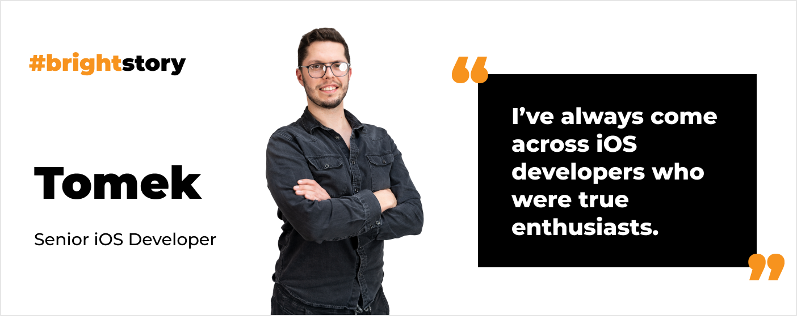
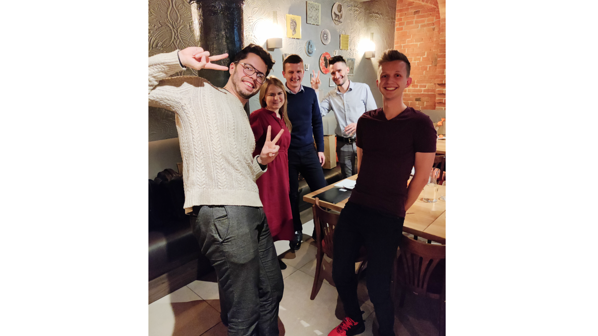
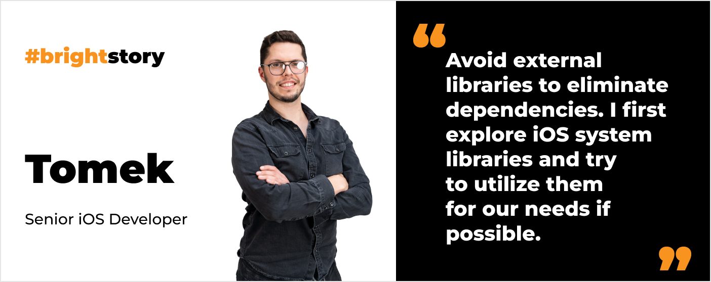
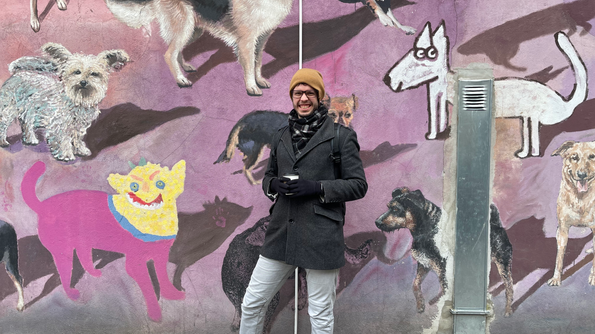
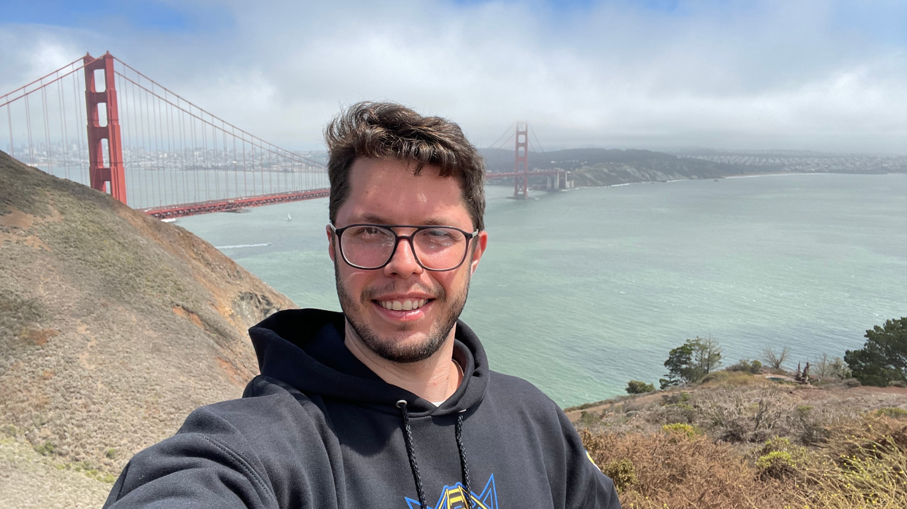

**Tomek is a Senior iOS Developer with over 5 years of experience. His initial career, as a nuclear power engineer, guided him toward programming. Learn more about his approach to [mobile development](/our-areas/mobile-app-development/), and the iOS trends he observes. Also, find out how Tomek overcame job burnout that almost took away his passion for programming.**

## You studied Nuclear Power Engineering and Nuclear Physics. How did you end up becoming an iOS developer?

Tech gadgets have intrigued me since I was a child, especially phones & smartphones. For most of my teenage years, I was buying broken phones, fixing them, and re-selling them. **I’ve always loved hardware**. However **boring Informatics classes in high school killed any possible passion for software**. I didn’t even know there was a software developer career line. I had this stereotypical vision of a Computer Science student who ended up being this lonely guy living in their mother’s basement. 

So I decided to study **Nuclear Power Engineering** at Warsaw University of Technology and **Nuclear Physics** at Warsaw University because I really enjoyed physics and math. **These studies actually led me into programming anyway**.

## How come?

At my first full-time job, **I had a chance to build a power plant simulator**. I felt so limited because **I didn’t have access to the source code**. It was a constant struggle to work with logic blocks when you didn’t have access to the underlying algorithm. I tried to manage on my own, looking for reasons for problems. In the end, finding solutions felt super satisfying. I even **wrote my first commercial application to improve power plant simulations**. I was going deeper and deeper into programming.

<h2>Do you want to join Tomek?</h2>
We are looking for iOS developers. Work with Tomek and develop iOS applications for global FoodTech company.
<a href="/jobs/senior-ios-developer/"><button>apply and join our team</button></a>

What’s more, my two friends were programming in iOS. So I started to learn with them. We even **developed an app for Warsaw University**. At that time the entry threshold to iOS development was high because you had to buy expensive Apple devices. So more people chose Android development because they already had a computer with Windows or Linux to work on. That’s why **we felt it might be easier to establish ourselves in iOS development because the competition would be lower**. 

Finally, I decided to focus completely on programming. I moved to Northern Poland to work as an iOS developer in a local company.

## What do you like the most about iOS development?

**People**. Maybe I am just lucky, but **I’ve always come across iOS developers who were true enthusiasts**. I don’t say that it is possible only after choosing iOS development. ;) I must admit, though, that I’ve met so many iOS devs that really seem to love their job as much as I do. It’s **great to have the possibility to share the same passion with others**.

I also enjoy the fact that when you write a mobile app, **you can quickly see the results of your work**. Quick gratification is really powerful in this case. I can instantly see the UI that was born from my code.

Last but not least, I love gadgets. 😉 **I enjoy writing apps for all devices Apple has to offer**. Yes, I’ve been captivated by Apple’s world. That’s a side effect of my work that I quite appreciate. 

## How did you land in Bright Inventions?

Right before joining Bright Inventions **I actually experienced a massive job burnout**. I was during a very challenging career moment, under lots of pressure, dealing with hours of overtime. **I was concerned that I had lost my passion for this job**. I even thought about a career change. Eventually, I left my current job to figure out my next move. 

I decided to stick to programming. I started to go through job offers and found Bright Inventions’ offer. It reminded me that my friend [Kamil](/about-us/kamil-b/) worked there. So I asked him basically if the job description was true. **Not only did he confirm everything, but also painted an even more positive image of working at Bright Inventions**.

Then I reached out to Ula and after going through the recruitment process I joined the company. So it was a bumpy road to Bright Inventions. Yet with a happy ending. **I am glad to be here. This is the place where I got back my passion for software development**.

## So it turned out that your way to overcome burnout was actually finding a new job?

A new job with great people. **The people you work with are key**. You know well, how nice and friendly people are here. So it helped me get back on track.

## If you had to start an iOS project from scratch, with no technological debt, what tools would you use?

There isn’t one simple answer to that question. **It depends on the product I would build. If it is a solution for a large group of users with a spectrum of Apple devices, then you can’t choose only Swift UI**. No matter how trendy it is right now. 

Yet **if the product targets a smaller group of tech-savvy users I would base it on Swift UI**. Having in mind that it is still a young technology, **you cannot cross off good old UIKit completely**.

What I would try to do, no matter the type of product, is to **avoid external libraries to eliminate dependencies**. It’s better to have control of our code, as much as reasonably possible. I would first explore iOS system libraries and try to utilize them for our needs.

It’s also important to **choose frameworks wisely**. For example, don’t choose RxSwift or Combine when your development team is not familiar with reactive programming.

## What trends do you observe in iOS development?

Great new technologies are here to discover such as **Swift UI and generally high-level frameworks**. They largely **simplify our work** and let us do advanced operations at a lower cost. On the one hand, it makes it easier to get into iOS development but at the same time, I feel that there is more stuff to comprehend. **When I was starting my iOS adventure there weren’t so many things to learn**.

Another trend is **multiplatform apps**. You can write code once and it will work (with a few alterations) on iPhones as well as iPads and Macs. You can even write an application for iPad on iPad.

## Tell us more about projects you work on.

One of the projects is a **food delivery application operating in Israel**. This is not a typical food delivery app, it’s also a **popular employee benefit**. Companies use it to subsidize employees' lunches. It’s also a well-suited product for Israeli users due to this country's highly developed lunch culture.

Another project is a **customizable workflow management** **solution** that helps to work efficiently in international teams. It’s well-adjustable for various business groups: lawyers, hairdressers, banks, and many more. **The product we help to build consists of many tools such as a calendar, reservations management, payments, chats, video calls**, and other platforms useful for daily business operations.

## I know you love to travel. Where have you been so far in 2023?

My wife planned a **surprise birthday trip** for me. We went to **Wrocław**. Another gift for me was joining the barista workshop there. The art of making coffee is one of my passions.

Also, we’ve just come back from **Vietnam**. We spent three weeks there. It was a **totally new experience for me**. It’s a very wild and friendly country at the same time. 

We will see what other adventures this year brings…

<h2>Ready to join Tomek?</h2>
Check out our openings. Build solutions for startup from Israel, USA or Germany.
<a href="/career/"><button>check career opportunities</button></a>

