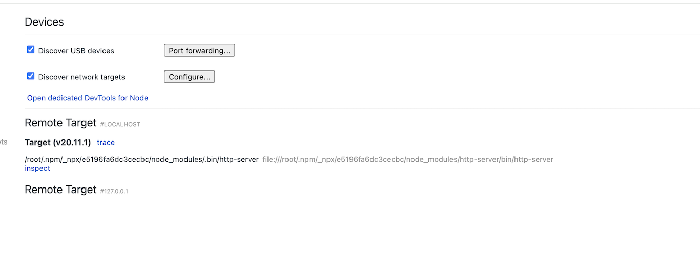
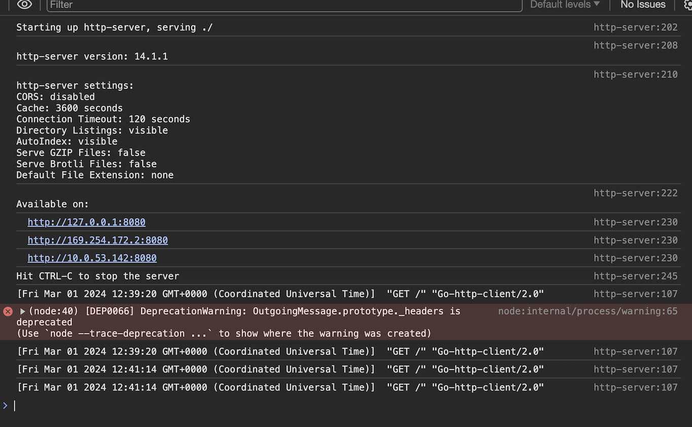
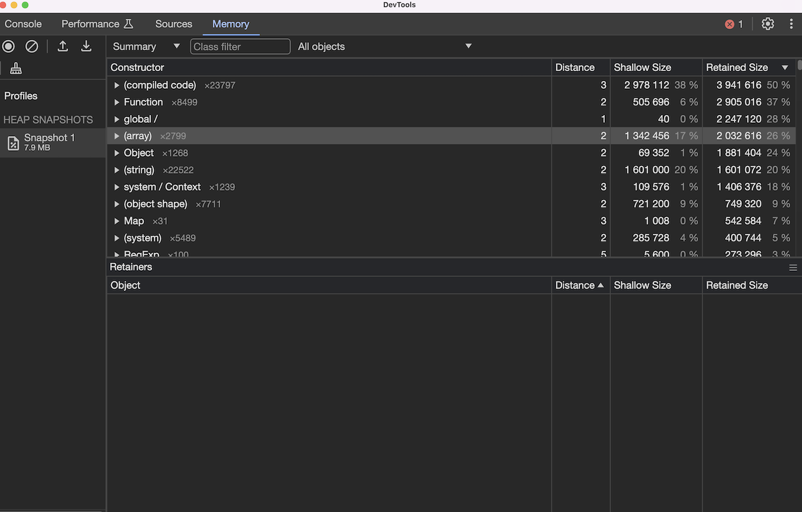

<div className="image"></div>

**Recently my colleague wrote a blog post on how to create a [cheap Node.js Fargate service](/blog/aws-cdk-cheap-ecs-fargate/). Imagine that after some time of happy running, you investigate that something is not clearing memory or the task suddenly exits with an error. You analyze the log and metrics, but the issue seems to be deeper, and you have to get your hands dirty. For such cases, a great option to [debug](https://nodejs.org/en/learn/getting-started/debugging) the Node.js service is with inspector. In this tutorial I will show you how to utilize it with CDK deployed Node.js app on AWS Fargate using AWS ECS Exec and AWS SSM port forwarding.**

## Node.js debugging

Node.js inspector [debugging](https://nodejs.org/en/learn/getting-started/debugging) with `--inspect` flag might show you potential problems with the event loop or where is the memory leak you are looking for. It personally helped me many times. If you are interested about the details and how to look for problems, you can see a great video of it in action with one of the [core contributors](https://www.youtube.com/watch?v=vkys6Wk-jYk&ab_channel=AdventuresinNodeland-MatteoCollina) of Node.js.

## Remote Node.js debugging

Ok, so you are armored with cool knowledge about Node.js debugging now. You say, “Great! Let’s run inspector and check it out.” Not so fast—your service is running in a remote environment. It means that you somehow have to expose a remote debugger to your local inspector environment. Sometimes, it is not necessary as you might be able to spot the problem when running the process locally. But what if the problem only appears when some particular thing happens on a remote? Traditionally, you could just expose the inspected port via [SSH local forwarding](https://nodejs.org/en/learn/getting-started/debugging#enabling-remote-debugging-scenarios). But what if you are running Fargate and you are not able to SSH to underlying machine? Let’s find out!

## Checking if your task is eligible for ECS exec
Ok, so your task is running. What shall you do next? You will use a combination of [AWS ECS Exec](https://docs.aws.amazon.com/AmazonECS/latest/developerguide/ecs-exec.html) and [AWS SSM port forwarding](https://aws.amazon.com/blogs/mt/use-port-forwarding-in-aws-systems-manager-session-manager-to-connect-to-remote-hosts/) to forward the debugger port to the local machine. AWS has an official [GitHub repo](https://github.com/aws-containers/amazon-ecs-exec-checker) with a script by which you can check if your task allows for AWS exec. Using the infrastructure described [before](/blog/aws-cdk-cheap-ecs-fargate/), you should configure AWS CLI and execute
```bash
./check-ecs-exec.sh cluster-id task-id
```
in our case
```bash
./check-ecs-exec.sh BrightCheapEcsFargateStack-ClusterEB0386A7-PQVGdDDGFxS4 70d6a6e5606b4cf5ad413821326bd765
```
As per the output, task is missing some of the required things for exec execution: 
```bash
  Exec Enabled for Task  | NO
```
```bash
Task Role Permissions    
     ssmmessages:CreateControlChannel: implicitDeny
     ssmmessages:CreateDataChannel: implicitDeny
     ssmmessages:OpenControlChannel: implicitDeny
     ssmmessages:OpenDataChannel: implicitDeny
``` 

[The Readme](https://github.com/aws-containers/amazon-ecs-exec-checker) of the project provides directions on how to fix the potential issues you might have. It might be connected either to your IAM user, ECS task role permissions, or configuration. For the [repo](https://github.com/bright/bright-cheap-ecs-fargate-https) you are using, the only two things that you needed to add are:
```typescript
enableExecuteCommand: true
``` 
to `FargateService` in CDK definition and
changing container command to expose debugger 
```typescript
command: ['npx', '--node-options=--inspect', 'http-server']
```
Upon CDK deployment you will see that required `ssmmessages` permissions are added automatically.
When you will rerun the [script](https://github.com/aws-containers/amazon-ecs-exec-checker) I will see that all controls are green or yellow. That means that we can connect to our task using AWS exec! 


##  Connecting to Fargate ECS task 
To do it, you need to know `cluster-name`, `task-id` and `runtime-id` of the task first. 
You can get those by running 
``` bash
aws ecs describe-tasks \
    --cluster cluster-id \                                                                                  
    --task task-id 
```
in our case
``` bash
aws ecs describe-tasks \
    --cluster BrightCheapEcsFargateStack-ClusterEB0386A7-PQVGdDDGFxS4 \                                                                                  
    --task 70d6a6e5606b4cf5ad413821326bd765   
```
Runtime ID in above case is `70d6a6e5606b4cf5ad413821326bd765-2750272591` so we can run the following:
```bash
aws ssm start-session \
    --target ecs:BrightCheapEcsFargateStack-ClusterEB0386A7-PQVGdDDGFxS4_70d6a6e5606b4cf5ad413821326bd765_70d6a6e5606b4cf5ad413821326bd765-2750272591 \
    --document-name AWS-StartPortForwardingSession \
    --parameters '{"portNumber":["9229"], "localPortNumber":["9229"]}'
``` 
Where target is a string that consists of `ecs:<cluster-name>_<task-id>_<container-runtime_id>`. Port `9229` is the default port for Node.js inspector.
If all is ok, as a response you will get
```bash
Starting session with SessionId: rafal.hofman@brightinventions.pl-06148b47c2f094b19
Port 9229 opened for sessionId rafal.hofman@brightinventions.pl-06148b47c2f094b19.
Waiting for connections...

Connection accepted for the session [rafal.hofman@brightinventions.pl-06148b47c2f094b19]
``` 

##  Running local inspector with remote ECS target
After the successful connection you can go to inspector in Chrome browser (chrome://inspect). You can see there the remote target connection you just enabled, forwarded to your local port of 9229
<div className="image"></div>

Upon connection, you can see logs from the Node.js process and can go ahead with debugging.

<div className="image"></div>
<div className="image"></div>

As you can see, the process is pretty straightforward. You do not have to expose your `--inspect` process port publicly, but can safely use AWS SSM port forwarding. 
What is important, the task can have a private IP, and you can still access it! 
If needed, you can also use AWS exec to bin/bash to the container. Remember to remove enableExecuteCommand when you are done. Happy coding & debugging!


