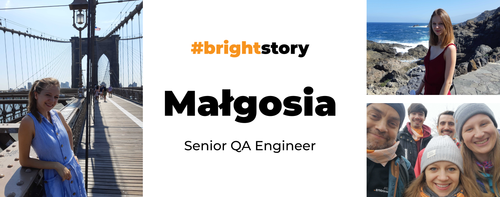

**Nearly 9 years ago, Małgosia decided to transition into QA engineering, long before it became a trend. Once she discovered her passion for automated testing, there was no turning back. Now, she thrives on tackling daily challenges, from balancing the right test coverage to building robust relationships with developers. Dive into Małgosia's career story to explore her journey!**

I think I was among the first people who tried switching to software development before it became popular. At that time (about 9 years ago), I didn't know any success stories of such a transition; in fact, I had only heard about failures. But I still wanted to give it a try. So, I committed fully to this new path — **I quit my job and dedicated my time to learning every day**. 

Initially, my goal was to become a software developer. After two months of intensive learning, I began job hunting. I even received a software developer job offer. However, during this period, **I started writing my first automated tests, and it completely captivated me**. **I found immense enjoyment in it**. As a result, I turned down the software developer job and instead sought out a QA position. **Fortunately, I found a place where I could engage in writing automated tests right from the start**.

## I assume that back then there weren’t many software testers in the teams?

Oh yes, **I was the only tester in the team**. There was another tester in the company where I worked but I didn't know many other QA Engineers back then. Obviously, **the situation is quite different now**.

## What aspects of the QA job give you the most satisfaction?

What drives me in my QA role is the unique set of challenges each project presents, **pushing me to constantly rethink testing and automation strategies**. Every project offers the **opportunity to find the perfect balance between manual and automated testing** and to select the right types of tests that are easy to maintain, credible, and reliable. 

Throughout my career, I've encountered the mindset that 'we don’t have time to write automated tests,' but in reality, automation actually saves time. When we're not required to test everything manually, the quality of the product usually improves. Reaching this point in a project is incredibly satisfying. 🙂

## What is your recipe for successful cooperation with programmers?

**It’s a continuous learning process because throughout your career, you work with various people, each with different personalities**. Everyone has their own priorities in projects, and sometimes it can be challenging to persuade someone to see things from your perspective and to focus on your priorities. 

What I’ve learned recently is that people can interpret your words differently. For instance, if I say something in a meeting, 2 out of 3 people might understand it in a way that's completely different from what I intended. Therefore, **it’s crucial to work on balancing your words and ensuring clear communication**.

*Read Małgosia’s and Michał’s blog posts on [successful dev-QA relations](/blog/communication-challenges-faced-by-developers-and-testers/).*