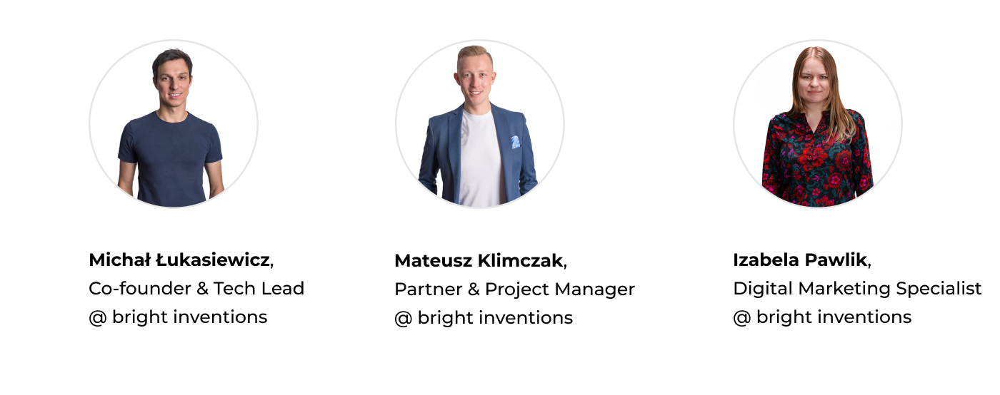

**Download the free ebook about Minimum Viable Product (MVP) development. This is the ultimate guide for startup founders, CTOs and product owners who are considering launching the product. Why should your start with MVP? What mistakes should you avoid? What factors determine the cost of MVP? Get your copy now!**

<EbookDynamic sectionTitle='get free MVP guide now' ebookName='From-MVP-to-a-Final-Product.pdf' ebookDescription=' Calling all founders, CTOs and product owners! Dive into the world of MVP development with our comprehensive ebook. Don’t wait, grab your copy here!' ebookImage='/images/mvp_ebook_cover.svg' ebookAlt='MVP free ebook for startups' />

## What’s inside the MVP ebook?

Check out the table of contents:

1. Why you should start from MVP.
2. How to choose the right MVP partner?
3. Software development pricing models.
4. Factors that determine the MVP cost. 
5. Native vs hybrid app – find your perfect fit.
6. Software development stages (with a time range).
7. Ease your pivot using MVP.
8. How to avoid common startup mistakes while developing products.
9. Estimate your MVP.

## Who should read our guide?

Do you have an idea for an app but you don’t know what to do next? You are not sure if it's going to be successful. Do you have a limited budget to verify your solution? **The answer to all your problems might be MVP**. Download our free guide to find out why!

## Authors

At Bright Inventions **we have been developing MVPs for over a decade**. This ebook is based on our team's experience in launching MVPs for startups based in Israel, Norway, Germany, the USA, and more. Feel free to get your copy!
