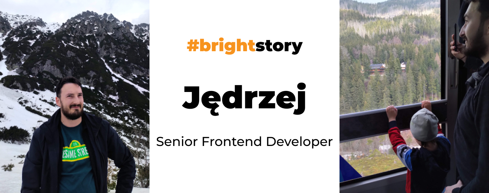
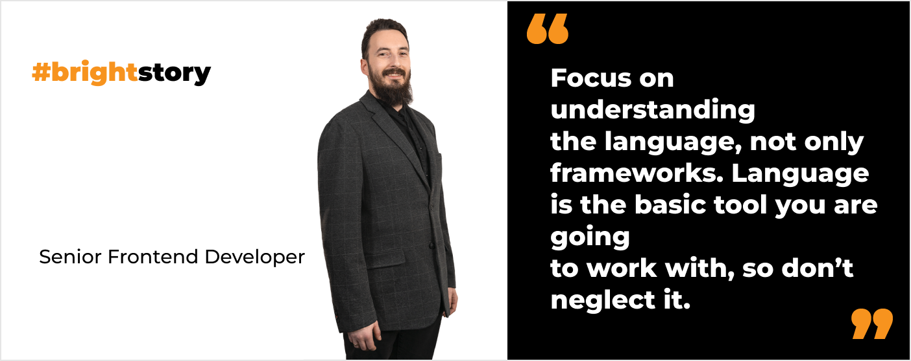
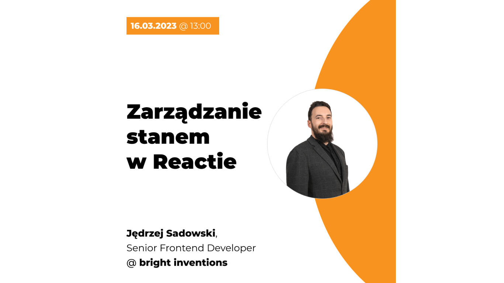
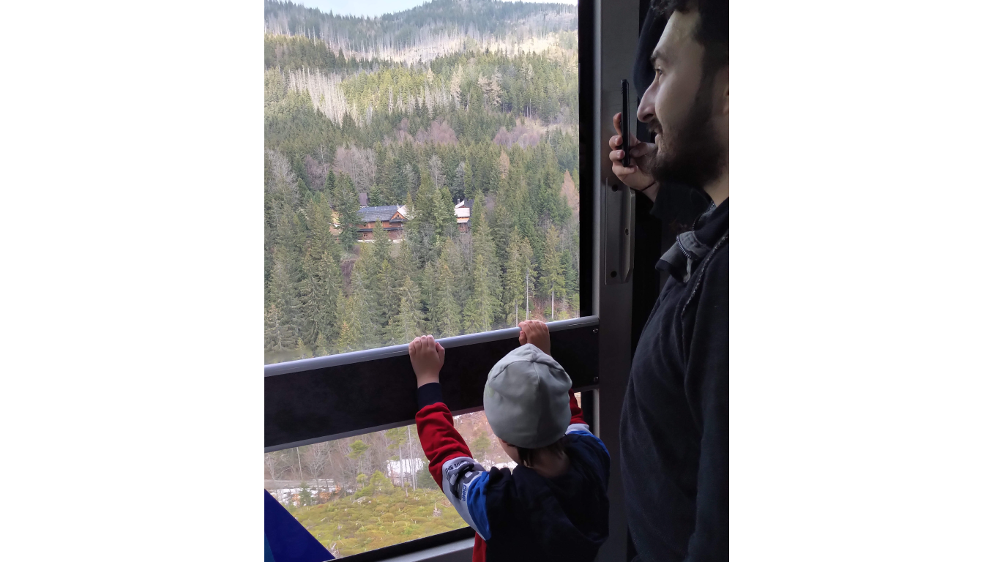

**Jędrzej is a senior frontend developer who started his career before the frameworks era. Can you imagine that? 😉 What advice does he have for people who want to become frontend devs? Why did he decide to be a sauna master? Read the interview.**

## You are a frontend developer. Is the backend totally strange to you?

No. **I used to work as a fullstack developer and I worked with servers as well**. I have no problem going to “the other side” as long as I am familiar with the backend stack used in a project I work on.

## How long do you work as a software developer? How do you recall the beginnings of your career?

I have over **8 years of commercial experience**. My first job started as an internship. I was a part of the internal team which had an ambitious goal to build a to-do list application. **I wrote the backend in PHP with Symfony** which is a hardcore framework with a high entry threshold. 

Eventually, I was offered a full-time job. **I started to learn Angular** which was something new back then. After that, **I turned to React and have been working with this framework for the past 5 years**.

<h2>Do you want to join Jędrzej?</h2>
Join Jędrzej and other bright developers. Work with clients from industries such as FinTech, Blockchain, HealthTech, Retail, Logistics, and more.
<a href="/career"><button>check our career opportunities</button></a>

## What is your advice to people who want to become junior frontend developers?

It’s hard to say because as you know I started to work in this industry years ago. I guess my career began when there weren’t so many frameworks available. So I naturally focused on getting to know the language. That’s what I would recommend to future frontend developers. **Focus on understanding the language, not only frameworks**. Language is the basic tool you are going to work with, so don’t neglect it. Also, you should **understand the basics of algorithms and software design patterns**.

When you possess that knowledge, you can **start to get familiar with popular frameworks like React or Vue**. That's also a great moment to **learn libraries, like styled components or Tailwind for styling and the role of tooling like Webpack** in a project. You don’t need to know how to configure Webpack, but you should be aware what’s the purpose of it.

## You have worked at Bright Inventions for over a year. How do you recall joining the company?

I had a couple of interviews scheduled with different companies including Bright Inventions. **Why did I choose Bright? Actually, because of the very intriguing tech interview** I had with [Piotr](/about-us/piotr/) and [Bartek](/about-us/bartosz-sz/). It was a long, 2-hour interview. However, after finishing it I felt that these were the people I wanted to work with. I was happy that the feeling was mutual when I was offered a job.

## We organize a webinar for frontend developers that you will conduct. Share some info about the webinar.

I will talk about **managing React State**. The webinar will be held **in Polish**. **It’s free. Anyone can join**. [You can sign up here](https://webinar-react-zarzadzanie-stanem.getresponsepages.com/). We will look at React through the tools that this framework gives us. **Webinar is suited for junior frontend developers who know the basics of React**. However, I think that some **mid-developers will find it useful as well** because I will talk about the still new feature which is Concurrent Mode. If you want to know what problems **Concurrent Mode** can cause in your code, join my webinar.

## You work remotely. How do you organize your work and create online relations with other colleagues?

**I organize my day to work continually for 8 hours and don’t distract myself with other errands**. Thanks to that at 4 pm my work is done and I can focus on my free time and family. It's helpful to keep a work-life balance. If I did some chores during the day, which is tempting when you work from home, I would have to spend my evenings working. I try to avoid that.

Building relations while working remotely is possible. Naturally, I have daily contact with people from my team. Apart from that, **you just have to be active on Slack, do small talks, and share thoughts with others**. I also attend our **biweekly meetings gathering all front-end developers from Bright Inventions**. We discuss hot tech topics and address tech challenges in our projects. Actually, at this meeting, I conducted a webinar about React State and now I will present it to developers outside my organization. 

What’s more? **I try to regularly attend team retreats that take place in Gdańsk**. So I get to see people face to face.

## You are a sauna master. How did that happen? 😄

It all started 5-6 years ago when therms with saunas were opened in my neighborhood. I started to attend sauna sessions regularly. It’s a cozy place, so I quickly got to know sauna masters there. I was impressed by their work. When there was a chance to join a training for sauna masters I simply signed up. **I was intrigued by this idea and also wanted to possess a new skill**. So I became a Sauna Master certificated by the Polish Sauna Association.

Although I must say that I don’t attend the sauna sessions as much as I used to. I hope it will change.

## Have you conducted sauna ceremonies?

Yes, but only for my family and close friends. It’s not my extra job. However, it’s a skill that ChatGPT won’t be able to take over from me. 😉

<h2>Join Jędrzej</h2>
Work on web and mobile solutions we develop for our clients from Germany, USA, or Israel. Check our job offers.
<a href="/career"><button>check our career opportunities</button></a>

