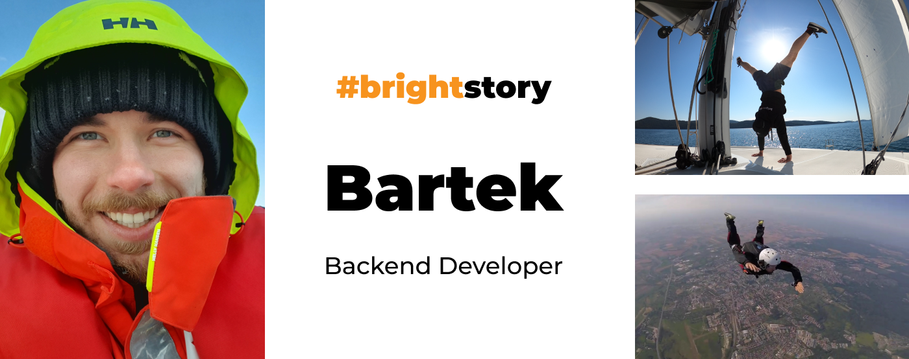
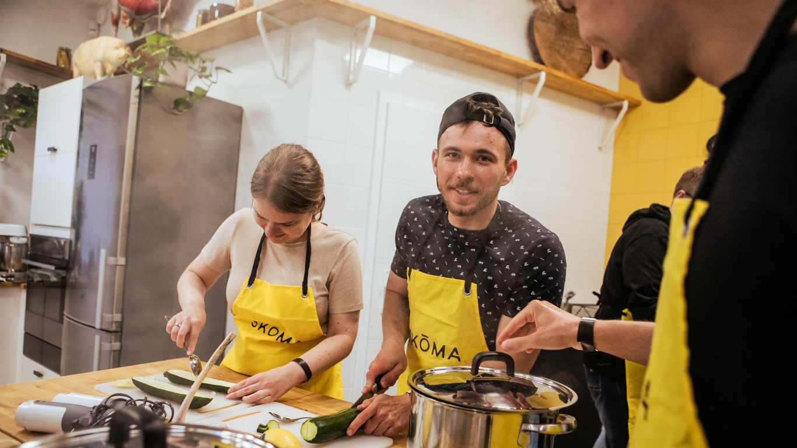
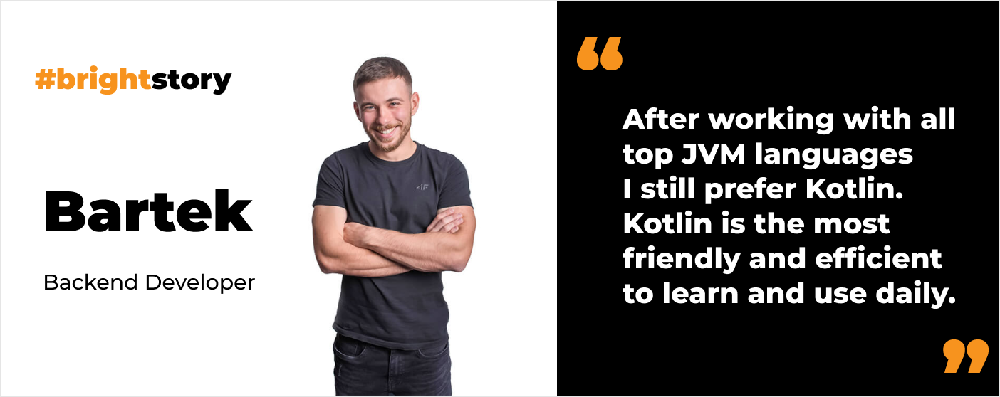
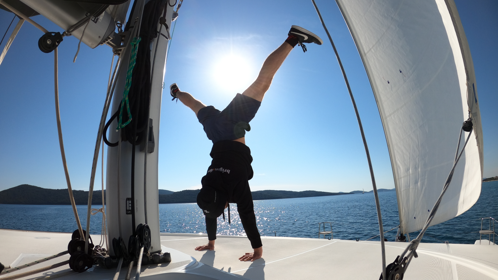
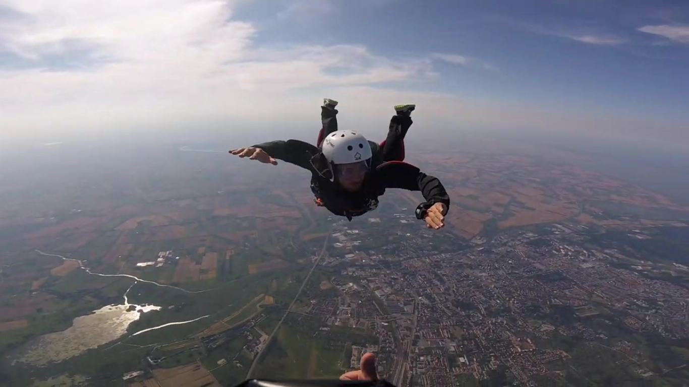

**Sailing the Atlantic, skydiving, steering a plane… He has done it all. Apart from that he’s a Kotlin enthusiast open for some coding in Scala as well. Meet Bartek, the most adventurous bright team member!**

## You are a backend developer. Yet I know that you wanted to be a mobile dev. What happened? 😀

While I was studying Computer Science **I had this vision that I would start my career as a mobile developer**. I thought it would be so great to build something that could be downloaded by millions. Obviously, that was just a vision, far away from reality. 😉

I was pursuing that dream and got an internship to build a mobile app. When I joined the company it turned out the mobile app was basically done. Yet they needed help with the backend. So **I started to work with Spring Boot and quite enjoyed that**. 

Now **I am glad I pursued the backend path instead of mobile**. Maintaining backward compatibility in mobile isn’t appealing to me. The backend is more simple in that way. So I’ve never regretted how things turned out. I sometimes build mobile apps, but only for personal use.

<h2>Work with Bartek</h2>
We are looking for an experienced Backend Developer who understands Java/Kotlin & Spring really well and who would like to work with AWS on daily basis.
<a href="/career/"><button>check our job offers</button></a>

## How did you land in Bright Inventions?

I’ve known the company since college. **I met [Piotr](/about-us/piotr/) from Bright Inventions at a job fair** at the Gdańsk University of Technology. Back then I was writing my master's thesis on serverless so I **decided to visit every company’s stand to ask if they worked with serverless**. **Bright Inventions was the only one that did**. Then I had a great conversation about it with Piotr and I could immediately see how knowledgeable and experienced he was.

Our paths crossed again a few years later. Back then, I was working at a company where I learned Java and Kotlin. **Kotlin was life-changing to me**. I loved it. Unfortunately, I started to get projects in Python. I felt I needed to find a place where I could continue my work with Kotlin. So, I finally joined Bright Inventions. I was eager to work with Piotr on the huge international ePOS project with Kotlin and AWS.

What's **unique about Bright Inventions is the mature process of software development**. The team is highly skilled and experienced. **We focus 100% on quality**.

## Tell us more about the project you are currently working on at Bright Inventions.

This is an **international security system**. The backend is in **Scala**. I haven't worked with Scala much before. However, it's part of the JVM world, so it’s not something totally strange to me. It’s not like visiting a new world which would be switching to Go or C. For example, I still can choose the libraries I used while working with Java. 

The project is a great opportunity to get to know another major language from the JVM world. After working with all of them, I still prefer Kotlin. **Kotlin is the most friendly and efficient to learn and use daily**.

## What were your biggest professional challenges so far?

I guess **getting to Bright Inventions**. **The interview with Piotr was definitely a challenge**. The atmosphere was really nice and positive. Yet whatever I said, Piotr responded, "What more can you say about it?" 🙂 **I thought I did poorly, but at the end of the interview, Piotr said I did well**. I was quite surprised.

**For me, mistakes are challenges because you operate under stress**. At Bright Inventions, I haven’t experienced that because we have well-organized processes. It was never necessary to wake up in the middle of the night to fix something urgent. 

However, while working at a previous company, which operates in the medical care industry, there were many stressful situations, especially during COVID-19. We had to develop a COVID-19 testing system very quickly, taking care of all important and private patient data. Your mistakes could wrongly assign a patient’s name to a sample, so we had to be extremely careful. That was a stressful time.

## On your first day of work, you brought tens of donuts to the office. This is legendary now. 😉 Is it your first day at work strategy?

I thought that's what people do when they join the company. In my previous work, everyone was bringing some sweets for their first day at work. Yet when I came to Bright Inventions with donuts, people were surprised. I guess not everyone does it. :D 

That didn't discourage me from surprising you again. **I mostly work remotely, but when I visit the office, I sometimes bring some treats with me**.

## I know your passion is sailing. What were your recent sea adventures?

Last year **I sailed across the Atlantic Ocean, from the Canary Islands to the Caribbean**. We sailed for 23 days and 17 hours. :D 

However now I’m focusing more on my other passions, so sailing has gone into the background for now. Although it still has a place in my heart and I would always enjoy going through the seas.

## So what do you do apart from sailing?

I started a skydiving course last year. However, I couldn't finish it because it requires many factors to be met which wasn’t so obvious for me when I started. The weather has to be perfect, especially for skydiving students, so they can have safe landings. 

The other thing is that skydiving zones are mostly open on weekends, so you have to match your free weekend with the availability of instructors… Even with that, it’s not always a recipe for success because the actual weather can differ from the forecast. 😀 **Skydiving is fun, but it requires huge amounts of patience**.

## But that didn’t put you off?

Not at all. Now I like the air even more and **I decided not only to jump out of planes but also to steer them**. 😀 Now I am at the beginning of my journey to **get a Private Pilot License** (PPL). I even moved closer to the airport where I train. I have to finish the theoretical and practical part of my training and then pass the Civil Aviation Authority exams.

## From sailing to flying an airplane. How did that happen?

There are people who inspired me to do this. As with many other things – people are a great inspiration. When it comes to flying, I met some pilots who are great people and I felt like this is something worth trying. 🙂

<h2>Join our team</h2>
Seeking passionate individuals to help us build a bright future. Apply today!
<a href="/career"><button>check our job offers</button></a>

