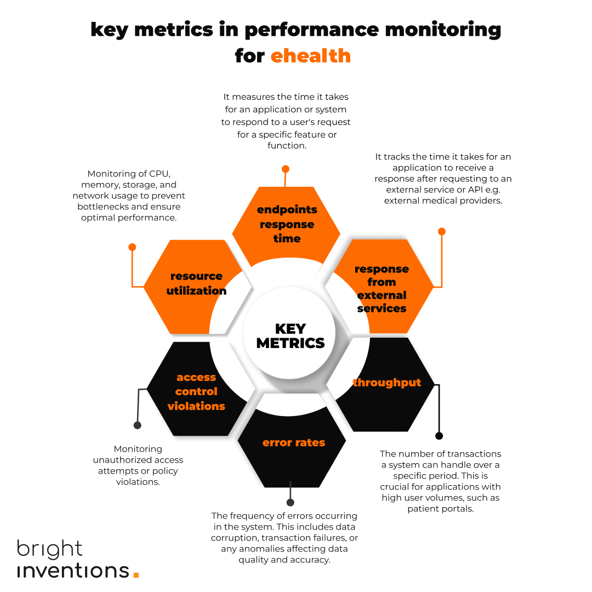

**Every software product eventually reaches a point where closely monitoring its condition becomes essential. The sooner you start monitoring your product, the better the outcomes for your business will be. Let us guide you through implementing application performance monitoring for your eHealth solution, including a technical tutorial and performance metrics cheat sheet.**

## What is app performance monitoring and what does it bring to the HealthTech table

**Performance monitoring involves regularly checking the "vital signs" of your application** to keep an eye on its performance, which is especially crucial as the number of users increases. **Every company with a growing product faces the challenge of scaling its infrastructure in line with the increasing number of users**. Performance monitoring is a great tool to handle this challenge proactively.

### Example of performing monitoring use case in eHealth

Imagine an app designed to remind your users about taking medication or joining a video consultation with a doctor. However, the notification meant to prompt these actions isn't sent. **How can you actually realize that the notifications don't work?** It's difficult to notice when something doesn't happen. Yet, **with app performance monitoring, you can track every feature, including sending notifications**. This way, you'll quickly know when any part of the app doesn't function as intended.

## The best moment to set up performance monitoring

Ideally, you should establish basic performance monitoring before launching your product to measure key metrics and verify that your solution functions correctly. Unfortunately, p**erformance monitoring often becomes a tool companies turn to only after experiencing performance issues**, especially those related to an increasing number of users. 

By this point, **it might be too late to restore trust among your end-users who might have been frustrated by the app’s performance issues**. Starting early with performance monitoring can help you prevent such situations by identifying and addressing potential issues before they impact the user experience.

<EbookDynamic sectionTitle='Facing scalability issues? Download our free guide!' ebookName='Scale-Your-Healthtech-Solution-Successfully.pdf' ebookDescription={'Almost 100 pages about scaling HealthTech solution. Don’t miss the chance to get your copy.'} ebookImage='/images/healthtech_guide_cover.png' ebookAlt='cover' />

## Powerful advantages of application performance monitoring

### Faster reaction times

You no longer have to wait for your clients to inform you of a problem with your system. **You can even detect symptoms of potential issues before they occur**. If you notice that certain parts of the app are starting to slow down, you can proactively investigate the cause before it begins to impact your users.

### Better scalability planning

Performance monitoring provides the data needed to make data-driven decisions about when and how to scale. For example, **it allows you to precisely identify peak usage periods that require additional resources to maintain optimal performance**.

### Fast track to machine learning

Performance metrics are numerical values that enable quick automation with machine learning. **AI can learn from the provided data and detect issues that are invisible to the human eye**. Some tools, like [Grafana Cloud even offer ML](https://grafana.com/docs/grafana-cloud/alerting-and-irm/machine-learning/) monitoring out of the box.

## Setting up app performance monitoring – tutorial & tools

It is a common misconception that implementing performance monitoring is time-consuming and therefore costly. **In reality, an experienced software development team might implement standard performance monitoring even within a day**.

If you lack performance monitoring experts on your team, you can either hire a software development agency to establish monitoring or acquire the knowledge internally. Common standards are extensively discussed within the community, making it easy to set up basic monitoring with a handful of tutorials.

**Our performance monitoring team has prepared a guide for setting up performance monitoring using the OpenTelemetry standard** – an open-source solution for implementing monitoring across your applications. OpenTelemetry provides a unified set of APIs, libraries, agents, and instrumentation that allow you to collect, process, and export telemetry data (metrics, logs, and traces) for analysis.

**Follow our tutorials:**

* [performance monitoring setup with TypeScript](/blog/how-to-improve-your-app-observability-easily-with-grafana-and-opentelemetry/),
* [performance monitoring setup with Java](https://grafana.com/blog/2023/10/30/how-to-integrate-a-spring-boot-app-with-grafana-using-opentelemetry-standards/).

## Key app performance monitoring metrics to measure \[a cheat sheet]

In data analysis, the question always arises: **what should you actually measure, and which metrics are crucial to your business?** Certainly, not all data is necessary; **having too many metrics can cause chaos** rather than help you reach valuable conclusions.

We've listed the most common app performance metrics so that you can choose the ones best suited to your solution.

### Endpoints response time

It measures the time it takes for an application or system to respond to a user's request 
for a specific feature or function.

### Response from external services

It tracks the time it takes for an application to receive a response after requesting an external service or API e.g. external medical providers.

### Throughput

The number of transactions a system can handle over a specific period. This is crucial for applications with high user volumes, such as patient portals.

### Error rates

The frequency of errors occurring in the system. This includes data corruption, transaction failures, or any anomalies affecting data quality and accuracy.

### Access Control Violations

Monitoring unauthorized access attempts or policy violations.

### Resource Utilization

Monitoring of CPU, memory, storage, and network usage to prevent bottlenecks and ensure optimal performance.

**Or just save this infographic:**

**If you want to discuss performance monitoring for your solution, [just book a free consultation](/start-project/). Our experts will guide you through any scalability challenges.**