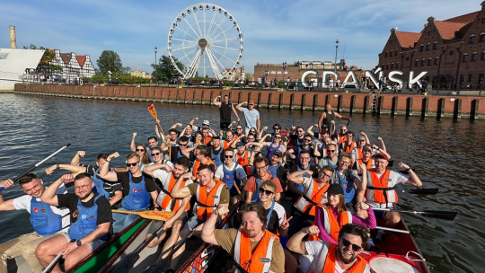
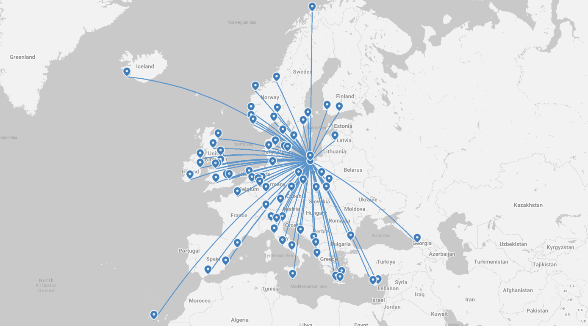
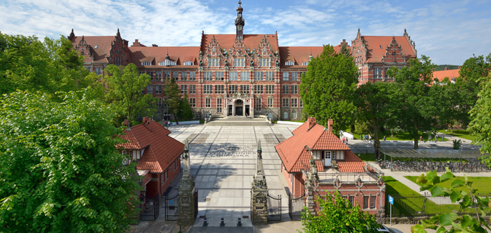
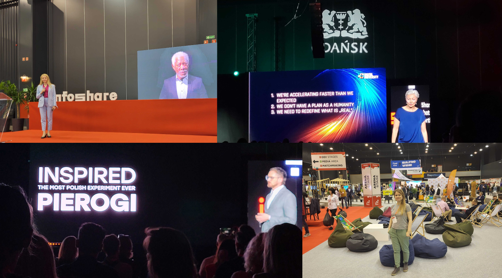
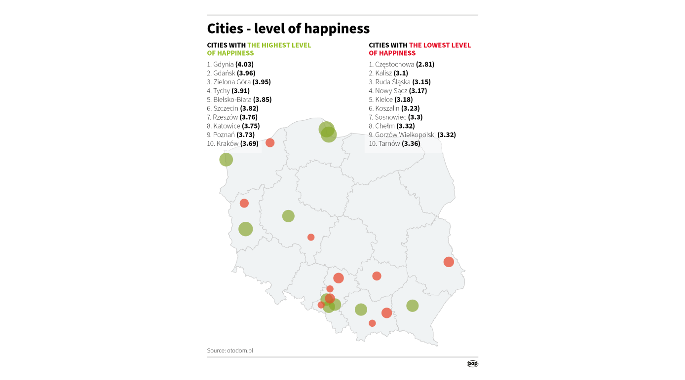

**Looking for a software development agency based in Poland? Consider choosing a software company from Gdańsk. Why? Unlock Gdańsk's tech potential and find out why it might be a perfect place for you to create digital solutions.**

**Contents**

[Great geo-localization and flight connections](/blog/hiring-software-development-agency-based-in-gdansk/#great-geo-localization-and-flight-connections)

[The opportunity to see face-to-face](/blog/hiring-software-development-agency-based-in-gdansk/#the-opportunity-to-see-face-to-face)

[Collaboration-friendly time zone](/blog/hiring-software-development-agency-based-in-gdansk/#collaboration-friendly-time-zone)

[One of the top Polish technology universities is in Gdansk](/blog/hiring-software-development-agency-based-in-gdansk/#one-of-the-top-polish-technology-universities-is-in-gdansk)

[Gdansk is full of programming talents](/blog/hiring-software-development-agency-based-in-gdansk/#gdansk-is-full-of-programming-talents)

[Gdansk hosts infoShare – the biggest tech and startup event in CEE](/blog/hiring-software-development-agency-based-in-gdansk/#gdansk-hosts-infoshare--the-biggest-tech-and-startup-event-in-cee)

[Studies show that people who live in Gdansk are one of the happiest in Poland ☺️](/blog/hiring-software-development-agency-based-in-gdansk/#studies-show-that-people-who-live-in-gdansk-are-one-of-the-happiest-in-poland-%EF%B8%8F)

[Combine your business trip with pleasure](/blog/hiring-software-development-agency-based-in-gdansk/#combine-your-business-trip-with-pleasure)

[See you in Gdansk? 😉](/blog/hiring-software-development-agency-based-in-gdansk/#see-you-in-gdansk-)

## Great geo-localization and flight connections

You can fly to over 20 countries from Gdańsk Airport ([data](https://www.airport.gdansk.pl/lotnisko/aktualnosci/80-polaczen-do-24-krajow-n2234.html) from March 2023). Thanks to the Gdańsk's great localization in the center of Europe, flying to some cities like Copenhagen, Oslo, and Munich takes even less than two hours.

What’s more Gdańsk Airport has [the most direct flights to Scandinavia](https://www.airport.gdansk.pl/lotnisko/aktualnosci/od-kwietnia-nowe-polaczenia-z-gdanska-do-skandynawii--n1706.html) (among Polish airports) including connections to **Tromso, Trondheim, Alesund, Turku, Stockholm, Oslo, Goteburg Vaxjo, Malmo, Billund**, and more. It’s worth mentioning that the Helsinki-Gdansk flights will be back in 2024 according to the [airport website](https://www.airport.gdansk.pl/lotnisko/aktualnosci/wroca-loty-z-gdanska-do-helsinek--n2251.html).

The Gdańsk Airport is located about 20 minutes from the center of the city by car (getting to the Bright Inventions office from the airport is even quicker). 

Source: \[Gdansk Airport website](https://www.airport.gdansk.pl/flight-information/where-we-fly-p3.html) 

Additionally, you can reach the city comfortably by train from Berlin. 

## The opportunity to see face-to-face

Working day by day in a distributed team has proven effective, yet from time to time, you might need to meet the people you work with daily in an offline setting. That’s why Gdańsk is a great place to have a software development team located, as you can reach the city in only a few hours from across Europe. Or the team can come to you. This is especially useful for [product workshops](/our-areas/product-workshops/) that kick off most software development projects. These are the workshops that can benefit from face-to-face interactions. Software agency members can visit you to conduct these workshops.

For example, we visited our client, a renowned humanitarian agency in Rome, to conduct product workshops for the team.

## Collaboration-friendly time zone

Poland is in **Central European Time (CET)** which makes it possible to organize **daily online meetings** with client representatives from **European countries**, as well as **Israel** or even the **USA**.

Examples of time differences:

🇵🇱 Poland – 🇩🇪 Germany: no time difference

🇵🇱 Poland – 🇳🇴 Norway: no time difference

🇵🇱 Poland – 🇬🇧 the UK: 1-hour time difference

🇵🇱 Poland – 🇮🇱 Israel: 1-hour time difference

🇵🇱 Poland – 🇺🇸 New York: 6-hours time difference

At Bright Inventions we successfully collaborate with clients from the listed countries.

## One of the top Polish technology universities is in Gdansk

Based on the 2023 Perspektywy Report *[Universities of Technology 2023](https://2023.ranking.perspektywy.org/ranking/university-ranking/ranking-by-university-type/universities-of-technology)* **Gdansk University of Technology was ranked third among universities of technologies in Poland** (following universities in Warsaw and Krakow).

Lots of Bright Inventions team members graduated from Gdansk University of Technology including our co-founders [Daniel Makurat](/about-us/daniel/) and [Michał Łukasiewicz](/about-us/michal/). Our project manager [Kasia Łukasiewicz](/about-us/kasia/) is also a lecturer at the Gdansk University of Technology’s Informatics department.

 Source: \[Gdansk University of Technology's website](https://pg.edu.pl/dzial-promocji/marka-pg/galeria-zdjec)

It’s worth mentioning that graduates of the Gdansk University of Technology created [text-to-speech Ivona](https://pg.edu.pl/aktualnosci/2021-04/chcemy-dac-polakom-milion-dodatkowych-lat-zycia-w-zdrowiu-rozmowa-z-lukaszem). Their solution eventually helped to build the famous Alexa.

## Gdansk is full of programming talents

Over 500 people graduated in [2022](https://cdn.files.pg.edu.pl/main/Dzia%C5%82%20Kszta%C5%82cenia/Statystyki/Liczba%20absolwent%C3%B3w%20stan%20na%20dzie%C5%84%2031.12.2022.pdf) from the Faculty of Electronics, Telecommunications, and Informatics of Gdansk University of Technology. Naturally, that is not the only college in Gdansk offering informatics studies.

The official [news portal of Gdańsk](https://www.gdansk.pl/wiadomosci/Armia-18-tysiecy-programistow-Czy-Gdansk-jest-zaglebiem-branzy-IT-w-Polsce-Invest-in-Pomerania-Marcin-Grzegory-BSS-biurowce,a,224885) says that **in Gdansk works around 18 000 programmers**. That’s why Gdansk is a place where true tech giants choose to operate including Amazon, Intel, and IBM.

## Gdansk hosts infoShare – the biggest tech and startup event in CEE

[infoShare](https://infoshare.pl/conference/) brings over 6 thousand attendees, 150 speakers, and over 500 startups. The first edition of the event was organized in 2007. infoShare brings to Gdańsk speakers representing companies like IBM, Linux, Oracle, Intel and more.

 Pictures from infoShare 2023 

## Studies show that people who live in Gdansk are one of the happiest in Poland ☺️

Gdańsk citizens are one of the happiest in Poland according to studies conducted between 2021-2022 by [Otodom and ThinkCo](https://www.thefirstnews.com/article/gdynia-happiest-place-in-poland-says-new-report-revealing-countrys-most-and-least-satisfied-cities-32304). Only a nearby city Gdynia had the highest level of citizen’s happiness.

 The level of happiness by Otodom and ThinkCo 

One of the reasons might be the fact that **Gdansk offers opportunities to grow professionally as well as to pursue other passions**. Gdańsk, situated next to Baltic See, gives a chance for water activities like kite surfing, sup, sailing, and more. With hundreds of kilometers of bike routes and lots of green spaces, the city lets you truly rest after work. As a result, it helps to establish a work-life balance among employees [crucial for maintaining happiness](https://www.researchgate.net/publication/299741273_The_Relationship_Between_Work-Life_Balance_and_Happiness_From_the_Perspectives_of_Generation_X_and_Y).

## Combine your business trip with pleasure

Gdańsk is a great city to experience beach sunsets, sailing, historical sightseeing, and much more. Check out the [places to visit in the city recommended by our team](/blog/things-to-see-in-gdansk/)!

## See you in Gdańsk? 😉

We hope that you have unlocked the potential Gdańsk has. If you are looking for a software agency based in Gdansk, reach out to our team.

<h2>meet best software development studio in Gdańsk</h2>
Contact us to discuss your idea or software solution. We have been developing digital products since 2012 for clients from Norway, Israel, Germany, the UK, Israel, the USA, and more.
<a href="/our-areas/gdansk-software-company/"><button>meet for a coffee</button></a>
