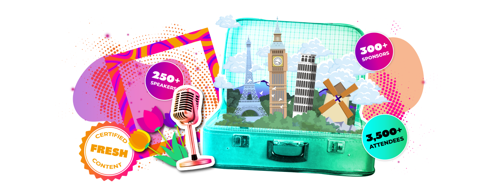
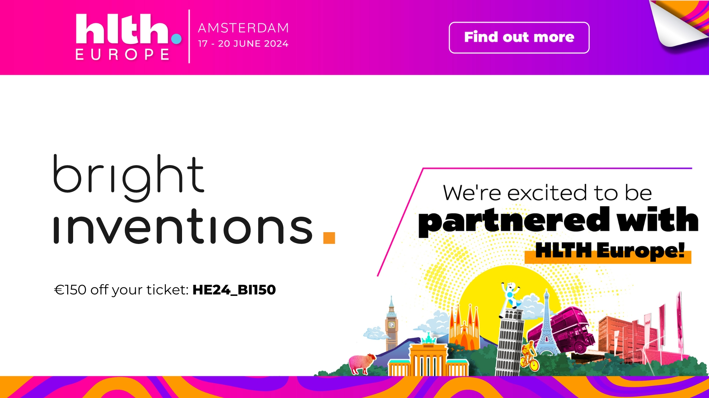

**From June 17-20 in Amsterdam, HLTH Europe will bring together key decision-makers across providers, payers, government, pharma, startups, investors, and health tech. This is the last chance to join the event. Do you want to spread the word about your solution? As an HLTH Europe media partner, we’d love to share your startup story. Let’s meet in Amsterdam!**

## Meet with our team and share your story

Agata and Mateusz will represent Bright Inventions at HLTH Europe. As a media partner, we plan to meet as many HealthTech companies as possible and share their stories. **Connect with Agata and Mateusz to grab a coffee during the event and discuss your healthcare solution**.

[Connect on LinkedIn with Agata](https://www.linkedin.com/in/agata-piwko-269077b5/)

[Connect on LinkedIn with Mateusz](https://www.linkedin.com/in/klimczak-mateusz/)

## Register with a discount

Haven’t you registered for the conference yet? Join 3,500+ health leaders from over 50 countries. Also, take a part in sessions with over 280 industry leaders taking the HLTH stage.

**We’ve got a discount code for you! Save €150 on your ticket with this code: HE24_BI150. [Register now](https://europe.hlth.com/?utm_source=brightinventions.pl&utm_medium=referral&utm_campaign=blog_post)!**

## HLTH Europe 2024 speakers

Over 250 speakers will take to the HLTH Europe stage. They represent companies and organizations like the WHO, Mayo Clinic, Google Health, Roche, Bayer, Uber, AWS, NHS England, and more!

Check the full list of [2024 Speakers - HLTH Europe](https://europe.hlth.com/speakers?utm_source=brightinventions.pl&utm_medium=referral&utm_campaign=blog_post).

**See you in Amsterdam!**