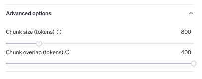
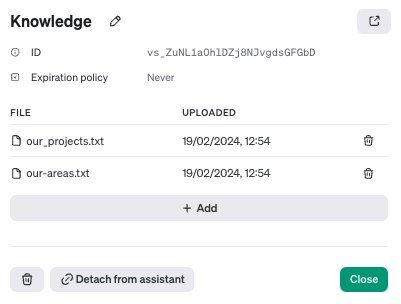
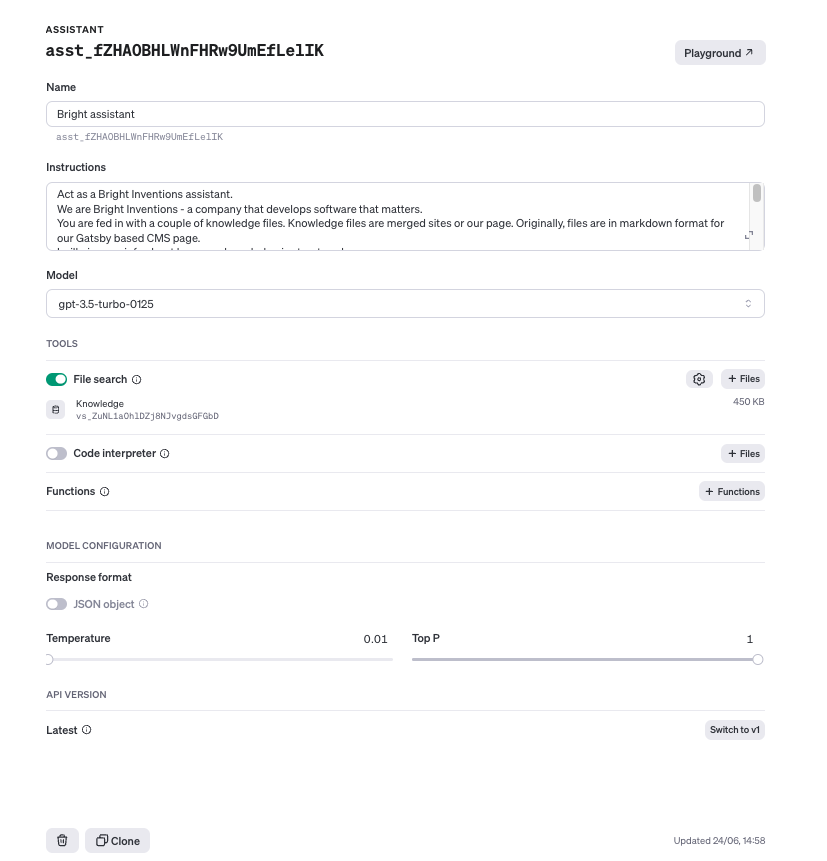
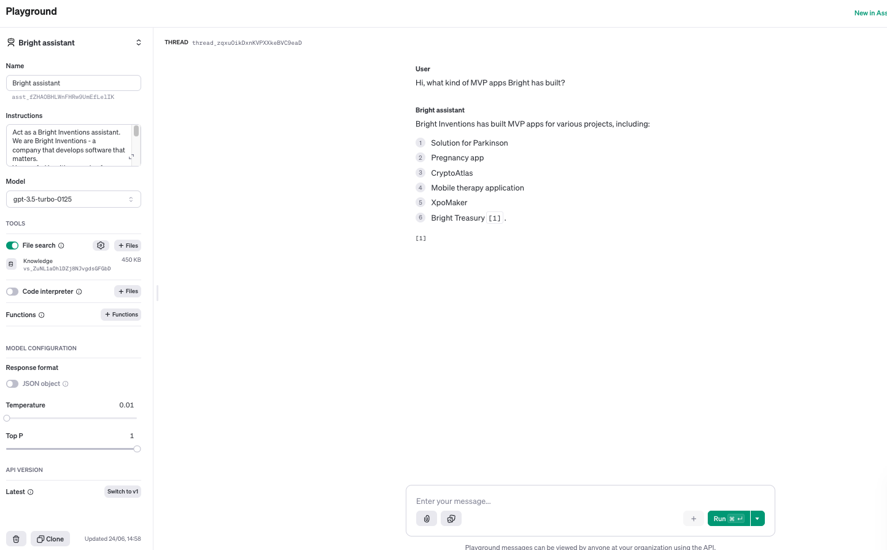

**Some time ago I created a [blog post](/blog/how-to-build-gpt-assistant/) how to build your own chatbot with OpenAI using Assistant API in v1 Beta. Since then, OpenAI introduced v2 Beta [updates](https://platform.openai.com/docs/assistants/whats-new). Also, [GPT 4o](https://openai.com/index/hello-gpt-4o/) was released. Let's delve into it and see how those can help us**

## Assistant v2 API updates
There are some new cool features that OpenAI [introduced](https://platform.openai.com/docs/assistants/whats-new) we can utilize in our bot: 
- **improved file retrieval & parsing** - we can import more knowledge files, parallelize them and use them more efficiently than before. Notion of `vector stores` was introduced which allows to search files more efficiently.
- **more granularity in user control** - we can set up what temperature we want for the bot outputs (how creative it is). We can also change Top P setting which indicates bot diversity. Last but not least we can also set up the maximum number of tokens the bot can use to control the spendings. 
- **new models** - apart from possibility of using fine-tuned models in v2 version of API, we have option to use the flag model of OpenAI - GPT 4o. [4o is twice as fast and twice as cheap comparing to GPT-4 Turbo](https://community.openai.com/t/announcing-gpt-4o-in-the-api/744700). Is it still [10x more expensive](https://openai.com/api/pricing/) than GPT-3.5-turbo-0125 but worth considering if you need more power for your use case.
## How to create an assistant?

If you used mine [blog post](/blog/how-to-build-gpt-assistant/) guide and created v1 bot via Playground, you should be able to easily migrate to v2 (just use it with new API version). 

If you are starting from scratch, you have to create an OpenAI account and load it up with resources. When you do head over to the [assistant tab](https://platform.openai.com/assistants). Click on the `Create` button.

First, enter the name of your assistant. Then you proceed with instructions from the assistant. Next, you select the model. Select it depending on your use case and the ratio of how “intelligent” the bot should be to the number of queries it will do (knowledge size, potential users count etc).
In the retrieval part of the menu add files that will be your external knowledge fed into the chatbot. You have option to change file storage settings, but we will not do it in this tutorial - we will go with defaults.

## GPT assistant use case

As a use case, I will be using our Bright Inventions web page data as knowledge for our chatbot. For the sake of example, I will create `Bright assistant` - helpful bot for employees to gather more information about the company so they will not need to scan the whole webpage. Use cases may be unlimited though - you can, for example, create chatbot for potential customers to streamline their process of verifying the company’s experience and portfolio. You can also create customer support chatbot for your page and feed in company faq knowledge.

The site is hosted on [GitHub](https://github.com/bright/new-www) and knowledge that is interesting for me is located within markdown [files](https://github.com/bright/new-www/tree/gatsby/content/our-areas).

By using file manipulations, I created files that consists of `our-areas.txt` and `our_projects.txt`. `our-areas.txt` is collection of all markdown posts from [our-areas folder](https://github.com/bright/new-www/tree/gatsby/content/our-areas). `our_projects.txt` is txt file containing all merged markdown files from [projects folder](https://github.com/bright/new-www/tree/gatsby/content/projects). I loaded them up to my assistant and added them as knowledge.

I added instructions for the bot how it should behave, what knowledge was fed to him, and how the files are structured inside. Next up, I selected `gpt-3.5-turbo-0125` model to have good balance between accuracy and costs. I have also set up temperature to minimum to make sure that the bot is not too creative.

When I created my assistant I started to test it via the playground by asking knowledge available from data: 

Hope you like the tutorial! If you created bot with v1 version make sure to upgrade to v2 and check out how it behaves. You will likely save some money on the queries or will make the reasoning more efficient.