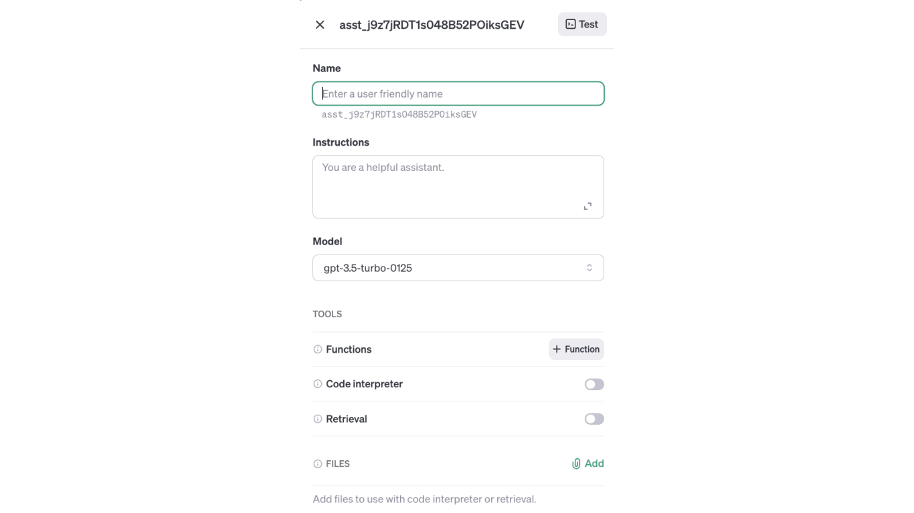
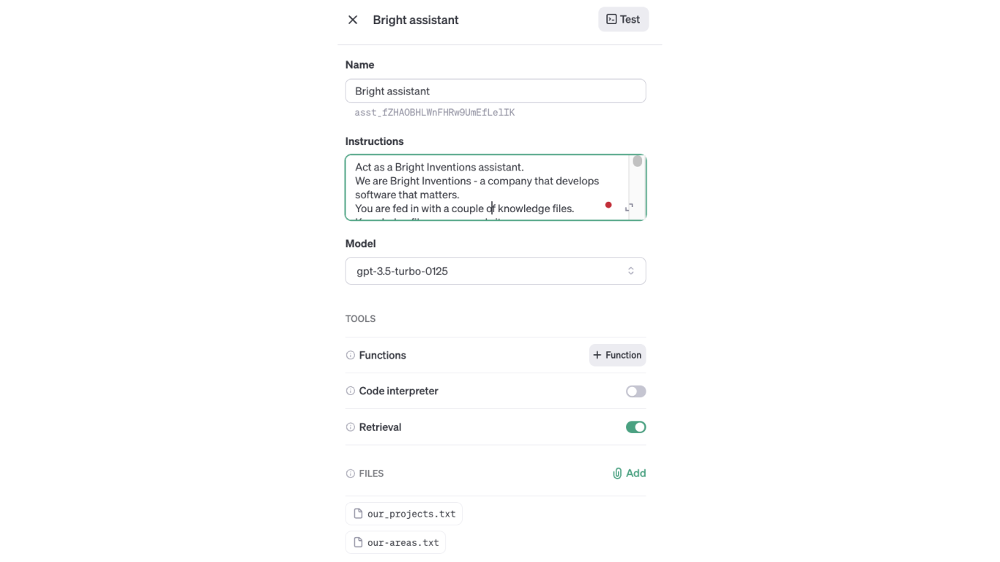
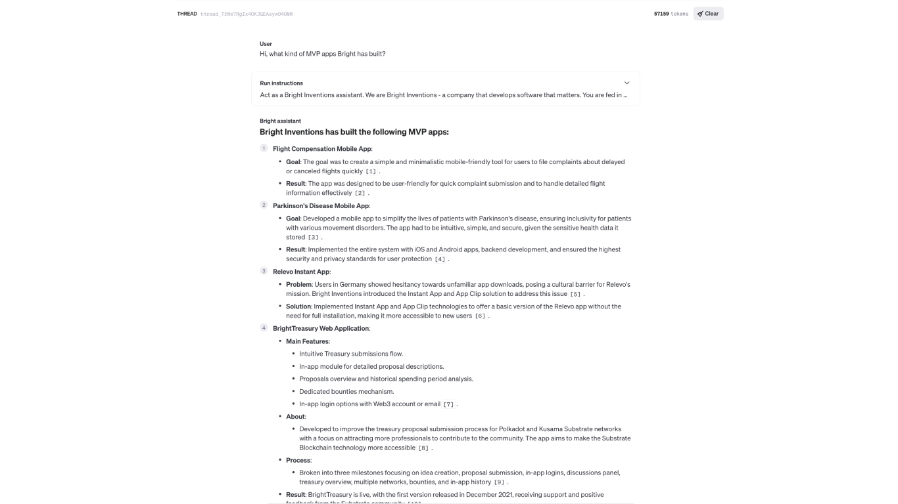

**Imagine you want to create a bot with an internal company wiki or bot that will help your customers navigate via your page. Traditionally, you could do it with the [RAG approach](/blog/build-llm-application-with-rag-langchain/). Since last 4 months, you have the option to create a custom GPT if you are a GPT Plus subscriber. The problem with this approach is that the bot is only accessible to other Plus subscribers. Additionally, you are bound to Chat GPT data privacy which I was writing in [this](/blog/openai-chatgpt-free-plus-privacy-policies-explained/) post. I will show you how to use API and create your own GPT Assistant. Firstly, you will not be limited to Plus GPT subscribers. Secondly, you will most likely have better out-of-the-box data control via API than the ChatGPT interface.**
## What is a GPT assistant?

[GPT assistant API](https://platform.openai.com/docs/assistants/overview) was introduced at [OpenAI Dev Day](https://devday.openai.com/). Instead of just using chat completions OpenAI allows you to enable code interpreter (which is executing Python snippets) and uploading of external knowledge which is used by it.

## Is GPT assistant for me?

As you will see, GPT assistants allow low-barrier entry to chat with own knowledge. Normally, due to the context window limit, you would need to create embeddings and use vector database and RAG in general.

Your use case might not require zero data retention which is super specific (I was writing about it in the [post](/blog/openai-api-privacy-policies-explained/)), so GPT assistant might be good enough for you, especially to test some PoC and save time.

Note: Assitant API is still in [BETA](https://community.openai.com/t/assistants-api-token-usage-and-pricing-breakdown-clarification/508410/10), meaning that it might cost some money and be less performant than classic RAG approach. I suggest using API with `GPT-3.5-turbo-0125` model which is the newest and cheapest from OpenAI offerings. What we get in exchange is a very quick time to market value. So bear this in mind for your use case!

So, is Assistant API for you? As always, it depends and you are the one to decide.

## How to create an assistant?

You have to create an OpenAI account and load it up with resources. When you do head over to the [assistant tab](https://platform.openai.com/assistants). Click on the `Create` button. Following side menu will open:

First, enter the name of your assistant. Then you proceed with instructions from the assistant. Next, you select the model. Select it depending on your use case and the ratio of how “intelligent” the bot should be to the number of queries it will do (knowledge size, potential users count etc). I suggest going with `GPT-3.5-turbo-0125` at the beginning.
In the retrieval part of the menu add files that will be your external knowledge fed into the chatbot. 

For the limits of the file, on the OpenAI page, we can read that:

<blockquote>
    
You can attach a maximum of 20 files per Assistant, and they can be at most 512 MB each. The size of all the files uploaded by your organization should not exceed 100 GB. You can request an increase in this storage limit using our help center. In addition to the 512 MB file size limit, each file can only contain 2,000,000 tokens. Assistant or Message creation will fail if any attached files exceed the token limit.

    <footer>[OpenAI docs](https://platform.openai.com/docs/assistants/how-it-works/creating-assistants)</footer>
</blockquote>

[On supported files page](https://platform.openai.com/docs/assistants/tools/supported-files) you can find what file extensions are supported. For the pricing of the assistant you can read more [on pricing page](https://openai.com/pricing).
If you are interested what is happening under the hood, you can read up [community discussion](https://community.openai.com/t/where-does-gpt-assistant-store-the-embeddings/506167) how and where embedings are stored.

## GPT assistant use case

As a use case, I will be using our Bright Inventions web page data as knowledge for our chatbot. For the sake of example, I will create `Bright assistant` - helpful bot for employees to gather more information about the company so they will not need to scan the whole webpage. Use cases may be unlimited though - you can, for example, create chatbot for potential customers to streamline their process of verifying the company’s experience and portfolio. You can also create customer support chatbot for your page and feed in company faq knowledge.

The site is hosted on [GitHub](https://github.com/bright/new-www) and knowledge that is interesting for me is located within markdown [files](https://github.com/bright/new-www/tree/gatsby/content/our-areas).

By using file manipulations, I created one file that consists of `our-areas.txt` and `our_projects.txt`. `our-areas.txt` is collection of all markdown posts from [our-areas folder](https://github.com/bright/new-www/tree/gatsby/content/our-areas). `our_projects.txt` is txt file containing all merged markdown files from [projects folder](https://github.com/bright/new-www/tree/gatsby/content/projects). I loaded them up to my assistant. I added instructions for the bot how it should behave, what knowledge was fed to him, and how the files are structured inside. Next up, I selected `gpt-3.5-turbo-0125` model to have good balance between accuracy and costs.

When I created my assistant I started to test it via the playground by asking knowledge available from data: 

As you can see, if your knowledge database is big, building chatbots for your company to access them is a good idea. It might limit the time needed for the newcomers or potential customers to get some information.
What is important to note is that one should place only public, non-critical information in the bot. There are ways you can force unprotected assistants to return files/information it has access to. When you will create assistant you can easily connect it to your Slack (via for example no-code [Zapier](https://zapier.com/)) or create external chat bot project (like [Open-Custom-GPT](https://github.com/SamurAIGPT/Open-Custom-GPT)). 
OpenAI is making easiear and easier every day to disrupt the market with AI. Publishing Assistant API is a good example of that. Hope you will find it useful for your use case!
