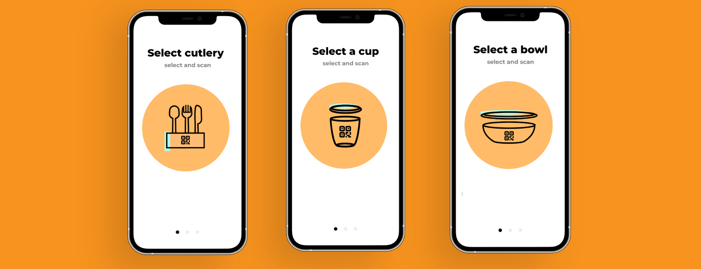
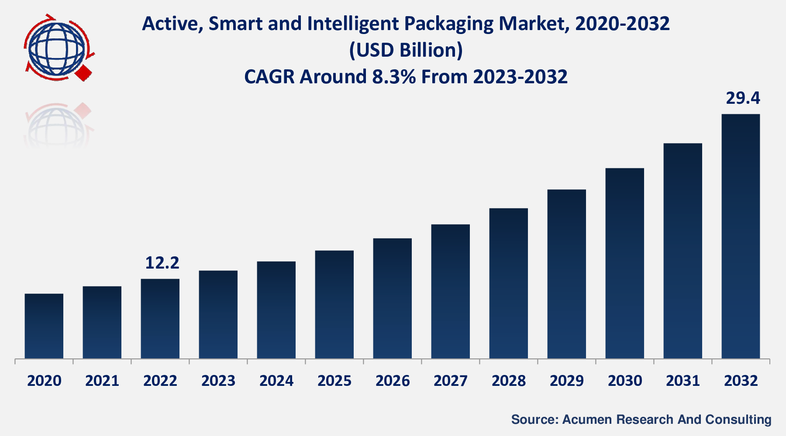
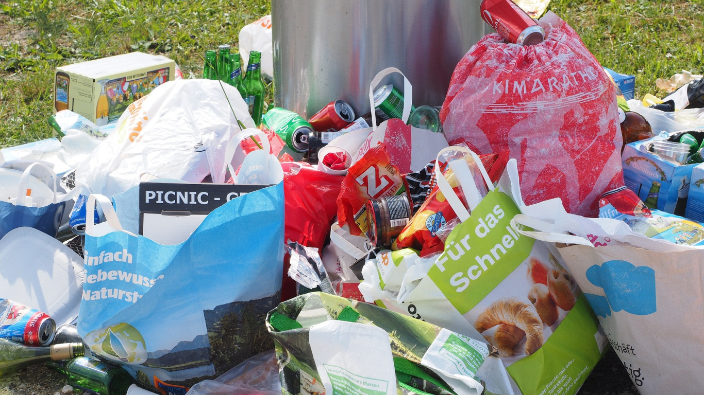
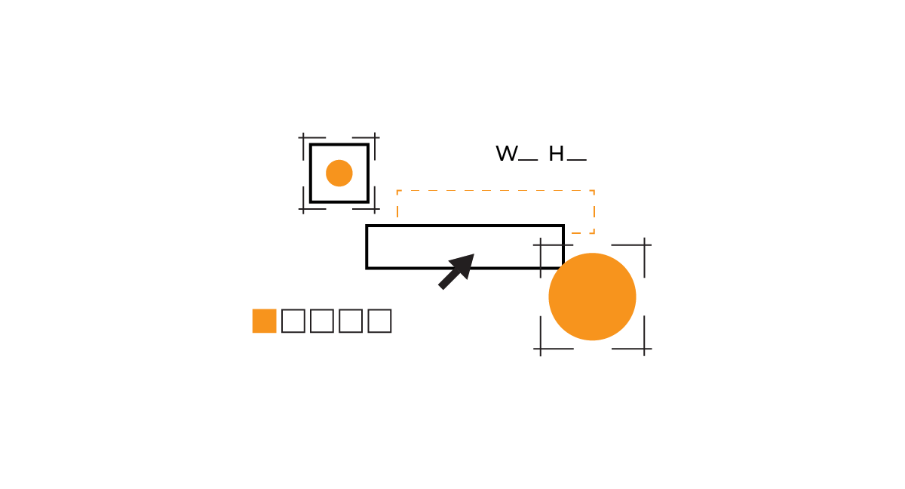

**Do you plan to enter the smart packaging industry with your solution? With such a fast-developing industry time-to-market is the key. The best way is to build and launch MVP (Minimum Viable Product) and start gathering first users' feedback. What problems could smart packaging solve? What are MVP development stages? What tech should you implement in your MVP? Dive in!**

- - -

## Table of contents

[Smart packaging definition and market size](/blog/how-to-build-mvp-for-smart-packaging-solution/#smart-packaging-definition-and-market-size)

[Why you should build MVP for Smart Packaging](/blog/how-to-build-mvp-for-smart-packaging-solution/#why-you-should-build-mvp-for-smart-packaging)

[Top benefits of building an MVP for a smart packaging startup](/blog/how-to-build-mvp-for-smart-packaging-solution/#top-benefits-of-building-an-mvp-for-a-smart-packaging-startup)

[Problems that smart packaging MVP can offer solutions for](/blog/how-to-build-mvp-for-smart-packaging-solution/#problems-that-smart-packaging-mvp-can-offer-solutions-for)

[Examples of smart packaging solutions on the market](/blog/how-to-build-mvp-for-smart-packaging-solution/#examples-of-smart-packaging-solutions-on-the-market)

[MVP development stages for a smart packaging solution](/blog/how-to-build-mvp-for-smart-packaging-solution/#mvp-development-stages-for-a-smart-packaging-solution)

[Examples of technologies to implement in a smart packaging product](/blog/how-to-build-mvp-for-smart-packaging-solution/#examples-of-technologies-to-implement-in-a-smart-packaging-product)

[What stack to use for smart packaging solution in 2024?](/blog/how-to-build-mvp-for-smart-packaging-solution/#what-stack-to-use-for-smart-packaging-solution-in-2023)

- - -

## Smart packaging definition and market size

**Smart packaging refers to packaging that is designed with advanced technologies** to provide additional features such as information, monitoring, and security. 

According to [Acumen Research and Consulting](https://www.globenewswire.com/en/news-release/2023/02/22/2612787/0/en/Active-Smart-and-Intelligent-Packaging-Market-Size-Growing-at-8-3-CAGR-Set-to-Reach-USD-29-4-Billion-By-2032.html#:~:text=The%20Global%20Active%2C%20Smart%20And%20Intelligent%20Packaging%20Market%20Size%20in,at%20a%20CAGR%20of%208.3%25), **The Global Smart Packaging Market Size in 2022 stood at USD 12.2 Billion and is set to reach USD 29.4 Billion by 2032**.

**To provide a comparison, one market that has a similar size to the projected smart packaging market size is the global digital signage market**. According to a report by MarketsandMarkets, the global digital signage market size was estimated at USD 16.3 billion in 2021 and is projected to reach USD 27.8 billion by 2026, growing at a CAGR of 11.2% during the forecast period.

## Why you should build MVP for Smart Packaging

When building an innovation you can never be sure if it adopts in the market. That’s why it is better to build a low-cost and fast MVP to minimize the risk of an unsuccessful investment.

An MVP, short for a Minimum Viable Product, is a software product that includes only the essential features necessary for launching and obtaining initial feedback from early adopters. It serves as a starting point for further development based on the insights gained from early users.

## Top benefits of building an MVP for a smart packaging startup

These are the benefits you should consider:

### Validate your idea

MVP lets you **validate your assumptions about the target audience in a timely and low-cost manner**. If the MVP turns out not to be successful, you can quickly rethink your strategy and adjust it to meet users' expectations. When the MVP proves to be a success, then you know you are going in the right direction and can simply keep working.

### Reducing costs

MVP is an investment in the base of your product. **Choosing to build only crucial features helps to reduce costs**. A low budget can actually be an advantage for startups. How come? It helps you rationally choose the key features of your solution. It motivates software developers to seek effective, low-cost solutions to any technical challenge. In the end, it protects startups from losing all their resources on a product that won’t attract users.

### Short time to market

The smart packaging industry is rapidly evolving, and **building an MVP can help you stay ahead of the curve** by allowing you to quickly test new technologies and features. Building MVP is a matter of weeks, so you can really quickly show your product to the market.

### Iterative Development

By building an MVP, **you can continually test and improve your product**, allowing you to adapt to changing market conditions and customer needs. This iterative development process can help you create a more robust and successful product in the long run.

<EbookDynamic sectionTitle='70 pages about MVP development just for you' ebookName='From-MVP-to-a-Final-Product.pdf' ebookDescription='Dive into MVP development. Get the free guide and ensure that MVP is a great option for your business.' ebookImage='/images/mvp_ebook_cover.png' ebookAlt='MVP guide ebook cover' />

## Problems that smart packaging MVP can offer solutions for

Examples of problems smart packaging innovations can address:

### Supply chain inefficiency

Smart packaging has the potential to **revolutionize the supply chain by providing real-time information about products' location, condition, and integrity**. By building an MVP, you can quickly demonstrate the value of your product to potential partners and investors in the logistics industry, helping to drive adoption and create a more efficient supply chain.

### Food and packaging waste

Smart packaging can help **reduce waste by extending the shelf life of perishable goods and preventing product spoilage**. It also **helps to reduce plastic waste**. Single-use plastic containers, wrappings, etc. create unimaginable waste. By building an MVP, you can demonstrate the impact of your product on waste reduction, helping to position your startup as a leader in sustainability.

### Lack of traceability and security

Smart packaging can also **improve product traceability and security by providing a tamper-evident seal and tracking information throughout the supply chain**. By building an MVP, you can demonstrate the value of your product to potential partners and investors, helping to drive adoption and create a more secure supply chain.

## Examples of smart packaging solutions on the market

Learn more about successful products that offer smart packaging:

### Relevo

[Relevo](/projects/eco-friendly-app/) – a smart packaging solution that helps to limit food containers' plastic waste.

<InstagramEmbed url='https://www.instagram.com/p/CrQkFALId1E/?igshid=YmMyMTA2M2Y%3D' />

### Securikeitt

[Securikeitt](https://www.securikett.com/en/our-solution/securitylabels-and-seals/) – security labels and seals securing products from tampering, counterfeiting and grey trade.

<YouTubeEmbed url='https://youtu.be/up2ptPxyU80' />

### Eupry

[Eupry](https://eupry.com/temperature-mapping/temperature-mapping-kit/) – temperature mapping kit contains wireless data loggers and specialized mapping software.

<YouTubeEmbed url='https://www.youtube.com/watch?v=Ka4oFjGQ3l4' />

## MVP development stages for a smart packaging solution

Here are the typical MVP development stages. The final flow may vary depending on the project.

### Idea for MVP

The idea doesn’t guarantee success. It’s only the first step. ;) It’s essential to verify whether the idea has business potential and a chance to stand in the market. It's also the perfect opportunity to set first goals that will help measure the app's success in the future. 

During this stage, you can try to consult your idea with a suitable MVP development company. Finally, it’s time to decide if you plan to get your own team to build the MVP or hire an MVP agency to take care of that.

### MVP Prototyping (1-4 weeks)

Validating the ideas' potential is followed by prototyping. The prototyping phase is when a product designer creates the first visual representation of the idea. The effect of close cooperation with a [product design team](/our-areas/product-design/) is prototypes. They are basic clickable mockups or wireframes without any backend. This stage helps to eliminate first mistakes and understand how the solution might work.

### Building and launching the MVP (Minimum Viable Product) **(4-20 weeks)**

According to the feedback received during the prototyping stage, the software development agency gathers the final requirements from the client and builds the minimal viable product. 

As you can see, you can launch an MVP in weeks and with marketing experts quickly start to gather users. Launched MVP is also a great conversation starter with investors. 😉

MVP is a cornerstone of your product. Based on it you keep developing it according to your users' feedback. 

### Product Development & Maintenance based on MVP (Infinity – hopefully)

The final stage is app development and maintenance. At this stage, a software development company or internal dev team regularly deploys new features to production. Every change in the product will affect your users. Thus, the priority for developers is to maintain the app's stability. All development updates should be tested in a staging environment. It’s a constant challenge of developing the product to give more and more satisfaction to the users.

The crucial part of development, yet often neglected is analytics. You should monitor app performance, user behavior, and install and retention rates in the post-MVP phase to get to know your users as much it is possible.

## Examples of technologies to implement in a smart packaging product

MVP is all about launching a product with key features. So you shouldn’t implement too many time-consuming and expensive (to build) features at the beginning. However, we’d like to show you what innovations you might consider while building smart packaging solutions.

### QR Codes

These codes are printed on the packaging and can be scanned by smartphones to provide information about the product, such as ingredients, nutritional information, and product origin.

### Near Field Communication (NFC)

This technology uses radio frequency identification (RFID) to transmit data wirelessly between a tag embedded in the packaging and a reader. This allows for more extensive information about the product, including temperature and humidity data, to be transmitted.

### Time-Temperature Indicators (TTIs)

These are small devices that are attached to packaging to monitor the temperature of perishable goods during transport and storage. They can provide an indication of whether the product has been subjected to temperature abuse and can help to prevent food waste.

### Intelligent Packaging

This refers to packaging that is embedded with sensors and can communicate with other devices. For example, intelligent packaging could include a sensor that detects when a product has been opened and communicates with a smartphone app to provide recipes or serving suggestions.

### Active Packaging

This type of packaging contains substances that can extend the shelf life of the product. For example, oxygen scavengers can be added to packaging to prevent spoilage.

### Anti-counterfeiting Technologies

Smart packaging can include technologies such as holograms, QR codes, and RFID tags to help prevent counterfeit products from entering the supply chain.

### Augmented Reality

This technology uses the camera on a smartphone or tablet to overlay digital information onto the packaging, providing additional information or interactive experiences for consumers.

### Printed Electronics

This technology involves printing electronic components onto packaging materials, allowing for more advanced features such as temperature monitoring and product authentication.

## What stack to use for smart packaging solution in 2024?

Based on our experience in developing software since 2012 we listed the stack your software team should work with in 2024. 

### Web development:

**Frontend**: TypeScript, React
**Backend**: Node.js, PostgreSQL/Redis, NestJS, AWS

### Mobile development:

Whether you decide to build native or hybrid applications (one app for both Google Play and AppStore), we will show you what stack you should consider. Remember that **you don’t need to build MVP for both systems (Android, iOS**). You can start with one app and launch it as MVP and then work on another. A hybrid approach is only recommended when you want to build a very simple solution. 

**Android development**: Jetpack Compose, Kotlin, Apollo GraphQL, WorkManager, Room, Hilt.

**iOS development**: SwiftUI + UIKit, Swiftgen, Apollo GraphQL, CoreData, SwiftLint, SwiftFormat, Sourcery, Bitrise.

**Hybrid app development**: React Native, TypeScript, mobx-state-tree

**Project management & documentation**: Jira, Figma, Github, Notion, Miro, GitHub Actions

**Product design**: Figma, Adobe, Miro

<h2>Ready to take your solution to the next level?</h2>
Schedule a free consultation with our team. We'll provide expert insights within 48 hours.
<a href="https://brightinventions.pl/start-project/"><button>let's talk about your product</button></a>
