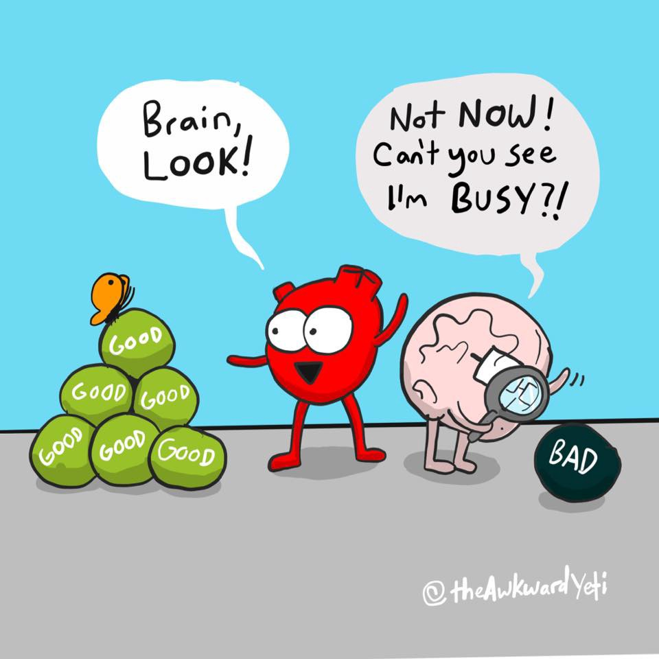
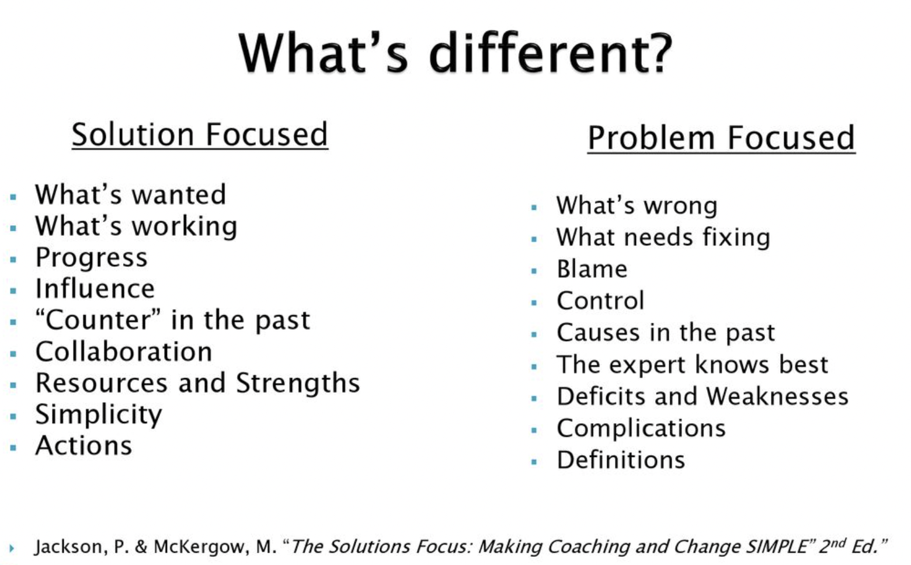
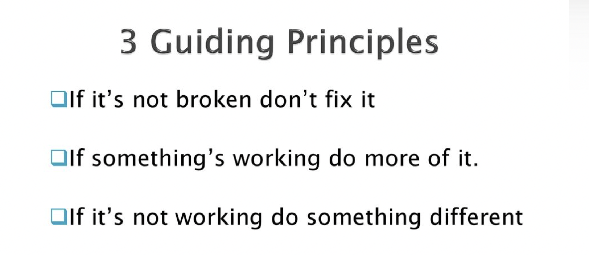

Throughout human history, survival was the primary concern, and addressing problems and challenges was crucial for our existence. This instinct is deeply ingrained in our psyche, even in modern times it leads us to focus on potential threats and issues much more than on potential opportunities and solutions. Apart from our natural inclinations we are surround by the media that tend to prioritize reporting on problems, conflicts, disasters, and negative events as they grab attention and increase viewership. This constant exposure to negative news can reinforce our problem-oriented way of thinking and can even create the perception of the problem-centric world. **However, human progress is driven by identifying and solving problems not thinking about them. We should work towards solutions and improvements, promoting a more balanced view of the world.** Acknowledging the positive aspects and celebrating achievements can help shift our perception away from a solely problem-focused lenses. 

## **Negativity bias** 

Our cognitive biases, such as [the negativity bias, make us more attentive to negative information](https://www.verywellmind.com/negative-bias-4589618). **We tend to remember and emphasise negative experiences over positive ones, reinforcing the idea that problems are more prevalent.** Even though we may no longer need to be on constant alert as our ancestors had to be in order to survive, the negativity bias still has a main role in our brain operations. It has a huge effect on how we think, feel and act. 

###### Source: https://www.instagram.com/theawkwardyeti

Understanding the negativity bias can help you be more aware of your thought patterns and emotional responses. While it may be challenging to completely eliminate this bias, you may use some strategies to minimalise it. **Among the techniques you can find some simples ones such as practising gratitude, limiting expose to negative news (and negative people 😉), evaluating the validity of native thoughts or expressing appreciation.** 

## **What does it mean to be solution-oriented** 

People who are solution-oriented have a mindset that focuses on finding practical and effective solutions to problems and challenges. **It involves a proactive and positive attitude, and taking action to overcome obstacles rather than dwelling on the problems themselves**. Being solution-oriented often leads to more productive and constructive outcomes in various aspects of life - not only at work. 

**Among the main traits of solution-oriented approach we can see:**

* positive mindset even in the face of setbacks,
* concentration on identifying creative approaches to tackle the issue at hand, 
* proactiveness and initiative to seek ways to implement solutions,
* thinking outside the box,
* seeking support from others and recognizing diverse perspectives,
* quick adjusting of an approach if the initial solution does not yield the desired results,
* seeing failure as a learning opportunity and motivation to keep trying. 

## **How to become more solutions-oriented**

Becoming solution-oriented requires developing a particular mindset and adopting specific practices.

1. First of all, you should acknowledge that negativity bias exists and you have to become aware of its impact on your thoughts and actions. **Without building self-awareness it is rather impossible to change anything.** If you are not sure whether you have a tendency to focus excessively on problems, ask your family and friends - they can sometimes say about your behaviours much more than you yourself.
2. If gaining self-awareness is not an issue and you understand the effect of negativity bias on your life, you should start the whole practical process. Whenever you encounter a problem, shift your focus from dwelling on the issue to exploring potential solutions. **Avoid getting stuck in a loop of complaining or ruminating about the problem. Remember also to clearly articulate the problem you are facing.** A well-defined problem is halfway to being solved. Then **try to generate as many potential solutions as you can**, regardless of how unconventional they may seem initially. In the end assess the potential solutions based on their effectiveness, practicality, and alignment with your goals.
3. Seek input and support from others. Collaboration with friends, family or your team members can provide fresh perspectives and insights. **Stay open to exploring ideas that may challenge your initial assumptions. Sometimes the best solutions come from unexpected sources.**
4. Invest time in enhancing your problem-solving abilities. Read books, take courses, or engage in activities that promote critical thinking and creative problem-solving. Becoming solution-oriented is an approach that requires practice and consistency. Be patient with yourself as you develop and reinforce this new way of thinking.
5. **Cultivate [a habit of expressing gratitude](https://www.health.harvard.edu/healthbeat/giving-thanks-can-make-you-happier#:~:text=In%20positive%20psychology%20research,%20gratitude,adversity,%20and%20build%20strong%20relationships.) for what you have and the progress you make.** Gratitude can foster a positive attitude. As a grateful individual you can often cope better with stress and adversity and counteract the negative impact of stressors, leading to improved emotional resilience. 

## A **solution-oriented team** 

The focus on solutions can empower any organisation and make better use of our time and resources. The key to success here is being clear and transparent what kind of behaviours you want to have in your team and which ones you really disapprove of. 

🙌 If solution-oriented thinking is a skill that you want to be learned and possessed by each member of your team, you had better **set the right example how to act and provide a person with appropriate feedback in real time.** It is important to catch inappropriate behaviour just when it happens and help explain the situation to the team members who are struggling. **If a problem seems to be overwhelming to your team members, break it down into smaller, more manageable components.** This can make it easier to identify potential solutions for each part.

 🚀 Another thing you can do is to **encourage creative thinking during your team’s meetings**. Understand that not every solution may work as intended, but the brainstorming process and looking for different options is also a valuable part of problem-solving skill. **If a solution doesn't succeed, view it just as a learning opportunity and use the experience to refine your approach.**

 🎉 **Don not forget about acknowledging and celebrating successes, no matter how small they may seem.** Focus on improving relationships through expressing appreciation and thankfulness among team members. It fosters feelings of connectedness and trust, leading to more fulfilling and supportive relationships. **Positive reinforcement can reinforce a solution-oriented mindset in your team as well.** When people are not afraid of expressing their views openly and know they can rely on each other, solving problems seems to be a natural and smooth part of their daily life and work. 

## **Solution-focused communication** 

There is one special [solution-oriented therapy](https://solutionfocused.net/what-is-solution-focused-therapy/) that is worth mentioning here. [Steve de Shazer](https://www.goodtherapy.org/famous-psychologists/steve-de-shazer.html) together with [Insoo Kim Ber](https://www.goodtherapy.org/famous-psychologists/insoo-kim-berg.html), two developed a type of brief therapeutic approach that focuses on identifying and building solutions to a person’s problems rather than dwelling on the problems themselves. It is based on the belief that people have the resources and strengths to overcome challenges, and the therapist's role is to help them tap into those resources and find effective solutions.

The same we can do with our everyday communication. **We can put a strong emphasis on identifying and amplifying solutions rather than analyzing problems in depth. To do that we can talk with the details about a preferred future where our problems have been resolved.** 

As during the therapy we can use a series of questions designed to think about the problematic situation in new more constructive ways. **These questions often begin with "how" or "what" and encourage us to explore our strengths, exceptions to the problem, and potential solutions. For example, we can ask ourselves - what worked for us in similar situations in the past? Or what could work for our friend/colleague in a similar situation?** Identify and explore previous “exceptions,” e.g. times when you have successfully coped with or addressed previous difficulties and challenges.

**Steve de Shazer made a valid point saying that very often the solution is not directly related to the problem and the language we use to describe the solution is different than that needed to describe a problem.** 

## **Summary - solutions as small miracles** 

While describing SFT I did not mention one important question that is used in the therapy. One of the key techniques is **"Miracle Question."** Clients with a problem is asked to imagine that a miracle has occurred overnight, and their problem is solved. They are then prompted to describe what their life would be like, how they would feel, and what they would be doing differently. This exercise can help them clarify their goals and identify steps toward achieving them. I believe that it is a very simple and opening technique we can use in our organisations to make a switch from problem-orientation to solution-orientation. **Make sure to keep the focus on what is wanted, not what is not wanted.** 

By highlighting strengths, exceptions, and potential solutions we can be empowered to make positive changes and achieve desired outcomes. **Henry Ford said that “most people spend more time and energy going around problems than in trying to solve them” - I believe the emphasis should be always placed on identifying and building solutions to problems, rather than getting stuck in a cycle of dwelling on the problems themselves.** There are three guiding principles you can use every time you start creating problems:

###### Source: [https://slideplayer.com/slide/14741507](https://slideplayer.com/slide/14741507/)