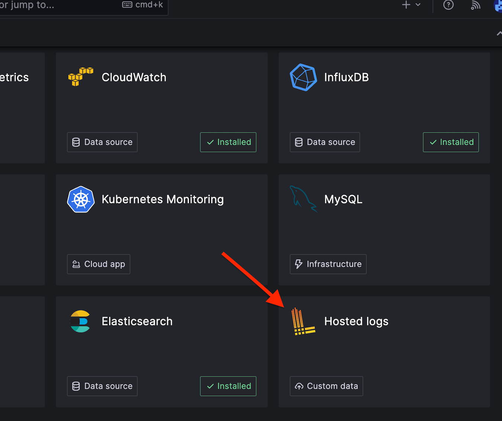
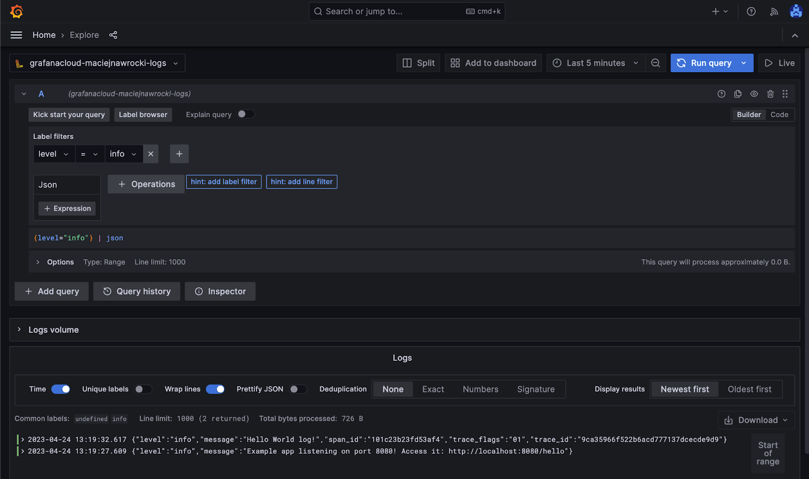
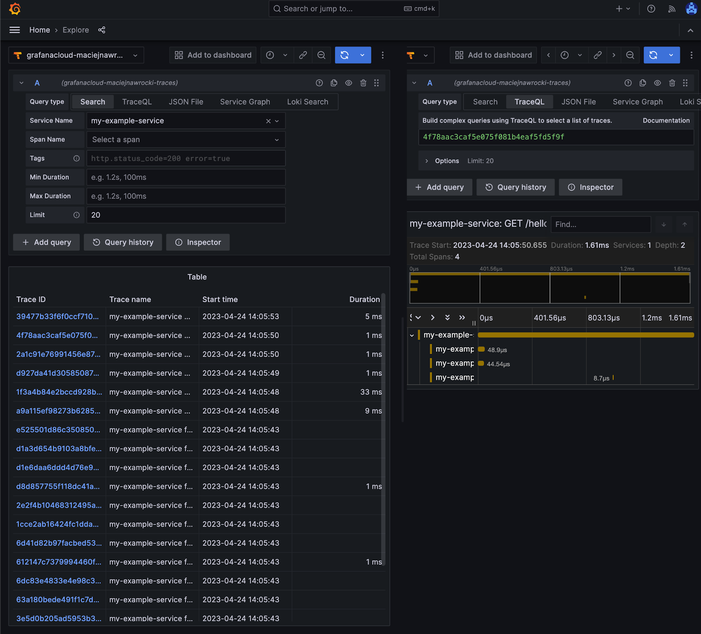

**Have you heard about the [Pareto Principle ](https://en.wikipedia.org/wiki/Pareto_principle)(aka the 80/20 rule)? Briefly, it states that 80% of all outcomes are derived from 20% of causes. In other words, a small amount of work can cause a great effect. I want to show you how to greatly improve observability with just a small amount of effort using Grafana and OpenTelemetry.**

## What is observability and why is it important?

Application observability is the practice of monitoring and understanding the behavior and performance of applications in production environments. 

Why is observability important?

* It helps developers gain better visibility into their application's behavior.
* It enables us to identify issues before they impact users.
* It assists in quickly diagnosing and resolving problems when they occur.
* It improves application reliability.
* It enables faster problem resolution.
* It allows us to provide a better customer experience.

## How can we achieve better observability \[tutorial]?

You may think that introducing additional tools to your application would be challenging. Due to the fact that your application is too big, or because it already works in production and you don’t want to introduce too many changes. Another reason to hesitate might be that it would simply be too difficult. But that is not the case!

## What app observability tools are we going to use?

In this tutorial, I will show you how to set up basic monitoring for your application using the [OpenTelemetry](https://opentelemetry.io/) and [Grafana's LGTM](https://grafana.com/go/observabilitycon/2022/lgtm-scale-observability-with-mimir-loki-and-tempo/) set of tools. "OpenTelemetry is a collection of tools, APIs, and SDKs that you can use to instrument, generate, collect, and export telemetry data (metrics, logs, and traces) to help you analyze your software’s performance and behavior."

OpenTelemetry provides a standard and vendor-neutral way to instrument, collect, and export telemetry data (metrics, logs, and traces) from applications and infrastructure. It allows developers to easily add observability to their applications without being locked into any specific vendor or technology stack. It is available for most popular languages and frameworks, so it will most likely be available for you too.

## Initial Application

Let's take an [example application:](https://gitlab.com/maciej.nawrocki.bright/observability-example/-/tree/initial-app)

```typescript
import express from "express";

const app = express();

app.get('/hello', (req, res) => {
   res.send('Hello World!');
   console.log("Hello World log!")
});

app.listen(8080, () => {
   console.log('Example app listening on port 8080! Access it: http://localhost:8080/hello');
});
```

…which logs “Hello World log!” after accessing its endpoint.

## Add Logging

First, we need to use a logger that supports multiple transports to apply additional logging configuration. I’m going to use winston, but feel free to use any other logger library.

```shell
npm install --save winston
```

We need to add logger configuration:

```typescript
import * as winston from "winston";

export const logger = winston.createLogger({
   transports: [
       new winston.transports.Console()
   ],
})
```

include it in `app.ts` (in your production application you will probably use dependency injection to use logger in modules) and replace `console.log()` with `logger.info()`:

```typescript
import express from "express";
import {logger} from "./logger";

const app = express();

app.get('/hello', (req, res) => {
   res.send('Hello World!');
   logger.info("Hello World log!")
});

app.listen(8080, () => {
   logger.info('Example app listening on port 8080! Access it: http://localhost:8080/hello');
});
```

And now after accessing our endpoint we receive log in json format:

```json
{"level":"info","message":"Hello World log!"}
```

That’s better! It’s usually [better to use json format for logging](https://www.loggly.com/use-cases/json-logging-best-practices/) since it’s easier for someone unfamiliar with web server logs to understand what the message contains, as each field is labeled.

## Add Tracing

I believe it’s safe to assume that if your application is already released to production, you’re not using console.log() for logging and you already had this first step implemented. Now we can take care of tracing. Following [OpenTelemetry manual](https://opentelemetry.io/docs/instrumentation/js/getting-started/nodejs/) let’s add required OpenTelemetry dependencies:

```shell
npm install --save @opentelemetry/sdk-node \
 @opentelemetry/auto-instrumentations-node
```

Now, we can add example tracing configuration from OpenTelemetry docs. Let’s create tracing.js in main directory:

```typescript
import {NodeSDK} from '@opentelemetry/sdk-node';
import {ConsoleSpanExporter} from '@opentelemetry/sdk-trace-node';
import {getNodeAutoInstrumentations} from '@opentelemetry/auto-instrumentations-node';

const sdk = new NodeSDK({
   traceExporter: new ConsoleSpanExporter(),
   instrumentations: \[getNodeAutoInstrumentations()]
});

sdk.start()
   .then(() => {
       console.log('Tracing initialized');
   })
   .catch((error) => console.log('Error initializing tracing', error));
```

We can add new script to our package.json, to run our application with tracing:

```json
"scripts": {
 "start": "tsc && node dist/app.js",
 "start_with_tracing": "tsc && node --require ./dist/tracing.js dist/app.js"
},
```

Just like that, we enriched our logs with tracing:

```json
{"level":"info","message":"Hello World log!","span_id":"449dfd613318f0dc","trace_flags":"01","trace_id":"f929031d4ad745017a83ed92819ac563"}
```

and traces started to appear in our console! 

## Add Grafana-Agent

Traces logged in the console are not really readable. Let’s send our telemetry data to a monitoring system which provides telemetry data visualisation. There are plenty of monitoring systems available, like [DataDog](https://www.datadoghq.com/), [New Relic](https://newrelic.com/), [Sentry](https://sentry.io/), etc. 

I will use Grafana Cloud. We need to start with creating a free Grafana Cloud account: https://grafana.com/. After your account is created, on the left sidebar select Connections and Hosted Logs:

<div className="image"></div>

Go to the Configuration Details tab, provide Choose your use case to be “Send logs from a standalone host”, provide “API Key name” and select “Create API Key''.

Instead of running promtail, we will use grafana-agent, which supports other types of telemetry (metrics, traces) and instead of starting it from a command, we will use `docker-compose`. You can also consider using [Otel Collector](https://opentelemetry.io/docs/collector/), which is not tangled with Grafana. We also don’t want to commit our credentials to the source code repository, so we will store them in the `.env` file.

To run grafana agent using docker compose, create `docker-compose.yml` file:

```yaml
version: "2.1"

services:
 grafana_agent:
   container_name: grafana_agent
   image: grafana/agent:v0.30.1
   ports:
     - "3500:3500"
   volumes:
     - "${PWD}/grafana-agent/agent.yaml:/etc/agent/agent.yaml"
   command: [
     "-config.file=/etc/agent/agent.yaml",
     "-config.expand-env",
   ]
   env_file:
     .env
```

Create grafana configuration file in `{your-project}/grafana-agent/agent.yml`:

```yaml
server:
 log_level: info

logs:
 configs:
   - name: default
     positions:
       filename: /tmp/positions.yaml
     clients:
       - url: ${LOKI_URL}
         basic_auth:
           username: ${LOKI_USERNAME}
           password: ${LOKI_PASSWORD}
     scrape_configs:
       - job_name: http_logs
         loki_push_api:
           server:
             http_listen_port: ${LOGS_HTTP_PORT}
```

And `.env` file from template:

```properties
LOKI_USERNAME={your-username}
LOKI_PASSWORD={your-password}
LOKI_URL={your-loki-url}

LOGS_HTTP_HOST=localhost
LOGS_HTTP_PORT=3500
```

Now we can run `docker compose up` to start grafana-agent.

## Configure Loki Transport

Let’s update our app configuration, to provide telemetry data to grafana-agent, instead of standard output (console).
First, install winston loki transport(https://www.npmjs.com/package/winston-loki):

```shell
npm install --save winston-loki
```

and add loki transport to winston configuration in logger.ts:

```typescript
import * as winston from "winston";
import LokiTransport from "winston-loki";

let winstonTransports = []

winstonTransports.push(new winston.transports.Console())

let httpTransport = new LokiTransport({
   host: `http://${process.env.LOGS_HTTP_HOST}:${process.env.LOGS_HTTP_PORT}`,
   json: true
})
winstonTransports.push(httpTransport)

export const logger = winston.createLogger({
   transports: winstonTransports
})
```

as you can see, we started to use environment variables from defined in `.env` file, so we need to import them using [Dotenv library](https://www.npmjs.com/package/dotenv):

```shell
npm install -- save dotenv
```

And import dotenv configuration in `app.ts`:

```typescript
import 'dotenv/config'
…
```

Now, when we restart our app, logs should be transported to `grafana-agent`(which we run locally) and sent to the Grafana Cloud instance. Let's see them:

<div className="image"></div>

Looks great!

## Configure Trace Exporter

Now we can apply a similar configuration for tracing. First, install [opentelemetry trace exporter](https://www.npmjs.com/package/@opentelemetry/exporter-trace-otlp-grpc):

```typescript
import {NodeSDK} from '@opentelemetry/sdk-node';
import {getNodeAutoInstrumentations} from '@opentelemetry/auto-instrumentations-node';
import {OTLPTraceExporter} from "@opentelemetry/exporter-trace-otlp-grpc";

let traceExporter = new OTLPTraceExporter()

const sdk = new NodeSDK({
   traceExporter: traceExporter,
   instrumentations: [getNodeAutoInstrumentations()],
   serviceName: "my-example-service",
});

sdk.start()
   .then(() => {
       console.log('Tracing initialized');
   })
   .catch((error) => console.log('Error initializing tracing', error));
```

By [default](https://opentelemetry.io/docs/concepts/sdk-configuration/otlp-exporter-configuration/), OTLPTraceExporter sends grpc traces to `http://localhost:4317`, so let’s configure our grafana-agent, to listen on that port, by adding traces configuration to agent.yaml file:

```yaml
traces:
 configs:
   - name: default
     receivers:
       otlp:
         protocols:
           grpc:
     remote_write:
       - endpoint: ${TEMPO_ENDPOINT}
         basic_auth:
           username: ${TEMPO_USERNAME}
           password: ${TEMPO_PASSWORD}
```

and missing envs in .env:

```properties
TEMPO_ENDPOINT={your-endpoint}
TEMPO_USERNAME={your-username}
TEMPO_PASSWORD={your-password}
```

We also need to export this default port in docker-compose.yml:

```yaml
ports:
 - "3500:3500"
 - "4317:4317"
```

Now when we restart grafana-agent and example application, our application started to send traces: 

<div className="image"></div>

## Summary

That's it! Now you know how to configure remote logging and tracing for your TypeScript application. Let us know if you like this tutorial and you want to know more, like how to start working with metrics.

You can find all steps in [example repository](https://gitlab.com/maciej.nawrocki.bright/observability-example/-/merge_requests).

Good luck!

<div className="block-button"><h2>Passionate senior backend developers needed. Apply today!</h2><div>We are looking for an experienced backend developer who understands Java/Kotlin & Spring really well and who would like to work with AWS on daily basis.</div><a href="/jobs/senior-backend-developer/"><button>join our team</button></a></div>
